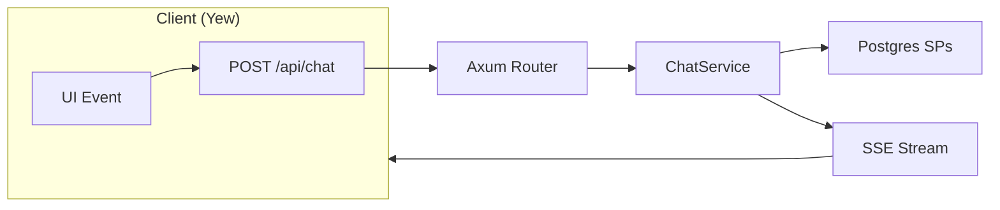
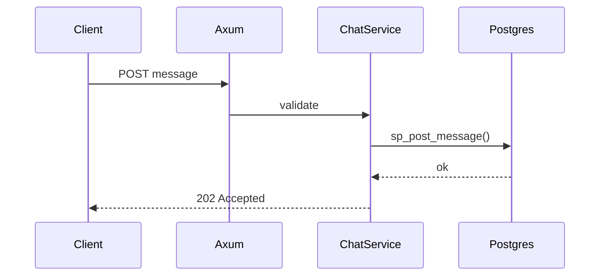
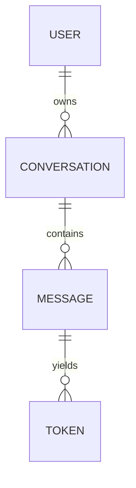

# E-SPEC-0001-RUSTY-GPT-DOCS

**Rust‑Native Documentation and Publishing System — Definitive Normative Engineering Specification** **System:** RustyGPT Project **Version:** 5.0 (Definitive; supersedes all prior drafts/specs/ECRs) **Status:** ✅ Normative & Binding **Owner:** RustyGPT Architecture & Tooling Council **Date:** 2025‑10‑19 **Applies To:** All RustyGPT repositories, crates, and subprojects

> This specification is the **single source of truth** for documentation across RustyGPT. It is designed for **Codex** and human maintainers to implement and enforce. **No Python or Node** SHALL be introduced anywhere in the documentation toolchain or CI. All requirements herein are **mandatory** unless explicitly marked OPTIONAL/RECOMMENDED.

---

## 0. Table of Contents

1. Purpose
2. Scope
3. Normative References
4. Definitions & Terms
5. Architectural Overview
6. Repository Layout (Normative)
7. Toolchain & Versions (Rust‑Only)
8. Build & Deployment (Normative Requirements)
9. Content Authoring Rules
10. Mermaid Diagramming Rules
11. Accessibility, Performance & SEO
12. LLM Manifests & Machine‑Readable Index
13. Continuous Integration (CI) — Full Workflow
14. Security, Privacy & Licensing
15. Governance, Reviews & Change Control
16. Compliance, Verification & Audits
17. Templates (book.toml, SUMMARY.md, index.md, PR template, ADR, etc.)
18. Example `justfile` (Complete)
19. Example `docs-indexer` (Rust) — Requirements & Scaffolding
20. Troubleshooting & FAQ
21. Migration Guide (from MkDocs/other)
22. Glossary

---

## 1. Purpose

This specification defines a **Rust‑native, deterministic, and enforceable** documentation system for RustyGPT that:

- Builds **without Python or Node** using **mdBook** and Rust plugins only.
- Publishes **versioned** static HTML via **GitHub Pages**.
- Mandates **text‑native Mermaid diagrams** (no images) for diff‑friendly reviews.
- Produces **LLM‑readable JSON manifests** for programmatic ingestion.
- Enforces **accessibility (WCAG 2.2 AA)**, security hygiene, and performance budgets.
- Provides **complete templates**, governance, and CI rules so Codex can implement end‑to‑end with zero ambiguity.

---

## 2. Scope

This spec applies to:

- All RustyGPT repositories and workspace members (e.g., `rustygpt-core`, `rustygpt-server`, `rustygpt-yew`, `rustygpt-memory`, etc.).
- All documentation sources and generated outputs within `/docs`, `/adr`, `/architecture`, `/changelog`, `/specs`.
- CI infrastructure for building and publishing docs to GitHub Pages.

This spec does **not** govern runtime API behavior beyond the inclusion and publication of OpenAPI documents under `/specs`.

---

## 3. Normative References

- **Rust Toolchain**: Rust 2024 Edition; Cargo ≥ 1.81
- **mdBook**: ≥ 0.4.40
- **mdbook-mermaid**: ≥ 0.13 (client‑side Mermaid)
- **mdbook-versions**: ≥ 0.3
- **lychee** (Rust link checker): ≥ 0.15 (OPTIONAL but RECOMMENDED)
- **GitHub Actions** (Ubuntu runner)
- **Just**: ≥ 1.30 (command runner)
- **WCAG 2.2 AA** (accessibility baseline)
- **SPDX** identifiers for licensing

---

## 4. Definitions & Terms

- **MUST/SHALL**: mandatory requirement
- **SHOULD/RECOMMENDED**: strong recommendation; may be waived with justification
- **MAY/OPTIONAL**: discretionary
- **Document Page**: any `.md` file built into the published site
- **Build Artifact**: static output under the mdBook `book/` directory
- **Versioned Output**: documentation content published under a distinct version path (e.g., `/v0.3`)
- **LLM Manifest**: machine‑readable JSON index of doc entries and summaries

---

## 5. Architectural Overview

### 5.1 System Model

```
Authoring (Markdown + Mermaid)
       │
       ▼
 mdBook (Rust) ──► mdbook-mermaid ──► mdbook-versions ──► rustygpt-doc-indexer
       │
       ▼
Static HTML + JSON (book/) ──► gh-pages (GitHub Pages)
```

### 5.2 Design Tenets

1. **Rust‑Only**: cargo‑installed binaries; no pip/npm.
2. **Immutable Versions**: every published version maps to a Git commit/tag.
3. **Text‑First Diagrams**: `mermaid` fences only; no diagram images in repo.
4. **Deterministic CI**: all steps invoked via `just` targets.
5. **Accessible & Fast**: WCAG 2.2 AA; first paint ≤ 1 s on GitHub Pages baseline.
6. **Machine‑Ready**: LLM manifests generated on every build.

---

## 6. Repository Layout (Normative)

```
/book.toml                         # mdBook configuration (normative)
/docs/
  SUMMARY.md                       # table of contents (normative)
  index.md                         # landing page
  guide/                           # task-based walkthroughs
  concepts/                        # theory & conceptual background
  architecture/                    # internal subsystems + diagrams
  reference/                       # API, CLI, config references
  howto/                           # targeted, step-based guides
  changelog/                       # human-readable release notes
  llm/                             # generated JSON manifests (machine index)
  _snippets/diagrams/              # shared .mmd fragments (normative)
/adr/                               # Architecture Decision Records (Markdown)
/specs/openapi.yaml                # OpenAPI (sanitized; generated upstream)
/.justfile                         # docs commands (normative targets)
/.github/workflows/docs.yml        # CI (normative pipeline)
```

**Prohibitions**

- ❌ No `/docs/*.py`, `/docs/*.ipynb`, or custom HTML templates for content rendering.
- ❌ No bundlers or external web builds for docs (React/MDX/Docusaurus/etc.).

---

## 7. Toolchain & Versions (Rust‑Only)

**7.1 Mandatory Binaries (installed via cargo):**

- `mdbook`
- `mdbook-mermaid`
- `mdbook-versions`

**7.2 Optional Binaries (Rust):**

- `lychee` — external link checker

**7.3 Version Pinnings:**

- CI MUST install with `--locked` to guarantee Cargo.lock resolution.
- If pinning exact crate versions is required, record in `/docs/standards/TOOLING.lock.md` (OPTIONAL).

---

## 8. Build & Deployment (Normative Requirements)

### 8.1 Justfile Targets (MUST exist)

```make
# Serve with live reload
docs-serve:
	mdbook serve --open

# Strict build (fail on error)
docs-build:
	mdbook build

# Generate machine index
docs-index:
	cargo run -p rustygpt-doc-indexer --release

# Publish to gh-pages (atomic: build -> index -> commit -> push)
docs-deploy:
	just docs-build
	just docs-index
	git add book/ docs/llm/
	git commit -m "docs: publish"
	git push origin gh-pages
```

### 8.2 Build Requirements

- **B1.** `mdbook build` SHALL complete without warnings or errors.
- **B2.** Build MUST be offline (no network fetch beyond Cargo install step in CI).
- **B3.** Any file with forbidden extensions (`.py`, `.ipynb`, `.html` templates for content) SHALL fail CI.

### 8.3 Versioning

- **V1.** `mdbook-versions` SHALL produce subdirectories `/vX.Y` for each tagged release.
- **V2.** `latest` SHALL track the `main` branch outputs.
- **V3.** Published versions SHALL be immutable; fix‑forward only.

### 8.4 Deployment

- **D1.** CI SHALL push static output to `gh-pages` branch only.
- **D2.** CI author identity: `ci@users.noreply.github.com`.
- **D3.** GitHub Pages MUST be enabled for the repo with source `gh-pages`.
- **D4.** Publishing MUST occur on: (a) push to `main`; (b) tag events (release).

---

## 9. Content Authoring Rules

### 9.1 Page Header & TL;DR (MUST)

Each page begins with:

```markdown
# Title

> TL;DR – 2–5 lines summarizing purpose, key outcomes, and links if applicable.
```

- H2 (`##`) sectioning MUST be used to structure content.
- Language‑labeled fenced code blocks MUST be used (` ```rust`, ` ```bash`, ` ```sql`, etc.).

### 9.2 Linking & Anchors

- Relative links ONLY inside `/docs` (e.g., `../concepts/dimensioned-entities.md`).
- Anchors MUST be stable across versions; renames require redirect stubs (see 17.1).

### 9.3 File / Section Naming

- File names: `kebab-case.md`.
- Section headings: Title Case (≤ 6 words), descriptive.

### 9.4 Content Types

- **Guide**: step-by-step; inputs/outputs; expected results.
- **Concepts**: explanations; diagrams; trade‑offs; glossary links.
- **Architecture**: internal flows, interfaces, invariants, failure modes.
- **Reference**: API/CLI/config; auto‑generated tables allowed if pasted as Markdown.
- **How‑to**: single task, crisp steps, copy‑pasteable commands.
- **Changelog**: human‑readable changes correlated with repo tags.

### 9.5 Quality Bars

- No `TODO`/`FIXME` in published pages.
- At least one outbound cross‑reference per page.
- Screenshots/images SHOULD be avoided; prefer text + diagrams. If used (e.g., hardware), provide alt text and dimensions.

---

## 10. Mermaid Diagramming Rules

### 10.1 Mandatory Usage

- All diagrams MUST be fenced `mermaid` blocks. No image exports in repo.
- Default flow **LR**; **TB** allowed for natural vertical processes.

### 10.2 Required Elements

- Preceding heading (H2/H3) for context.
- One‑sentence caption immediately below the diagram.
- Legend where symbols or grouping are non‑obvious.

### 10.3 Style Constraints

- Edge labels MUST be verb‑first (e.g., “validate → persist”).
- Node labels ≤ 4 words; Title Case.
- **No custom colors, classDef, or style overrides** unless an accessibility rationale is added as a note in the PR.

### 10.4 Snippets & Reuse

- Shared fragments live in `docs/_snippets/diagrams/*.mmd`.
- Include via mdBook template syntax:
  ```markdown
  {{#include _snippets/diagrams/sse-flow.mmd}}
  ```

### 10.5 Templates (Copy/Paste)

**Flowchart**



_Caption: High‑level request and streaming path._

**Sequence**



_Caption: Request/ack plus SSE subscription handshake._

**ER (Schema Overview)**



_Caption: Minimal relational ownership and production chain._

---

## 11. Accessibility, Performance & SEO

- **A11y‑1 (MUST)**: No color‑only semantics; provide text/labels/icons.
- **A11y‑2 (MUST)**: Light and dark themes render diagrams and text legibly.
- **Perf‑1 (MUST)**: First contentful paint ≤ 1 s (GitHub Pages baseline).
- **SEO‑1 (SHOULD)**: First paragraph TL;DR contains essential keywords.
- **SEO‑2 (SHOULD)**: Use descriptive titles and stable slugs.

---

## 12. LLM Manifests & Machine‑Readable Index

### 12.1 Requirements

- `rustygpt-doc-indexer` (workspace bin) SHALL:
  1. Traverse `/docs/**/*.md`.
  2. Extract H1, H2s, and first ~100 words (or TL;DR paragraph).
  3. Emit JSON files:
     - `/docs/llm/manifest.json`
     - `/docs/llm/summaries.json`
  4. Validate against JSON schema (12.2).

### 12.2 JSON Schema (Normative)

```json
{
  "$schema": "https://json-schema.org/draft/2020-12/schema",
  "title": "RustyGPT Docs Manifest",
  "type": "object",
  "required": ["version", "generated", "entries"],
  "properties": {
    "version": { "type": "string" },
    "generated": { "type": "string", "format": "date-time" },
    "entries": {
      "type": "array",
      "items": {
        "type": "object",
        "required": ["id", "title", "summary", "href"],
        "properties": {
          "id": { "type": "string", "minLength": 3 },
          "title": { "type": "string", "minLength": 3 },
          "summary": { "type": "string", "minLength": 10 },
          "tags": { "type": "array", "items": { "type": "string" } },
          "href": { "type": "string", "pattern": "^/[-a-z0-9_/]+/?$" }
        },
        "additionalProperties": false
      }
    }
  },
  "additionalProperties": false
}
```

### 12.3 Example Entry

```json
{
  "id": "architecture/streaming",
  "title": "SSE Streaming Architecture",
  "summary": "Describes tokenized streaming over Axum with retry and event correlation.",
  "tags": ["axum", "sse", "streaming"],
  "href": "/architecture/streaming/"
}
```

---

## 13. Continuous Integration (CI) — Full Workflow

### 13.1 GitHub Actions (Normative)

```yaml
name: docs
on:
  push:
    branches: [main]
  tags:
    - 'v*.*.*'
  workflow_dispatch:

concurrency: docs-${{ github.ref }}

jobs:
  build-deploy:
    runs-on: ubuntu-latest
    permissions:
      contents: write
    steps:
      - uses: actions/checkout@v4

      - name: Install Rust toolchain
        uses: dtolnay/rust-toolchain@stable

      - name: Install mdBook toolchain
        run: |
          cargo install --locked mdbook mdbook-mermaid mdbook-versions

      - name: Build docs
        run: just docs-build

      - name: Generate LLM manifests
        run: just docs-index

      # OPTIONAL: external link check (Rust)
      - name: Link check (optional)
        if: ${{ github.event_name == 'schedule' || github.event_name == 'workflow_dispatch' }}
        run: |
          cargo install --locked lychee
          lychee --verbose --no-progress docs || true

      - name: Deploy to gh-pages
        run: |
          git config user.name "ci"
          git config user.email "ci@users.noreply.github.com"
          git add book/ docs/llm/
          git commit -m "docs: deploy $GITHUB_SHA" || echo "No changes to commit"
          git push origin gh-pages
```

**Notes (Binding):**

- CI MUST fail on `mdbook build` error or invalid manifest (indexer returns non‑zero).
- Nightly/scheduled `lychee` MAY warn but SHOULD NOT block unless configured to enforce.

---

## 14. Security, Privacy & Licensing

- **S1 (MUST)**: No secrets, credentials, tokens, or internal hostnames in docs.
- **S2 (MUST)**: `/specs/openapi.yaml` sanitized; no internal IPs/URLs.
- **S3 (MUST)**: Automated grep gate for secret patterns runs in CI (see 16.2).
- **S4 (SHOULD)**: All included code samples use `example.com` domains.
- **L1 (MUST)**: Include SPDX license headers for embedded code blocks that are substantive (≥ 30 lines) if licensing differs from repo default.
- **L2 (MUST)**: All included third‑party assets must have permissive license references.

---

## 15. Governance, Reviews & Change Control

- **G1 (MUST)**: Docs PRs require review by a maintainer with `@docs` role.
- **G2 (MUST)**: Diagrams pass the **30‑second explainability** test.
- **G3 (MUST)**: No `TODO`/`FIXME` remain in published pages.
- **G4 (MUST)**: Changes to this spec require an ECR approved by the Architecture Council.
- **G5 (SHOULD)**: ADRs accompany significant structural or policy changes.

---

## 16. Compliance, Verification & Audits

### 16.1 Verification Matrix

| Area       | Requirements | Verification                                     |
| ---------- | ------------ | ------------------------------------------------ |
| Build      | B1–B3        | CI logs clean; non‑zero exit on violation        |
| Versioning | V1–V3        | Version directories present; `latest` alias      |
| Deploy     | D1–D4        | `gh-pages` commits; Pages is live                |
| Authoring  | 9.x          | Reviewer checklists; PR template                 |
| Diagrams   | 10.x         | Render check; caption present; style constraints |
| A11y/Perf  | 11.x         | Weekly Lighthouse report; manual spot checks     |
| LLM        | 12.x         | Schema validation; file presence                 |
| CI         | 13.x         | Pipeline pass criteria                           |
| Security   | 14.x         | Grep scan; OpenAPI audit                         |
| Governance | 15.x         | PR metadata; ECR records                         |

### 16.2 CI Guardrails (Binding)

Add a CI step (before deploy):

```bash
# Fail on secrets/forbidden tokens
! grep -R --include='*.md' -E '(AKIA[0-9A-Z]{16}|SECRET_KEY|token=|password=|x-api-key)' docs || (echo "Secret-like pattern found" && exit 1)

# Fail on forbidden content types
! git ls-files docs | grep -E '\.(py|ipynb|html)$' && echo "OK" || (echo "Forbidden file type present" && exit 1)
```

### 16.3 Retention & Archival

- Retain at least **3 major releases** or **24 months** of doc versions (whichever is longer).
- Archival takes place via `gh-pages` history; do not rewrite history.

---

## 17. Templates (Copy/Paste — Binding Examples)

### 17.1 `book.toml` (Normative Baseline)

```toml
[book]
title = "RustyGPT Documentation"
author = "RustyGPT Team"
language = "en"
src = "docs"
multilingual = false

[output.html]
default-theme = "rust"
preferred-dark-theme = "navy"
copy-fonts = true
no-section-label = true
git-repository-url = "https://github.com/RustyGPT/RustyGPT"
# mdbook-mermaid will inject Mermaid; no additional JS required

[preprocessor.versions]
# mdbook-versions configuration (adjust as needed)
```

### 17.2 `docs/SUMMARY.md` (Index)

```markdown
# Summary

- [Overview](index.md)
- Guide
  - [Quickstart](guide/quickstart.md)
  - [Local Development](guide/local-dev.md)
- Concepts
  - [Reasoning DAG](concepts/reasoning-dag.md)
  - [Dimensioned Entities](concepts/dimensioned-entities.md)
- Architecture
  - [SSE Streaming](architecture/streaming.md)
  - [Schema](architecture/schema.md)
- Reference
  - [REST API](reference/api.md)
  - [Config](reference/config.md)
- How-to
  - [Docker Deploy](howto/docker-deploy.md)
- Changelog
  - [Index](changelog/index.md)
```

### 17.3 `docs/index.md` (Landing)

```markdown
# RustyGPT Documentation

> TL;DR – Everything you need to build, run, and extend RustyGPT using a pure Rust toolchain. Start with Quickstart, then explore Concepts and Architecture.

Welcome to the RustyGPT docs. This site is:

- **Rust-native**: built with mdBook, no Python/Node
- **Versioned**: `latest` tracks main; releases are immutable
- **Machine-friendly**: docs ship with LLM manifests

## Fast Links

- [Quickstart](guide/quickstart.md)
- [Reasoning DAG](concepts/reasoning-dag.md)
- [SSE Streaming](architecture/streaming.md)
- [REST API](reference/api.md)
```

### 17.4 PR Template (Docs Changes)

```markdown
## Summary

Describe the change concisely.

## Checklist

- [ ] `mdbook build` passes locally
- [ ] Diagrams use Mermaid with captions and verb-first edges
- [ ] TL;DR present at top of each new/changed page
- [ ] Relative links only; anchors stable
- [ ] No TODO/FIXME remain
- [ ] LLM manifests updated (`just docs-index`)

## Reviewer Focus

- 30-second explainability for diagrams
- Accessibility considerations
```

### 17.5 ADR Template (`/adr/0001-title.md`)

```markdown
# ADR-0001: Title

Date: 2025-10-19 Status: Accepted

## Context

What problem are we solving?

## Decision

What did we choose and why?

## Consequences

Trade-offs, risks, follow-ups.
```

---

## 18. Example `justfile` (Complete)

```make
default: docs-build

# Docs local server
docs-serve:
	mdbook serve --open

# Strict build
docs-build:
	mdbook build

# Generate machine-readable manifests
docs-index:
	cargo run -p rustygpt-doc-indexer --release

# Optional external link check (nightly or manual)
docs-links:
	cargo install --locked lychee
	lychee --verbose --no-progress docs

# Deploy to gh-pages
docs-deploy:
	just docs-build
	just docs-index
	git add book/ docs/llm/
	git commit -m "docs: publish" || true
	git push origin gh-pages
```

---

## 19. Example `rustygpt-doc-indexer` — Requirements & Scaffolding

**Normative Behavior**

- Input: root path `./docs`
- Output: `./docs/llm/manifest.json`, `./docs/llm/summaries.json`
- Extract:
  - H1 (first `#`)
  - H2 list
  - TL;DR (first blockquote after H1) OR first 100 words
- Normalize href as `/path/` (no `.md` in output)
- Validate against schema (12.2); non‑zero exit on failure

**Minimal Crates (RECOMMENDED)**

- `walkdir`, `regex`, `serde`, `serde_json`, `chrono`

**Rust Skeleton (illustrative, non‑binding implementation)**

```rust
// bin: rustygpt-doc-indexer
use std::{fs, path::Path};
use walkdir::WalkDir;
use serde::Serialize;
use chrono::Utc;

#[derive(Serialize)]
struct Entry {
    id: String,
    title: String,
    summary: String,
    tags: Vec<String>,
    href: String,
}

#[derive(Serialize)]
struct Manifest {
    version: String,
    generated: String,
    entries: Vec<Entry>,
}

fn main() -> anyhow::Result<()> {
    let mut entries = Vec::new();
    for e in WalkDir::new("docs").into_iter().filter_map(Result::ok) {
        let p = e.path();
        if p.extension().and_then(|s| s.to_str()) != Some("md") { continue; }
        if p.file_name().and_then(|s| s.to_str()) == Some("SUMMARY.md") { continue; }
        let raw = fs::read_to_string(p)?;
        if let Some(entry) = parse_markdown(&raw, p) {
            entries.push(entry);
        }
    }
    let manifest = Manifest {
        version: "1.0".into(),
        generated: Utc::now().to_rfc3339(),
        entries,
    };
    fs::create_dir_all("docs/llm")?;
    fs::write("docs/llm/manifest.json", serde_json::to_string_pretty(&manifest)?)?;
    fs::write("docs/llm/summaries.json", serde_json::to_string_pretty(&manifest.entries)?)?;
    // TODO: schema validation step (load schema and assert)
    Ok(())
}

// parse_markdown(...) should extract H1, TL;DR, H2s; build id/href by path.
fn parse_markdown(raw: &str, path: &Path) -> Option<Entry> {
    // Implementation left to Codex per project needs.
    // Ensure TL;DR extraction or fallback to first 100 words.
    // Derive id from relative docs path without extension.
    None
}
```

---

## 20. Troubleshooting & FAQ

**Q: Mermaid isn’t rendering.** A: Ensure `mdbook-mermaid` is installed; `book.toml` is present; use correct fences ```mermaid.

**Q: Links break across versions.** A: Use relative links; keep headings stable; add redirect stubs if renaming sections (add a short “Moved” note with link).

**Q: We need an image (diagram screenshot).** A: Prohibited. Use Mermaid. Only exceptions: physical hardware schematics/photos with alt text.

**Q: Can we add a JS plugin?** A: No. Toolchain is Rust‑only. Client‑side Mermaid is allowed via `mdbook-mermaid` integration only.

**Q: Can we embed live API calls?** A: No. Docs are static. Provide examples only with sanitized URLs.

**Q: Multi‑repo docs aggregation?** A: Out of scope for now. Each repo publishes independently. A higher‑level index page MAY deep‑link to each repo’s Pages site.

---

## 21. Migration Guide (from MkDocs or Others)

1. Move Markdown to `/docs` and create `SUMMARY.md`.
2. Convert callouts/admonitions to plain Markdown sections.
3. Replace diagram images with Mermaid blocks.
4. Create `book.toml`, add `mdbook-mermaid` and `mdbook-versions`.
5. Add `justfile` targets and CI workflow from this spec.
6. Validate `mdbook build`; fix anchors; produce LLM manifests.
7. Enable GitHub Pages (`gh-pages`) and deploy.

---

## 22. Glossary

- **ADR**: Architecture Decision Record
- **CI**: Continuous Integration
- **FCP**: First Contentful Paint
- **LLM**: Large Language Model
- **SSE**: Server‑Sent Events
- **WCAG**: Web Content Accessibility Guidelines

---

### ✅ Binding Statement

Compliance with **E‑SPEC‑0001‑RUSTY‑GPT‑DOCS** is **mandatory** for all documentation contributions and CI pipelines. Any deviation SHALL be rejected by CI and must be addressed via an approved Engineering Change Request (ECR).
