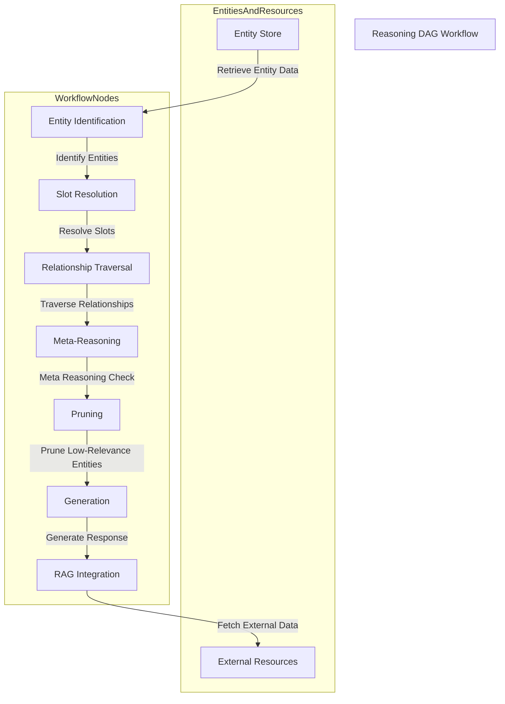
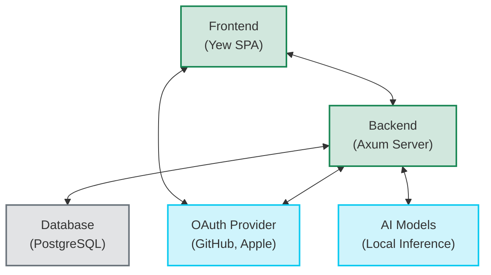

# RustyGPT Architecture

This document provides an overview of the RustyGPT project architecture.

## Background

The design is centered around the development of a Dimensioned-Entity-Enabled Reasoning DAG with Retrieval-Augmented Generation (RAG). This architecture aims to enable dynamic, scalable, and context-rich reasoning while maintaining high performance within resource-constrained environments.

Key Concepts:

1. Dimensioned Entities: Structured representations with dynamic attributes that maintain contextual and relational properties, essential for efficient reasoning.
2. Reasoning DAG: A directed acyclic graph that allows for structured, modular reasoning processes with dynamic context adaptation.
3. RAG: Integrates external knowledge sources, enriching responses and maintaining contextual relevance.

The architecture prioritizes a Rust-based implementation for performance, leveraging the llama_cpp crate for embedding generation and the PostgreSQL database for hyper-normalized storage of entities and relationships. The design ensures modularity, allowing the integration and orchestration of nodes to perform specific reasoning tasks, making it easily testable and modifiable.

## Requirements

The system will be built entirely in Rust to ensure performance, safety, and modularity. The primary objective is to develop a Reasoning DAG with RAG integration capable of dynamically orchestrating nodes in a coded function workflow. The following requirements are categorized using the MoSCoW prioritization:

### Must-Have

1. Dynamic Reasoning DAG Structure:

   - Support modular and autonomous nodes that can dynamically interact.
   - Ensure each node can perform specific reasoning tasks independently.

2. Hyper-Normalized Data Storage:

   - Utilize PostgreSQL for structured entity storage.
   - Efficiently handle dynamic entity relationships and attributes.
   - Employ embedding vectors for semantic matching.

3. Embedding Generation and Maintenance:

   - Generate entity embeddings using llama_cpp or equivalent Rust libraries.
   - Support incremental indexing to minimize computational overhead during updates.
   - Implement model re-basing to maintain embedding consistency.

4. Node Orchestration for Workflow Management:

   - Enable coded function workflows for testing and modification.
   - Ensure nodes can be easily added, removed, or updated without disrupting the DAG.

5. Efficient Pruning and Memory Management:

   - Employ pruning strategies to maintain high performance in large-scale deployments.
   - Implement caching and garbage collection for embedding vectors.

6. Retrieval-Augmented Generation (RAG) Integration:

   - Seamlessly link entities to external data sources.
   - Efficiently incorporate external data into the reasoning process.

7. Performance Optimization:

   - Utilize GPU acceleration for embedding operations when available.
   - Implement real-time indexing and retrieval for rapid reasoning.

### Should-Have

1. Robust Testing and Debugging Framework:

   - Enable testing of individual nodes and entire workflows.
   - Provide detailed logs for reasoning paths and node interactions.

2. Lifecycle Management for Entities:

   - Implement lifecycle stages from creation to pruning, ensuring long-term accuracy and relevance.
   - Automate embedding updates and archiving of inactive entities.

### Could-Have

1. Adaptive Pruning Thresholds:

   - Dynamically adjust pruning intensity based on system load.

2. Data Visualization Dashboard:

   - Visualize the DAG structure and entity relationships for better monitoring.

### Won’t Have

1. Web-Based User Interface:

   - Initial implementation will focus on core functionality and command-line interaction.
   - GUI or web-based interfaces are not a priority at this stage.

## Method

### Architectural Design

The system will be implemented as a Directed Acyclic Graph (DAG), where each node performs a specific reasoning function. The graph structure allows for modular, autonomous processing, supporting dynamic interactions between nodes.

#### Key Components:

1. Entity Identification Node:

   - Uses vector similarity to find the most relevant entities based on input data.
   - Efficiently queries the PostgreSQL database for embedding matches.

2. Slot Resolution Node:

   - Fills required and optional slots for identified entities.
   - Uses embedding-based matching to ensure high accuracy in slot population.

3. Relationship Traversal Node:

   - Expands reasoning by exploring relationships between identified entities.
   - Traverses dynamic links inferred from semantic similarity or shared attributes.

4. Meta-Reasoning Controller:

   - Validates the coherence of the reasoning chain.
   - Ensures that all necessary slots and relationships are populated before generating output.

5. Pruning Node:

   - Reduces reasoning complexity by removing low-relevance entities or outdated relationships.
   - Applies memory optimization by caching frequently accessed entities.

6. Generation Node:

   - Synthesizes responses based on resolved entities and enriched context.
   - Integrates data retrieved through RAG to enhance output quality.

7. RAG Integration Node:

   - Links entities to external resources when context gaps are detected.
   - Uses embedding vectors to match retrieved data with the current reasoning path.

#### Orchestration Workflow

Nodes are organized in a flexible and modular fashion, allowing seamless integration and modification. The DAG structure ensures that each node can independently process data and pass it to the next node.



### Database Schema

The database will make use of `ltree`.

```sql
CREATE EXTENSION IF NOT EXISTS ltree;
```

```sql
CREATE TABLE entities (
    entity_id SERIAL PRIMARY KEY,
    name TEXT,
    embedding VECTOR(768),
    created_at TIMESTAMP DEFAULT NOW(),
    updated_at TIMESTAMP DEFAULT NOW()
);

CREATE TABLE attributes (
    attribute_id SERIAL PRIMARY KEY,
    name TEXT
);

CREATE TABLE attribute_values (
    value_id SERIAL PRIMARY KEY,
    value TEXT
);

CREATE TABLE entity_attribute_link (
    link_id SERIAL PRIMARY KEY,
    entity_id INT REFERENCES entities(entity_id),
    attribute_id INT REFERENCES attributes(attribute_id),
    value_id INT REFERENCES attribute_values(value_id)
);

CREATE TABLE relationships (
    relationship_id SERIAL PRIMARY KEY,
    path ltree,
    entity_id_1 INT REFERENCES entities(entity_id),
    entity_id_2 INT REFERENCES entities(entity_id),
    relationship_type TEXT,
    weight FLOAT,
    timestamp TIMESTAMP DEFAULT NOW()
);

CREATE TABLE external_resources (
    resource_id SERIAL PRIMARY KEY,
    uri TEXT,
    resource_type TEXT,
    embedding VECTOR(768),
    created_at TIMESTAMP DEFAULT NOW()
);

CREATE TABLE entity_resource_link (
    link_id SERIAL PRIMARY KEY,
    entity_id INT REFERENCES entities(entity_id),
    resource_id INT REFERENCES external_resources(resource_id),
    confidence_score FLOAT
);

CREATE TABLE reference_tracking (
    reference_id SERIAL PRIMARY KEY,
    entity_id INT REFERENCES entities(entity_id),
    usage_count INT DEFAULT 0,
    last_accessed TIMESTAMP DEFAULT NOW()
);
```

#### Stored Procedures

```sql
CREATE OR REPLACE FUNCTION insert_entity(entity_name TEXT, embedding VECTOR) RETURNS INT AS $$
DECLARE
    entity_id INT;
BEGIN
    INSERT INTO entities (name, embedding) VALUES (entity_name, embedding)
    RETURNING entity_id INTO entity_id;
    RETURN entity_id;
END;
$$ LANGUAGE plpgsql;

CREATE OR REPLACE FUNCTION find_similar_entity(input_embedding VECTOR, limit INT) RETURNS TABLE(entity_id INT, name TEXT) AS $$
BEGIN
    RETURN QUERY
    SELECT entity_id, name
    FROM entities
    ORDER BY embedding <=> input_embedding
    LIMIT limit;
END;
$$ LANGUAGE plpgsql;

CREATE OR REPLACE FUNCTION get_entity_relationships(eid INT) RETURNS TABLE(entity_id_2 INT, relationship_type TEXT, weight FLOAT) AS $$
BEGIN
    RETURN QUERY
    SELECT entity_id_2, relationship_type, weight
    FROM relationships
    WHERE entity_id_1 = eid
    ORDER BY weight DESC;
END;
$$ LANGUAGE plpgsql;

CREATE OR REPLACE FUNCTION find_relationships(prefix ltree) RETURNS TABLE(entity_id_2 INT, rel_type TEXT, weight FLOAT) AS $$
BEGIN
    RETURN QUERY
    SELECT entity_id_2, relationship_type, weight
    FROM relationships
    WHERE path <@ prefix
    ORDER BY weight DESC;
END;
$$ LANGUAGE plpgsql;

CREATE OR REPLACE FUNCTION insert_relationship(
    path ltree,
    eid1 INT,
    eid2 INT,
    rel_type TEXT,
    rel_weight FLOAT
) RETURNS VOID AS $$
BEGIN
    INSERT INTO relationships (path, entity_id_1, entity_id_2, relationship_type, weight)
    VALUES (path, eid1, eid2, rel_type, rel_weight);
END;
$$ LANGUAGE plpgsql;
```

#### Indexes

```sql
CREATE INDEX idx_entity_embedding ON entities USING ivfflat (embedding);
CREATE INDEX idx_relationship_entities ON relationships (entity_id_1, entity_id_2);
CREATE INDEX idx_entity_attribute ON entity_attribute_link (entity_id, attribute_id, value_id);
CREATE INDEX idx_relationship_path ON relationships USING GIST (path);
```

### Workflow Implementation

#### Node Initialization:

- Nodes are loaded as separate threads using Rust’s concurrency model.
- Each node registers its function in the workflow orchestrator.
- Prioritization Setup: Nodes are assigned a priority based on their complexity, with simpler entity matching nodes prioritized.

#### Entity Identification:

- Input data is processed to extract semantic embeddings.
- Step 1: Simple Entity Matching:
  - Perform an exact match on entity names or known aliases.
  - Use cached embeddings for frequent entities to reduce computational load.
- Step 2: Similarity Matching:
  - Perform lightweight similarity checks (e.g., cosine similarity) for entities with common attribute values.
- Step 3: Complex Relationship Matching:
  - Traverse the entity graph to identify relationships that indirectly link to the input data.
- Outcome:
  - Start reasoning with the simplest matching entities and escalate to deeper reasoning if needed.

#### Slot Resolution:

- Identified entities are evaluated to check for missing attributes.
- Use incremental slot filling:
  - First, populate slots directly available from the identified entities.
  - If unresolved, escalate to more complex attribute inference or external data retrieval.
- Confidence Assessment:
  - Prioritize high-confidence matches first.
  - Use RAG to fill gaps only when simpler methods fail.

#### Relationship Traversal:

- Dynamically expand the reasoning graph, starting with the most straightforward relationships (direct links between entities).
- Move to more complex transitive relationships only if the initial traversal yields insufficient context.
- Use depth-first traversal when exploring deeper contextual chains to ensure that more relevant nodes are processed earlier.

#### Meta-Reasoning Validation:

- Check for completeness in the reasoning path.
- If the resolution path is too complex or the response lacks clarity, backtrack to simpler entity relationships.
- Employ a threshold-based evaluation:
  - Stop further reasoning if a sufficiently clear and contextually relevant answer is already available.

#### Response Generation:

- Combine the context from the simplest entities and relationships first.
- If the response lacks depth or completeness, incorporate more complex reasoning chains.
- Use context fusion to merge simple and complex reasoning outputs, maintaining coherence.

#### Pruning:

- Focus on pruning entities and relationships that were explored but deemed unnecessary for the final response.
- Maintain lightweight active sets to avoid clogging the reasoning process with less relevant entities.
- Periodically review low-usage entities and reduce memory footprint through LRU-based pruning.

### Optimization Strategies:

#### Lazy Evaluation:

- Only activate nodes when their output is explicitly required.
- Reduce computation by skipping deeper reasoning if simpler entities suffice.

#### Contextual Escalation:

- Start with surface-level reasoning suitable for casual conversation.
- Dynamically switch to deeper reasoning when contextual cues indicate a shift to more complex discourse.

#### Efficiency Heuristics:

- Rank entities by relevance and simplicity.
- Use the fewest computational steps to achieve an accurate response.

## Project Structure

RustyGPT follows a clean architecture with clear separation of concerns:

```
rusty_gpt/
├──rustygpt-cli/
│  ├── src
│  │   ├── main.rs            # Program entry point
│  │   └── commands/          # Command implementations
│  │       └── config.rs      # Command to write example config
│  └── Cargo.toml
├──rustygpt-dag/
│  ├── src
│  │   ├── lib.rs            # Library entry point
│  │   ├── dag/              # DAG components
│  │   │   ├── nodes.rs      # Node definitions
│  │   │   ├── workflow.rs   # Workflow orchestration
│  │   ├── db/               # Database interaction
│  │   │   ├── connection.rs # Database connection setup
│  │   │   ├── queries.rs    # Stored procedure calls
│  │   ├── tracing/          # Tracing utilities
│  │   └── utils/            # Helper functions
│  └── Cargo.toml
├──rustygpt-server/
│  ├── src
│  │   ├── main.rs            # Program entry point
│  │   ├── lib.rs             # Library entry point
│  │   ├── handlers/          # HTTP handler implementations
│  │   ├── middleware/        # HTTP middleware implementations
│  │   ├── routes/            # HTTP routing implementations
│  │   └── services/          # HTTP service implementations
│  └── Cargo.toml
├──rustygpt-shared/
│  ├── src
│  │   ├── lib.rs             # Library entry point
│  │   ├── config/            # Shared configuration implementations
│  │   └── models/            # Shared data model implementations
│  └── Cargo.toml
├──rustygpt-tools/
│  ├── confuse                # Runs multiple process simultaneously
│  │   └── Cargo.toml
│  └── i18n-agent             # Validates i18n usage and gaps
│      └── Cargo.toml
├──rustygpt-web/
│  ├── src
│  │   ├── main.rs            # Program entry point
│  │   ├── components/        # Reusable components
│  │   ├── containers/        # Reusable layout containers
│  │   ├── models/            # Project specific models
│  │   ├── pages/             # Navigable pages in the app
│  │   ├── public/            # Publicly deliverable assets
│  │   └── styles/            # Application styles
│  ├── translations
│  │   ├── de.json            # German translation file
│  │   ├── en.json            # ENglish translation file
│  │   ├── es.json            # Spanish translation file
│  │   └── fr.json            # French translation file
│  └── Cargo.toml
└── Cargo.toml
```

## Component Diagram



## Backend Architecture

The backend follows a layered architecture:

1. **Routes Layer**: Defines API endpoints and groups related routes
2. **Handlers Layer**: Processes HTTP requests and responses
3. **Services Layer**: Implements business logic and interacts with external systems
4. **Models Layer**: Defines data structures shared between layers

### Key Components

- **Authentication**: OAuth integration with GitHub and Apple
- **Conversation Management**: APIs for creating and managing conversations
- **Streaming**: Server-Sent Events (SSE) for real-time message delivery
- **Database Access**: PostgreSQL integration with stored procedures

## Frontend Architecture

The frontend is built using Yew, a Rust framework for creating web applications:

1. **Components**: Reusable UI elements following a component-based architecture
2. **Models**: Data structures representing application state
3. **Services**: Client-side logic for API communication

### Key Components

- **Chat Interface**: Interactive UI for sending and receiving messages
- **Real-time Updates**: SSE client for receiving streaming messages
- **Authentication Flow**: OAuth integration with the backend

## Communication Flow

1. **User Authentication**:

   - User initiates OAuth flow through the frontend
   - Backend handles OAuth provider communication
   - User session is established upon successful authentication

2. **Conversation Flow**:
   - User sends a message through the frontend
   - Backend processes the message and generates a response
   - Response is streamed back to the frontend in real-time using SSE
   - Frontend displays the streaming response with typing indicators

## Data Flow


## Security Considerations

- **Authentication**: OAuth 2.0 for secure user authentication
- **Authorization**: Role-based access control for protected resources
- **Data Protection**: Secure storage of user data and conversations
- **API Security**: Input validation and protection against common attacks

## Future Architecture Enhancements

- **Microservices**: Potential migration to a microservices architecture for better scalability
- **Event Sourcing**: Implementation of event sourcing for conversation history
- **Caching Layer**: Addition of a caching layer for improved performance
- **Distributed Processing**: Support for distributed AI model inference
