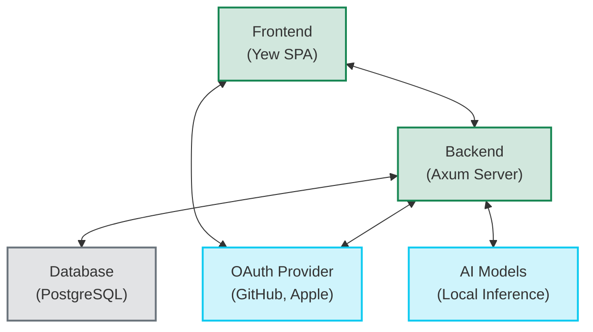
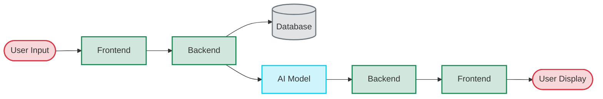

# RustyGPT Architecture

This document provides an overview of the RustyGPT project architecture.

## Project Structure

RustyGPT follows a clean architecture with clear separation of concerns:

```
rusty_gpt/
├── backend/           # Rust-based Axum server
│   ├── src/
│   │   ├── handlers/  # HTTP request handlers
│   │   ├── routes/    # API endpoint definitions
│   │   └── services/  # Business logic implementation
│   └── Cargo.toml     # Backend dependencies
├── frontend/          # Rust-based Yew frontend
│   ├── src/
│   │   ├── components/  # Reusable UI components
│   │   └── styles/      # CSS styles
│   └── Cargo.toml       # Frontend dependencies
└── shared/            # Common code shared between backend and frontend
    ├── src/
    │   └── models/    # Data structures and models
    └── Cargo.toml     # Shared dependencies
```

## Component Diagram



## Backend Architecture

The backend follows a layered architecture:

1. **Routes Layer**: Defines API endpoints and groups related routes
2. **Handlers Layer**: Processes HTTP requests and responses
3. **Services Layer**: Implements business logic and interacts with external systems
4. **Models Layer**: Defines data structures shared between layers

### Key Components

- **Authentication**: OAuth integration with GitHub and Apple
- **Conversation Management**: APIs for creating and managing conversations
- **Streaming**: Server-Sent Events (SSE) for real-time message delivery
- **Database Access**: PostgreSQL integration with stored procedures

## Frontend Architecture

The frontend is built using Yew, a Rust framework for creating web applications:

1. **Components**: Reusable UI elements following a component-based architecture
2. **Models**: Data structures representing application state
3. **Services**: Client-side logic for API communication

### Key Components

- **Chat Interface**: Interactive UI for sending and receiving messages
- **Real-time Updates**: SSE client for receiving streaming messages
- **Authentication Flow**: OAuth integration with the backend

## Communication Flow

1. **User Authentication**:

   - User initiates OAuth flow through the frontend
   - Backend handles OAuth provider communication
   - User session is established upon successful authentication

2. **Conversation Flow**:
   - User sends a message through the frontend
   - Backend processes the message and generates a response
   - Response is streamed back to the frontend in real-time using SSE
   - Frontend displays the streaming response with typing indicators

## Data Flow



## Security Considerations

- **Authentication**: OAuth 2.0 for secure user authentication
- **Authorization**: Role-based access control for protected resources
- **Data Protection**: Secure storage of user data and conversations
- **API Security**: Input validation and protection against common attacks

## Future Architecture Enhancements

- **Microservices**: Potential migration to a microservices architecture for better scalability
- **Event Sourcing**: Implementation of event sourcing for conversation history
- **Caching Layer**: Addition of a caching layer for improved performance
- **Distributed Processing**: Support for distributed AI model inference
