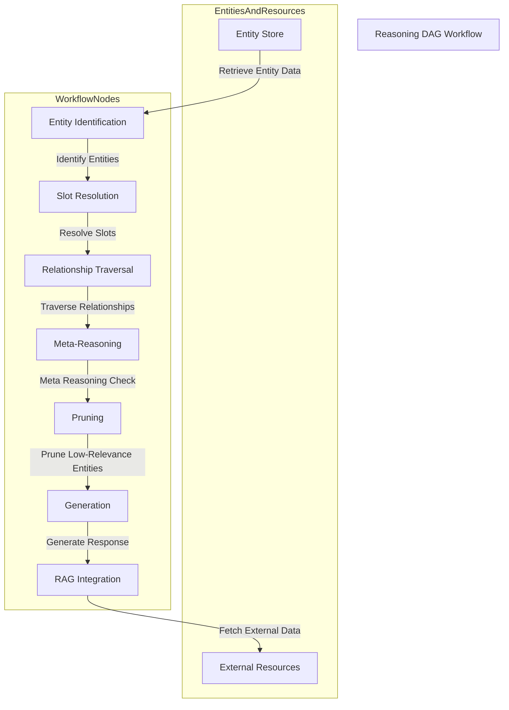
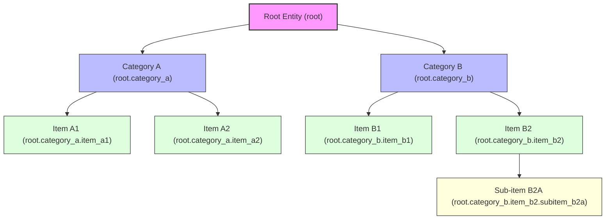

# RustyGPT Architecture Documentation

This document serves as the main index for RustyGPT's architecture documentation. The architecture has been organized into domain-specific documents for better maintainability and navigation.

## Overview

RustyGPT is a Rust-based implementation of a Dimensioned-Entity-Enabled Reasoning DAG with Retrieval-Augmented Generation (RAG). The architecture enables dynamic, scalable, and context-rich reasoning while maintaining high performance within resource-constrained environments.

For a high-level overview of the system, see: **[Architecture Overview](overview.md)**

## Architecture Documentation Structure

### 📋 [Requirements](requirements.md)

Comprehensive system requirements organized using MoSCoW prioritization:

- **Must-Have**: Core DAG structure, hyper-normalized storage, embedding generation, node orchestration, pruning, RAG integration
- **Should-Have**: Advanced features like adaptive learning, multi-model support, comprehensive monitoring
- **Could-Have**: Performance optimizations and extended integrations
- **Won't-Have**: Current scope limitations and excluded features

### 🧠 [Reasoning DAG](reasoning-dag.md)

Detailed design of the core reasoning engine:

- DAG architecture and key components
- Node types: Entity Identification, Slot Resolution, Relationship Traversal, Meta-Reasoning Controller
- Orchestration workflow with visual diagrams
- Implementation details and algorithms

### 🗄️ [Database Schema](database-schema.md)

Core database design and structure:

- PostgreSQL extensions (ltree, vector)
- Entity-Attribute-Value (EAV) model implementation
- Core table definitions and relationships
- Basic stored procedures and indexes

### ⚡ [Database Optimization](database-optimization.md)

Advanced database performance and optimization strategies:

- PostgreSQL ltree extension usage patterns
- Vector search optimization (IVFFlat indexing, ANN search)
- Embedding maintenance and hybrid search strategies
- Multi-hop relationship discovery algorithms

### 🚨 [Error Handling](error-handling.md)

Comprehensive error management architecture:

- Error design principles and type hierarchy
- Integration with `thiserror` and `anyhow` crates
- Structured logging strategies and API response formats
- Error internationalization and recovery patterns

## Key Architectural Concepts

### Dimensioned Entities

Structured representations with dynamic attributes that maintain contextual and relational properties, essential for efficient reasoning.

### Reasoning DAG

A directed acyclic graph that allows for structured, modular reasoning processes with dynamic context adaptation.

### Retrieval-Augmented Generation (RAG)

Integrates external knowledge sources, enriching responses and maintaining contextual relevance.

## Technology Stack

- **Language**: Rust (for performance, safety, and modularity)
- **Database**: PostgreSQL with vector and ltree extensions
- **Embeddings**: llama_cpp crate for embedding generation
- **Web Framework**: Axum for HTTP services
- **Frontend**: Yew with TailwindCSS and DaisyUI
- **Async Runtime**: Tokio

## Getting Started

1. Review the [Architecture Overview](overview.md) for a high-level understanding
2. Examine [Requirements](requirements.md) to understand system objectives
3. Study the [Reasoning DAG](reasoning-dag.md) design for core logic
4. Understand data storage through [Database Schema](database-schema.md)
5. Learn about performance optimizations in [Database Optimization](database-optimization.md)
6. Review [Error Handling](error-handling.md) for robust implementation patterns

## Implementation Priorities

The architecture prioritizes:

1. **Performance**: Rust-based implementation with optimized data structures
2. **Modularity**: Cleanly separated components with well-defined interfaces
3. **Testability**: Each node and component designed for independent testing
4. **Scalability**: Efficient pruning and memory management strategies
5. **Maintainability**: Clear documentation and structured error handling

## Related Documentation

- [API Documentation](../api/) - REST API specifications
- [Development Guide](../development/) - Setup and contribution guidelines
- [Deployment Guide](../deployment/) - Production deployment instructions

---

_This architecture documentation is designed to be a living document that evolves with the RustyGPT project. Each domain-specific document contains detailed technical specifications, implementation patterns, and cross-references to related concepts._

1. Dimensioned Entities: Structured representations with dynamic attributes that maintain contextual and relational properties, essential for efficient reasoning.
2. Reasoning DAG: A directed acyclic graph that allows for structured, modular reasoning processes with dynamic context adaptation.
3. RAG: Integrates external knowledge sources, enriching responses and maintaining contextual relevance.

The architecture prioritizes a Rust-based implementation for performance, leveraging the llama_cpp crate for embedding generation and the PostgreSQL database for hyper-normalized storage of entities and relationships. The design ensures modularity, allowing the integration and orchestration of nodes to perform specific reasoning tasks, making it easily testable and modifiable.

## Requirements

The system will be built entirely in Rust to ensure performance, safety, and modularity. The primary objective is to develop a Reasoning DAG with RAG integration capable of dynamically orchestrating nodes in a coded function workflow. The following requirements are categorized using the MoSCoW prioritization:

### Must-Have

1. Dynamic Reasoning DAG Structure:

   - Support modular and autonomous nodes that can dynamically interact.
   - Ensure each node can perform specific reasoning tasks independently.

2. Hyper-Normalized Data Storage:

   - Utilize PostgreSQL for structured entity storage.
   - Efficiently handle dynamic entity relationships and attributes.
   - Employ embedding vectors for semantic matching.

3. Embedding Generation and Maintenance:

   - Generate entity embeddings using llama_cpp or equivalent Rust libraries.
   - Support incremental indexing to minimize computational overhead during updates.
   - Implement model re-basing to maintain embedding consistency.

4. Node Orchestration for Workflow Management:

   - Enable coded function workflows for testing and modification.
   - Ensure nodes can be easily added, removed, or updated without disrupting the DAG.

5. Efficient Pruning and Memory Management:

   - Employ pruning strategies to maintain high performance in large-scale deployments.
   - Implement caching and garbage collection for embedding vectors.

6. Retrieval-Augmented Generation (RAG) Integration:

   - Seamlessly link entities to external data sources.
   - Efficiently incorporate external data into the reasoning process.

7. Performance Optimization:

   - Utilize GPU acceleration for embedding operations when available.
   - Implement real-time indexing and retrieval for rapid reasoning.

### Should-Have

1. Robust Testing and Debugging Framework:

   - Enable testing of individual nodes and entire workflows.
   - Provide detailed logs for reasoning paths and node interactions.

2. Lifecycle Management for Entities:

   - Implement lifecycle stages from creation to pruning, ensuring long-term accuracy and relevance.
   - Automate embedding updates and archiving of inactive entities.

### Could-Have

1. Adaptive Pruning Thresholds:

   - Dynamically adjust pruning intensity based on system load.

2. Data Visualization Dashboard:

   - Visualize the DAG structure and entity relationships for better monitoring.

### Won’t Have

1. Web-Based User Interface:

   - Initial implementation will focus on core functionality and command-line interaction.
   - GUI or web-based interfaces are not a priority at this stage.

## Method

### Architectural Design

The system will be implemented as a Directed Acyclic Graph (DAG), where each node performs a specific reasoning function. The graph structure allows for modular, autonomous processing, supporting dynamic interactions between nodes.

#### Key Components:

1. Entity Identification Node:

   - Uses vector similarity to find the most relevant entities based on input data.
   - Efficiently queries the PostgreSQL database for embedding matches.

2. Slot Resolution Node:

   - Fills required and optional slots for identified entities.
   - Uses embedding-based matching to ensure high accuracy in slot population.

3. Relationship Traversal Node:

   - Expands reasoning by exploring relationships between identified entities.
   - Traverses dynamic links inferred from semantic similarity or shared attributes.

4. Meta-Reasoning Controller:

   - Validates the coherence of the reasoning chain.
   - Ensures that all necessary slots and relationships are populated before generating output.

5. Pruning Node:

   - Reduces reasoning complexity by removing low-relevance entities or outdated relationships.
   - Applies memory optimization by caching frequently accessed entities.

6. Generation Node:

   - Synthesizes responses based on resolved entities and enriched context.
   - Integrates data retrieved through RAG to enhance output quality.

7. RAG Integration Node:

   - Links entities to external resources when context gaps are detected.
   - Uses embedding vectors to match retrieved data with the current reasoning path.

#### Orchestration Workflow

Nodes are organized in a flexible and modular fashion, allowing seamless integration and modification. The DAG structure ensures that each node can independently process data and pass it to the next node.



### Database Schema

The database will make use of `ltree`.

```sql
CREATE EXTENSION IF NOT EXISTS ltree;
```

```sql
CREATE TABLE entities (
    entity_id SERIAL PRIMARY KEY,
    name TEXT,
    embedding VECTOR(768),
    created_at TIMESTAMP DEFAULT NOW(),
    updated_at TIMESTAMP DEFAULT NOW()
);

CREATE TABLE attributes (
    attribute_id SERIAL PRIMARY KEY,
    name TEXT
);

CREATE TABLE attribute_values (
    value_id SERIAL PRIMARY KEY,
    value TEXT
);

CREATE TABLE entity_attribute_link (
    link_id SERIAL PRIMARY KEY,
    entity_id INT REFERENCES entities(entity_id),
    attribute_id INT REFERENCES attributes(attribute_id),
    value_id INT REFERENCES attribute_values(value_id)
);

CREATE TABLE relationships (
    relationship_id SERIAL PRIMARY KEY,
    path ltree,
    entity_id_1 INT REFERENCES entities(entity_id),
    entity_id_2 INT REFERENCES entities(entity_id),
    relationship_type TEXT,
    weight FLOAT,
    timestamp TIMESTAMP DEFAULT NOW()
);

CREATE TABLE external_resources (
    resource_id SERIAL PRIMARY KEY,
    uri TEXT,
    resource_type TEXT,
    embedding VECTOR(768),
    created_at TIMESTAMP DEFAULT NOW()
);

CREATE TABLE entity_resource_link (
    link_id SERIAL PRIMARY KEY,
    entity_id INT REFERENCES entities(entity_id),
    resource_id INT REFERENCES external_resources(resource_id),
    confidence_score FLOAT
);

CREATE TABLE reference_tracking (
    reference_id SERIAL PRIMARY KEY,
    entity_id INT REFERENCES entities(entity_id),
    usage_count INT DEFAULT 0,
    last_accessed TIMESTAMP DEFAULT NOW()
);
```

#### Stored Procedures

```sql
CREATE OR REPLACE FUNCTION insert_entity(entity_name TEXT, embedding VECTOR) RETURNS INT AS $$
DECLARE
    entity_id INT;
BEGIN
    INSERT INTO entities (name, embedding) VALUES (entity_name, embedding)
    RETURNING entity_id INTO entity_id;
    RETURN entity_id;
END;
$$ LANGUAGE plpgsql;

CREATE OR REPLACE FUNCTION find_similar_entity(input_embedding VECTOR, limit INT) RETURNS TABLE(entity_id INT, name TEXT) AS $$
BEGIN
    RETURN QUERY
    SELECT entity_id, name
    FROM entities
    ORDER BY embedding <=> input_embedding
    LIMIT limit;
END;
$$ LANGUAGE plpgsql;

CREATE OR REPLACE FUNCTION get_entity_relationships(eid INT) RETURNS TABLE(entity_id_2 INT, relationship_type TEXT, weight FLOAT) AS $$
BEGIN
    RETURN QUERY
    SELECT entity_id_2, relationship_type, weight
    FROM relationships
    WHERE entity_id_1 = eid
    ORDER BY weight DESC;
END;
$$ LANGUAGE plpgsql;

CREATE OR REPLACE FUNCTION find_relationships(prefix ltree) RETURNS TABLE(entity_id_2 INT, rel_type TEXT, weight FLOAT) AS $$
BEGIN
    RETURN QUERY
    SELECT entity_id_2, relationship_type, weight
    FROM relationships
    WHERE path <@ prefix
    ORDER BY weight DESC;
END;
$$ LANGUAGE plpgsql;

CREATE OR REPLACE FUNCTION insert_relationship(
    path ltree,
    eid1 INT,
    eid2 INT,
    rel_type TEXT,
    rel_weight FLOAT
) RETURNS VOID AS $$
BEGIN
    INSERT INTO relationships (path, entity_id_1, entity_id_2, relationship_type, weight)
    VALUES (path, eid1, eid2, rel_type, rel_weight);
END;
$$ LANGUAGE plpgsql;
```

#### Indexes

```sql
CREATE INDEX idx_entity_embedding ON entities USING ivfflat (embedding);
CREATE INDEX idx_relationship_entities ON relationships (entity_id_1, entity_id_2);
CREATE INDEX idx_entity_attribute ON entity_attribute_link (entity_id, attribute_id, value_id);
CREATE INDEX idx_relationship_path ON relationships USING GIST (path);
```

## Error Handling Architecture

RustyGPT implements a comprehensive error handling strategy that focuses on robustness, maintainability, and user experience. The approach leverages Rust's powerful type system and error handling capabilities while providing standardized patterns for error propagation, logging, and client-facing error responses.

### Error Design Principles

The following principles guide our error handling architecture:

1. **Type Safety**: Leverage Rust's type system for compile-time error handling verification.
2. **Clear Ownership**: Errors are created and logged at their point of origin.
3. **Contextual Information**: All errors carry meaningful context about what went wrong.
4. **Correlation**: Error instances maintain tracing identifiers for cross-system correlation.
5. **Internationalization**: Client-facing error messages support multiple languages.
6. **Security**: Error details are sanitized to prevent information leakage.
7. **Standardization**: Consistent error patterns across all components.
8. **Testability**: Error states can be reliably reproduced in tests.

### Error Type Hierarchy

The project uses [`thiserror`](https://docs.rs/thiserror) to define domain-specific error types with clear semantics:

```rust
use thiserror::Error;

/// Errors related to entity operations in the system.
#[derive(Debug, Error)]
pub enum EntityError {
    /// Occurs when an entity cannot be found by its identifier.
    #[error("Entity not found with ID: {id}")]
    NotFound {
        /// The ID that was not found
        id: String,
        /// The correlation ID for the request
        correlation_id: Uuid,
    },

    /// Occurs when validation fails for an entity's attributes.
    #[error("Invalid entity data: {reason}")]
    ValidationFailed {
        /// The reason validation failed
        reason: String,
        /// Field that failed validation, if applicable
        field: Option<String>,
        /// The correlation ID for the request
        correlation_id: Uuid,
    },

    /// Occurs when a database operation fails.
    #[error("Database operation failed")]
    DatabaseError(#[from] DatabaseError),

    /// Occurs when an entity operation times out.
    #[error("Entity operation timed out after {duration_ms} ms")]
    Timeout {
        /// Duration in milliseconds before timeout occurred
        duration_ms: u64,
        /// The correlation ID for the request
        correlation_id: Uuid,
    },
}

/// Error type for authentication operations.
#[derive(Debug, Error)]
pub enum AuthError {
    /// Occurs when credentials are invalid.
    #[error("Authentication failed")]
    InvalidCredentials {
        /// The correlation ID for the request
        correlation_id: Uuid,
    },

    /// Occurs when a session has expired.
    #[error("Session expired")]
    SessionExpired {
        /// The correlation ID for the request
        correlation_id: Uuid,
    },

    /// Occurs when a user doesn't have permission.
    #[error("Insufficient permissions for operation: {operation}")]
    InsufficientPermissions {
        /// The operation that was attempted
        operation: String,
        /// The correlation ID for the request
        correlation_id: Uuid,
    },
}
```

### Application Error Context

For application-level error handling, we use [`anyhow`](https://docs.rs/anyhow) to provide rich context for errors:

```rust
use anyhow::{Context, Result};

/// Attempts to create a new entity with the given properties.
///
/// # Arguments
///
/// * `name` - The name of the entity to create
/// * `properties` - A map of property names to values
///
/// # Returns
///
/// A [`Result`](https://doc.rust-lang.org/std/result/enum.Result.html) containing the newly created
/// [`Entity`](crate::entities::Entity) or an error if creation fails.
pub async fn create_entity(
    name: String,
    properties: HashMap<String, Value>,
    correlation_id: Uuid,
) -> Result<Entity> {
    // Validate entity properties
    validate_properties(&properties)
        .with_context(|| format!("Invalid properties for entity '{}'", name))?;

    // Create entity in database
    let entity_id = db::insert_entity(&name, &properties)
        .await
        .with_context(|| format!("Failed to insert entity '{}' into database", name))?;

    // Generate embeddings for the entity
    let embedding = generate_embedding(&name, &properties)
        .await
        .with_context(|| "Failed to generate entity embeddings")?;

    // Store embedding in vector database
    db::store_embedding(entity_id, &embedding)
        .await
        .with_context(|| format!("Failed to store embeddings for entity ID {}", entity_id))?;

    Ok(Entity {
        id: entity_id,
        name,
        properties,
        embedding,
        created_at: Utc::now(),
    })
}
```

### Error Logging Strategy

All errors are logged using structured logging with the following principles:

1. **No String Interpolation**: Error context is always logged as separate fields, never interpolated into the message string.
2. **Proper Log Levels**:

   - `error`: For system-level errors requiring immediate attention
   - `warn`: For client-related errors (e.g., validation failures)
   - `info`: For expected but notable events
   - `debug`: For detailed debugging information
   - `trace`: For extremely detailed system behavior

3. **Correlation IDs**: Every error includes the `correlation_id` to trace the error through the system.

```rust
/// Example of proper error logging
fn process_request(req: Request) -> Result<Response, ApiError> {
    let correlation_id = req.correlation_id();

    match authenticate_user(&req) {
        Ok(user) => {
            // Process authenticated request
            // ...
        }
        Err(err) => {
            // Log at warn level for client errors
            tracing::warn!(
                correlation_id = %correlation_id.to_string(),
                error_type = "authentication_failed",
                message = "User authentication failed",
                user_id = req.user_id(), // Structured context, not interpolated
                client_ip = req.client_ip(),  // Structured context, not interpolated
                // The %err formatter ensures proper Display implementation is used
                error = %err,
            );

            return Err(ApiError::AuthenticationFailed {
                correlation_id,
                i18n_key: "errors.auth.invalid_credentials",
                params: HashMap::new(),
            });
        }
    }
}
```

### API Error Response Format

Client-facing errors are returned as standardized JSON responses with consistent structure:

```json
{
  "error": {
    "code": "ENTITY_NOT_FOUND",
    "message": "The requested entity could not be found",
    "correlation_id": "550e8400-e29b-41d4-a716-446655440000",
    "i18n": {
      "key": "errors.entity.not_found",
      "params": {
        "id": "entity-123"
      }
    },
    "details": [
      {
        "field": "id",
        "constraint": "must_exist",
        "message": "Entity ID does not exist in the system"
      }
    ]
  }
}
```

### Error Internationalization

Error messages support internationalization via translation keys:

```rust
#[derive(Debug, Serialize)]
pub struct I18nError {
    /// The translation key for this error
    pub key: String,

    /// Parameters to inject into the translated message
    pub params: HashMap<String, String>,
}

/// Converts an error into an internationalized response
fn make_i18n_error(error: &EntityError, lang: &str) -> ApiResponse {
    let (key, params) = match error {
        EntityError::NotFound { id, .. } => (
            "errors.entity.not_found",
            HashMap::from_iter([("id".to_string(), id.to_string())]),
        ),
        EntityError::ValidationFailed { reason, field, .. } => {
            let mut params = HashMap::new();
            params.insert("reason".to_string(), reason.to_string());
            if let Some(field_name) = field {
                params.insert("field".to_string(), field_name.to_string());
            }
            ("errors.entity.validation_failed", params)
        },
        // Other error variants...
    };

    // Lookup translated message using key and language
    let message = i18n::translate(key, &params, lang);

    ApiResponse::error(error.status_code(), message, key, params)
}
```

### Error Propagation Patterns

The project follows these error propagation patterns:

1. **Early Return Pattern**: Use the `?` operator to propagate errors up the call stack.
2. **Error Context Enrichment**: Add context at each level using `anyhow::Context`.
3. **Error Mapping**: Convert between error types using `map_err` or the `From` trait.
4. **Error Type Boundaries**:
   - Domain-specific errors with `thiserror` at library boundaries
   - Generic `anyhow::Error` for application-level code
   - API-specific error responses at service boundaries

### Testing Error Paths

The project places special emphasis on testing error paths:

```rust
#[tokio::test]
async fn test_entity_not_found_error() {
    // Arrange
    let non_existent_id = Uuid::new_v4();
    let correlation_id = Uuid::new_v4();

    // Act
    let result = find_entity_by_id(non_existent_id, correlation_id).await;

    // Assert
    assert!(result.is_err());
    if let Err(EntityError::NotFound { id, correlation_id: error_correlation_id }) = result {
        assert_eq!(id, non_existent_id.to_string());
        assert_eq!(error_correlation_id, correlation_id);
    } else {
        panic!("Expected EntityError::NotFound, got: {:?}", result);
    }
}
```

## Database Optimization and Management

The RustyGPT system relies heavily on PostgreSQL for efficient data storage, retrieval, and complex relationship management. This section outlines advanced database optimization strategies, management approaches, and patterns for maintaining high performance at scale.

### PostgreSQL ltree Extension

The `ltree` extension is central to our hierarchical data management strategy, enabling efficient traversal of relationship trees and taxonomies. This extension provides specialized operators and functions for working with tree structures stored as materialized paths.

#### ltree Usage Patterns



Our entity relationships leverage the hierarchical ltree structure through the `path` column in the `relationships` table. This enables several powerful query patterns:

1. **Ancestor Queries**: Find all parent relationships (using the `@>` operator)

   ```sql
   -- Find all ancestors of a specific entity relationship
   SELECT * FROM relationships
   WHERE path @> 'root.category_b.item_b2.subitem_b2a';
   ```

2. **Descendant Queries**: Find all child relationships (using the `<@` operator)

   ```sql
   -- Find all descendants of Category B
   SELECT * FROM relationships
   WHERE path <@ 'root.category_b';
   ```

3. **Path Matching**: Find relationships matching specific patterns
   ```sql
   -- Find all items in any category (using wildcards)
   SELECT * FROM relationships
   WHERE path ~ 'root.*.item_*';
   ```

#### Extended ltree Stored Procedures

Additional stored procedures that leverage ltree functionality:

```sql
CREATE OR REPLACE FUNCTION find_relationship_ancestors(target_path ltree)
RETURNS TABLE(relationship_id INT, path ltree, entity_id_1 INT, entity_id_2 INT, relationship_type TEXT) AS $$
BEGIN
    RETURN QUERY
    SELECT r.relationship_id, r.path, r.entity_id_1, r.entity_id_2, r.relationship_type
    FROM relationships r
    WHERE r.path @> target_path
    ORDER BY nlevel(r.path);
END;
$$ LANGUAGE plpgsql;

CREATE OR REPLACE FUNCTION find_relationship_descendants(parent_path ltree)
RETURNS TABLE(relationship_id INT, path ltree, entity_id_1 INT, entity_id_2 INT, relationship_type TEXT) AS $$
BEGIN
    RETURN QUERY
    SELECT r.relationship_id, r.path, r.entity_id_1, r.entity_id_2, r.relationship_type
    FROM relationships r
    WHERE r.path <@ parent_path
    ORDER BY nlevel(r.path);
END;
$$ LANGUAGE plpgsql;

CREATE OR REPLACE FUNCTION find_relationship_siblings(entity_path ltree)
RETURNS TABLE(relationship_id INT, path ltree, entity_id_1 INT, entity_id_2 INT, relationship_type TEXT) AS $$
DECLARE
    parent_path ltree;
BEGIN
    -- Extract parent path
    SELECT subpath(entity_path, 0, nlevel(entity_path) - 1) INTO parent_path;

    RETURN QUERY
    SELECT r.relationship_id, r.path, r.entity_id_1, r.entity_id_2, r.relationship_type
    FROM relationships r
    WHERE
        r.path <@ parent_path AND
        nlevel(r.path) = nlevel(entity_path) AND
        r.path != entity_path
    ORDER BY r.path;
END;
$$ LANGUAGE plpgsql;
```

### Vector Search Optimization

The embedding vectors stored in the `entities` and `external_resources` tables are critical for semantic similarity searches. PostgreSQL's vector extension enables efficient nearest-neighbor searches, but requires careful optimization.

#### Embedding Index Strategies

We implement several techniques to optimize vector searches:

1. **IVFFlat Indexing**: The primary index on embeddings uses the IVFFlat (Inverted File with Flat Compression) algorithm, which divides the vector space into clusters:

   ```sql
   -- Create optimized vector index with custom parameters
   CREATE INDEX idx_entity_embedding_optimized ON entities
   USING ivfflat (embedding vector_l2_ops)
   WITH (lists = 100);  -- Number of clusters
   ```

2. **Approximate Nearest Neighbor (ANN) Search**: For improved performance, especially with large datasets, we use approximate rather than exact nearest-neighbor search:

   ```sql
   -- Find similar entities with efficient ANN search
   CREATE OR REPLACE FUNCTION find_similar_entities_ann(
       input_embedding VECTOR(768),
       similarity_threshold FLOAT,
       max_results INT,
       search_quality FLOAT DEFAULT 0.9
   ) RETURNS TABLE(entity_id INT, name TEXT, similarity FLOAT) AS $$
   BEGIN
       SET LOCAL ivfflat.probes = GREATEST(1, LEAST(100, CEIL(search_quality * 100)));

       RETURN QUERY
       SELECT e.entity_id, e.name, (1 - (e.embedding <=> input_embedding)) AS similarity
       FROM entities e
       WHERE (1 - (e.embedding <=> input_embedding)) > similarity_threshold
       ORDER BY similarity DESC
       LIMIT max_results;
   END;
   $$ LANGUAGE plpgsql;
   ```

3. **Hybrid Search**: Combining exact text matching with vector similarity for optimal results:

   ```sql
   CREATE OR REPLACE FUNCTION hybrid_entity_search(
       search_text TEXT,
       input_embedding VECTOR(768),
       text_weight FLOAT DEFAULT 0.3,
       vector_weight FLOAT DEFAULT 0.7,
       max_results INT DEFAULT 20,
       language TEXT DEFAULT 'english'
   ) RETURNS TABLE(entity_id INT, name TEXT, score FLOAT) AS $$
   BEGIN
       RETURN QUERY
       WITH text_matches AS (
           SELECT
               e.entity_id,
               e.name,
               ts_rank_cd(to_tsvector(language, e.name), to_tsquery(language, search_text)) AS text_score
           FROM entities e
           WHERE to_tsvector(language, e.name) @@ to_tsquery(language, search_text)
       ),
       vector_matches AS (
           SELECT
               e.entity_id,
               e.name,
               (1 - (e.embedding <=> input_embedding)) AS vector_score
           FROM entities e
           ORDER BY vector_score DESC
           LIMIT max_results * 2
       )
       SELECT
           COALESCE(t.entity_id, v.entity_id) AS entity_id,
           COALESCE(t.name, v.name) AS name,
           (COALESCE(t.text_score, 0) * text_weight +
            COALESCE(v.vector_score, 0) * vector_weight) AS score
       FROM text_matches t
       FULL OUTER JOIN vector_matches v ON t.entity_id = v.entity_id
       ORDER BY score DESC
       LIMIT max_results;
   END;
   $$ LANGUAGE plpgsql;
   ```

#### Embedding Maintenance Procedures

Managing vector embeddings efficiently is critical for system performance. The following procedures handle embedding updates and maintenance:

```sql
-- Update entity embeddings while maintaining historical references
CREATE OR REPLACE FUNCTION update_entity_embedding(
    target_entity_id INT,
    new_embedding VECTOR(768)
) RETURNS VOID AS $$
DECLARE
    old_embedding VECTOR(768);
BEGIN
    -- Save old embedding for reference
    SELECT embedding INTO old_embedding FROM entities WHERE entity_id = target_entity_id;

    -- Create embedding history record
    INSERT INTO embedding_history (
        entity_id,
        previous_embedding,
        change_date
    ) VALUES (
        target_entity_id,
        old_embedding,
        NOW()
    );

    -- Update entity with new embedding
    UPDATE entities
    SET
        embedding = new_embedding,
        updated_at = NOW()
    WHERE entity_id = target_entity_id;
END;
$$ LANGUAGE plpgsql;

-- Additional table needed for embedding history
-- CREATE TABLE embedding_history (
--     history_id SERIAL PRIMARY KEY,
--     entity_id INT REFERENCES entities(entity_id),
--     previous_embedding VECTOR(768),
--     change_date TIMESTAMP NOT NULL DEFAULT NOW()
-- );

-- Rebase all embeddings after model change
CREATE OR REPLACE FUNCTION rebase_all_embeddings(
    model_version TEXT
) RETURNS INT AS $$
DECLARE
    entities_updated INT := 0;
    entity_record RECORD;
BEGIN
    -- Create embedding model version record
    INSERT INTO embedding_model_versions (
        version_name,
        applied_date
    ) VALUES (
        model_version,
        NOW()
    );

    -- Record will be updated by the external Rust code
    -- that processes each entity and updates its embedding

    RETURN entities_updated;

    -- Note: Actual rebasing implementation happens in Rust code
    -- This function mainly creates the tracking record
END;
$$ LANGUAGE plpgsql;

-- Additional table needed for model version tracking
-- CREATE TABLE embedding_model_versions (
--     version_id SERIAL PRIMARY KEY,
--     version_name TEXT NOT NULL,
--     applied_date TIMESTAMP NOT NULL,
--     entities_processed INT DEFAULT 0,
--     status TEXT DEFAULT 'in_progress'
-- );
```

### Advanced Entity Relationships Management

Managing complex entity relationships efficiently requires specialized procedures:

```sql
-- Find multi-hop relationships between entities with confidence scoring
CREATE OR REPLACE FUNCTION find_entity_connection_paths(
    start_entity_id INT,
    end_entity_id INT,
    max_hops INT DEFAULT 3
) RETURNS TABLE(
    path_entities INT[],
    path_relationships TEXT[],
    confidence FLOAT
) AS $$
DECLARE
    hop INT;
BEGIN
    -- Initialize temporary tables for path finding
    CREATE TEMPORARY TABLE IF NOT EXISTS temp_paths (
        id SERIAL PRIMARY KEY,
        entity_path INT[],
        relationship_path TEXT[],
        path_confidence FLOAT
    ) ON COMMIT DROP;

    -- Start with the source entity
    INSERT INTO temp_paths (entity_path, relationship_path, path_confidence)
    VALUES (ARRAY[start_entity_id], ARRAY[]::TEXT[], 1.0);

    -- Iteratively build paths up to max_hops
    FOR hop IN 1..max_hops LOOP
        -- Extend existing paths by one relationship
        INSERT INTO temp_paths (entity_path, relationship_path, path_confidence)
        SELECT
            tp.entity_path || r.entity_id_2,
            tp.relationship_path || r.relationship_type,
            tp.path_confidence * r.weight
        FROM temp_paths tp
        JOIN relationships r ON r.entity_id_1 = tp.entity_path[array_length(tp.entity_path, 1)]
        WHERE
            r.entity_id_2 != ALL(tp.entity_path) AND  -- Prevent cycles
            array_length(tp.entity_path, 1) = hop;    -- Only extend paths of current hop length
    END LOOP;

    -- Return paths that reach the target entity, ordered by confidence
    RETURN QUERY
    SELECT
        tp.entity_path,
        tp.relationship_path,
        tp.path_confidence
    FROM temp_paths tp
    WHERE
        tp.entity_path[array_length(tp.entity_path, 1)] = end_entity_id AND
        array_length(tp.entity_path, 1) > 1
    ORDER BY tp.path_confidence DESC;
END;
$$ LANGUAGE plpgsql;

-- Find entities connected by specific relationship patterns
CREATE OR REPLACE FUNCTION find_entities_by_relationship_pattern(
    relationship_types TEXT[]
) RETURNS TABLE(
    start_entity_id INT,
    start_entity_name TEXT,
    end_entity_id INT,
    end_entity_name TEXT,
    path_confidence FLOAT
) AS $$
BEGIN
    RETURN QUERY
    WITH relevant_paths AS (
        SELECT
            r1.entity_id_1,
            r1.entity_id_2 AS intermediate_id,
            r2.entity_id_2,
            r1.weight * r2.weight AS combined_weight
        FROM relationships r1
        JOIN relationships r2 ON r1.entity_id_2 = r2.entity_id_1
        WHERE
            r1.relationship_type = relationship_types[1] AND
            r2.relationship_type = relationship_types[2]
    )
    SELECT
        rp.entity_id_1,
        e1.name,
        rp.entity_id_2,
        e2.name,
        rp.combined_weight
    FROM relevant_paths rp
    JOIN entities e1 ON rp.entity_id_1 = e1.entity_id
    JOIN entities e2 ON rp.entity_id_2 = e2.entity_id
    ORDER BY rp.combined_weight DESC;
END;
$$ LANGUAGE plpgsql;
```

### Database Optimization and Management

The RustyGPT system relies heavily on PostgreSQL for efficient data storage, retrieval, and complex relationship management. This section outlines advanced database optimization strategies, management approaches, and patterns for maintaining high performance at scale.

### PostgreSQL ltree Extension

The `ltree` extension is central to our hierarchical data management strategy, enabling efficient traversal of relationship trees and taxonomies. This extension provides specialized operators and functions for working with tree structures stored as materialized paths.

#### ltree Usage Patterns


Our entity relationships leverage the hierarchical ltree structure through the `path` column in the `relationships` table. This enables several powerful query patterns:

1. **Ancestor Queries**: Find all parent relationships (using the `@>` operator)

   ```sql
   -- Find all ancestors of a specific entity relationship
   SELECT * FROM relationships
   WHERE path @> 'root.category_b.item_b2.subitem_b2a';
   ```

2. **Descendant Queries**: Find all child relationships (using the `<@` operator)

   ```sql
   -- Find all descendants of Category B
   SELECT * FROM relationships
   WHERE path <@ 'root.category_b';
   ```

3. **Path Matching**: Find relationships matching specific patterns
   ```sql
   -- Find all items in any category (using wildcards)
   SELECT * FROM relationships
   WHERE path ~ 'root.*.item_*';
   ```

#### Extended ltree Stored Procedures

Additional stored procedures that leverage ltree functionality:

```sql
CREATE OR REPLACE FUNCTION find_relationship_ancestors(target_path ltree)
RETURNS TABLE(relationship_id INT, path ltree, entity_id_1 INT, entity_id_2 INT, relationship_type TEXT) AS $$
BEGIN
    RETURN QUERY
    SELECT r.relationship_id, r.path, r.entity_id_1, r.entity_id_2, r.relationship_type
    FROM relationships r
    WHERE r.path @> target_path
    ORDER BY nlevel(r.path);
END;
$$ LANGUAGE plpgsql;

CREATE OR REPLACE FUNCTION find_relationship_descendants(parent_path ltree)
RETURNS TABLE(relationship_id INT, path ltree, entity_id_1 INT, entity_id_2 INT, relationship_type TEXT) AS $$
BEGIN
    RETURN QUERY
    SELECT r.relationship_id, r.path, r.entity_id_1, r.entity_id_2, r.relationship_type
    FROM relationships r
    WHERE r.path <@ parent_path
    ORDER BY nlevel(r.path);
END;
$$ LANGUAGE plpgsql;

CREATE OR REPLACE FUNCTION find_relationship_siblings(entity_path ltree)
RETURNS TABLE(relationship_id INT, path ltree, entity_id_1 INT, entity_id_2 INT, relationship_type TEXT) AS $$
DECLARE
    parent_path ltree;
BEGIN
    -- Extract parent path
    SELECT subpath(entity_path, 0, nlevel(entity_path) - 1) INTO parent_path;

    RETURN QUERY
    SELECT r.relationship_id, r.path, r.entity_id_1, r.entity_id_2, r.relationship_type
    FROM relationships r
    WHERE
        r.path <@ parent_path AND
        nlevel(r.path) = nlevel(entity_path) AND
        r.path != entity_path
    ORDER BY r.path;
END;
$$ LANGUAGE plpgsql;
```

### Vector Search Optimization

The embedding vectors stored in the `entities` and `external_resources` tables are critical for semantic similarity searches. PostgreSQL's vector extension enables efficient nearest-neighbor searches, but requires careful optimization.

#### Embedding Index Strategies

We implement several techniques to optimize vector searches:

1. **IVFFlat Indexing**: The primary index on embeddings uses the IVFFlat (Inverted File with Flat Compression) algorithm, which divides the vector space into clusters:

   ```sql
   -- Create optimized vector index with custom parameters
   CREATE INDEX idx_entity_embedding_optimized ON entities
   USING ivfflat (embedding vector_l2_ops)
   WITH (lists = 100);  -- Number of clusters
   ```

2. **Approximate Nearest Neighbor (ANN) Search**: For improved performance, especially with large datasets, we use approximate rather than exact nearest-neighbor search:

   ```sql
   -- Find similar entities with efficient ANN search
   CREATE OR REPLACE FUNCTION find_similar_entities_ann(
       input_embedding VECTOR(768),
       similarity_threshold FLOAT,
       max_results INT,
       search_quality FLOAT DEFAULT 0.9
   ) RETURNS TABLE(entity_id INT, name TEXT, similarity FLOAT) AS $$
   BEGIN
       SET LOCAL ivfflat.probes = GREATEST(1, LEAST(100, CEIL(search_quality * 100)));

       RETURN QUERY
       SELECT e.entity_id, e.name, (1 - (e.embedding <=> input_embedding)) AS similarity
       FROM entities e
       WHERE (1 - (e.embedding <=> input_embedding)) > similarity_threshold
       ORDER BY similarity DESC
       LIMIT max_results;
   END;
   $$ LANGUAGE plpgsql;
   ```

3. **Hybrid Search**: Combining exact text matching with vector similarity for optimal results:

   ```sql
   CREATE OR REPLACE FUNCTION hybrid_entity_search(
       search_text TEXT,
       input_embedding VECTOR(768),
       text_weight FLOAT DEFAULT 0.3,
       vector_weight FLOAT DEFAULT 0.7,
       max_results INT DEFAULT 20,
       language TEXT DEFAULT 'english'
   ) RETURNS TABLE(entity_id INT, name TEXT, score FLOAT) AS $$
   BEGIN
       RETURN QUERY
       WITH text_matches AS (
           SELECT
               e.entity_id,
               e.name,
               ts_rank_cd(to_tsvector(language, e.name), to_tsquery(language, search_text)) AS text_score
           FROM entities e
           WHERE to_tsvector(language, e.name) @@ to_tsquery(language, search_text)
       ),
       vector_matches AS (
           SELECT
               e.entity_id,
               e.name,
               (1 - (e.embedding <=> input_embedding)) AS vector_score
           FROM entities e
           ORDER BY vector_score DESC
           LIMIT max_results * 2
       )
       SELECT
           COALESCE(t.entity_id, v.entity_id) AS entity_id,
           COALESCE(t.name, v.name) AS name,
           (COALESCE(t.text_score, 0) * text_weight +
            COALESCE(v.vector_score, 0) * vector_weight) AS score
       FROM text_matches t
       FULL OUTER JOIN vector_matches v ON t.entity_id = v.entity_id
       ORDER BY score DESC
       LIMIT max_results;
   END;
   $$ LANGUAGE plpgsql;
   ```

#### Embedding Maintenance Procedures

Managing vector embeddings efficiently is critical for system performance. The following procedures handle embedding updates and maintenance:

```sql
-- Update entity embeddings while maintaining historical references
CREATE OR REPLACE FUNCTION update_entity_embedding(
    target_entity_id INT,
    new_embedding VECTOR(768)
) RETURNS VOID AS $$
DECLARE
    old_embedding VECTOR(768);
BEGIN
    -- Save old embedding for reference
    SELECT embedding INTO old_embedding FROM entities WHERE entity_id = target_entity_id;

    -- Create embedding history record
    INSERT INTO embedding_history (
        entity_id,
        previous_embedding,
        change_date
    ) VALUES (
        target_entity_id,
        old_embedding,
        NOW()
    );

    -- Update entity with new embedding
    UPDATE entities
    SET
        embedding = new_embedding,
        updated_at = NOW()
    WHERE entity_id = target_entity_id;
END;
$$ LANGUAGE plpgsql;

-- Additional table needed for embedding history
-- CREATE TABLE embedding_history (
--     history_id SERIAL PRIMARY KEY,
--     entity_id INT REFERENCES entities(entity_id),
--     previous_embedding VECTOR(768),
--     change_date TIMESTAMP NOT NULL DEFAULT NOW()
-- );

-- Rebase all embeddings after model change
CREATE OR REPLACE FUNCTION rebase_all_embeddings(
    model_version TEXT
) RETURNS INT AS $$
DECLARE
    entities_updated INT := 0;
    entity_record RECORD;
BEGIN
    -- Create embedding model version record
    INSERT INTO embedding_model_versions (
        version_name,
        applied_date
    ) VALUES (
        model_version,
        NOW()
    );

    -- Record will be updated by the external Rust code
    -- that processes each entity and updates its embedding

    RETURN entities_updated;

    -- Note: Actual rebasing implementation happens in Rust code
    -- This function mainly creates the tracking record
END;
$$ LANGUAGE plpgsql;

-- Additional table needed for model version tracking
-- CREATE TABLE embedding_model_versions (
--     version_id SERIAL PRIMARY KEY,
--     version_name TEXT NOT NULL,
--     applied_date TIMESTAMP NOT NULL,
--     entities_processed INT DEFAULT 0,
--     status TEXT DEFAULT 'in_progress'
-- );
```

### Advanced Entity Relationships Management

Managing complex entity relationships efficiently requires specialized procedures:

```sql
-- Find multi-hop relationships between entities with confidence scoring
CREATE OR REPLACE FUNCTION find_entity_connection_paths(
    start_entity_id INT,
    end_entity_id INT,
    max_hops INT DEFAULT 3
) RETURNS TABLE(
    path_entities INT[],
    path_relationships TEXT[],
    confidence FLOAT
) AS $$
DECLARE
    hop INT;
BEGIN
    -- Initialize temporary tables for path finding
    CREATE TEMPORARY TABLE IF NOT EXISTS temp_paths (
        id SERIAL PRIMARY KEY,
        entity_path INT[],
        relationship_path TEXT[],
        path_confidence FLOAT
    ) ON COMMIT DROP;

    -- Start with the source entity
    INSERT INTO temp_paths (entity_path, relationship_path, path_confidence)
    VALUES (ARRAY[start_entity_id], ARRAY[]::TEXT[], 1.0);

    -- Iteratively build paths up to max_hops
    FOR hop IN 1..max_hops LOOP
        -- Extend existing paths by one relationship
        INSERT INTO temp_paths (entity_path, relationship_path, path_confidence)
        SELECT
            tp.entity_path || r.entity_id_2,
            tp.relationship_path || r.relationship_type,
            tp.path_confidence * r.weight
        FROM temp_paths tp
        JOIN relationships r ON r.entity_id_1 = tp.entity_path[array_length(tp.entity_path, 1)]
        WHERE
            r.entity_id_2 != ALL(tp.entity_path) AND  -- Prevent cycles
            array_length(tp.entity_path, 1) = hop;    -- Only extend paths of current hop length
    END LOOP;

    -- Return paths that reach the target entity, ordered by confidence
    RETURN QUERY
    SELECT
        tp.entity_path,
        tp.relationship_path,
        tp.path_confidence
    FROM temp_paths tp
    WHERE
        tp.entity_path[array_length(tp.entity_path, 1)] = end_entity_id AND
        array_length(tp.entity_path, 1) > 1
    ORDER BY tp.path_confidence DESC;
END;
$$ LANGUAGE plpgsql;

-- Find entities connected by specific relationship patterns
CREATE OR REPLACE FUNCTION find_entities_by_relationship_pattern(
    relationship_types TEXT[]
) RETURNS TABLE(
    start_entity_id INT,
    start_entity_name TEXT,
    end_entity_id INT,
    end_entity_name TEXT,
    path_confidence FLOAT
) AS $$
BEGIN
    RETURN QUERY
    WITH relevant_paths AS (
        SELECT
            r1.entity_id_1,
            r1.entity_id_2 AS intermediate_id,
            r2.entity_id_2,
            r1.weight * r2.weight AS combined_weight
        FROM relationships r1
        JOIN relationships r2 ON r1.entity_id_2 = r2.entity_id_1
        WHERE
            r1.relationship_type = relationship_types[1] AND
            r2.relationship_type = relationship_types[2]
    )
    SELECT
        rp.entity_id_1,
        e1.name,
        rp.entity_id_2,
        e2.name,
        rp.combined_weight
    FROM relevant_paths rp
    JOIN entities e1 ON rp.entity_id_1 = e1.entity_id
    JOIN entities e2 ON rp.entity_id_2 = e2.entity_id
    ORDER BY rp.combined_weight DESC;
END;
$$ LANGUAGE plpgsql;
```

## Database Optimization and Management

The RustyGPT system relies heavily on PostgreSQL for efficient data storage, retrieval, and complex relationship management. This section outlines advanced database optimization strategies, management approaches, and patterns for maintaining high performance at scale.

### PostgreSQL ltree Extension

The `ltree` extension is central to our hierarchical data management strategy, enabling efficient traversal of relationship trees and taxonomies. This extension provides specialized operators and functions for working with tree structures stored as materialized paths.

#### ltree Usage Patterns


Our entity relationships leverage the hierarchical ltree structure through the `path` column in the `relationships` table. This enables several powerful query patterns:

1. **Ancestor Queries**: Find all parent relationships (using the `@>` operator)

   ```sql
   -- Find all ancestors of a specific entity relationship
   SELECT * FROM relationships
   WHERE path @> 'root.category_b.item_b2.subitem_b2a';
   ```

2. **Descendant Queries**: Find all child relationships (using the `<@` operator)

   ```sql
   -- Find all descendants of Category B
   SELECT * FROM relationships
   WHERE path <@ 'root.category_b';
   ```

3. **Path Matching**: Find relationships matching specific patterns
   ```sql
   -- Find all items in any category (using wildcards)
   SELECT * FROM relationships
   WHERE path ~ 'root.*.item_*';
   ```

#### Extended ltree Stored Procedures

Additional stored procedures that leverage ltree functionality:

```sql
CREATE OR REPLACE FUNCTION find_relationship_ancestors(target_path ltree)
RETURNS TABLE(relationship_id INT, path ltree, entity_id_1 INT, entity_id_2 INT, relationship_type TEXT) AS $$
BEGIN
    RETURN QUERY
    SELECT r.relationship_id, r.path, r.entity_id_1, r.entity_id_2, r.relationship_type
    FROM relationships r
    WHERE r.path @> target_path
    ORDER BY nlevel(r.path);
END;
$$ LANGUAGE plpgsql;

CREATE OR REPLACE FUNCTION find_relationship_descendants(parent_path ltree)
RETURNS TABLE(relationship_id INT, path ltree, entity_id_1 INT, entity_id_2 INT, relationship_type TEXT) AS $$
BEGIN
    RETURN QUERY
    SELECT r.relationship_id, r.path, r.entity_id_1, r.entity_id_2, r.relationship_type
    FROM relationships r
    WHERE r.path <@ parent_path
    ORDER BY nlevel(r.path);
END;
$$ LANGUAGE plpgsql;

CREATE OR REPLACE FUNCTION find_relationship_siblings(entity_path ltree)
RETURNS TABLE(relationship_id INT, path ltree, entity_id_1 INT, entity_id_2 INT, relationship_type TEXT) AS $$
DECLARE
    parent_path ltree;
BEGIN
    -- Extract parent path
    SELECT subpath(entity_path, 0, nlevel(entity_path) - 1) INTO parent_path;

    RETURN QUERY
    SELECT r.relationship_id, r.path, r.entity_id_1, r.entity_id_2, r.relationship_type
    FROM relationships r
    WHERE
        r.path <@ parent_path AND
        nlevel(r.path) = nlevel(entity_path) AND
        r.path != entity_path
    ORDER BY r.path;
END;
$$ LANGUAGE plpgsql;
```

### Vector Search Optimization

The embedding vectors stored in the `entities` and `external_resources` tables are critical for semantic similarity searches. PostgreSQL's vector extension enables efficient nearest-neighbor searches, but requires careful optimization.

#### Embedding Index Strategies

We implement several techniques to optimize vector searches:

1. **IVFFlat Indexing**: The primary index on embeddings uses the IVFFlat (Inverted File with Flat Compression) algorithm, which divides the vector space into clusters:

   ```sql
   -- Create optimized vector index with custom parameters
   CREATE INDEX idx_entity_embedding_optimized ON entities
   USING ivfflat (embedding vector_l2_ops)
   WITH (lists = 100);  -- Number of clusters
   ```

2. **Approximate Nearest Neighbor (ANN) Search**: For improved performance, especially with large datasets, we use approximate rather than exact nearest-neighbor search:

   ```sql
   -- Find similar entities with efficient ANN search
   CREATE OR REPLACE FUNCTION find_similar_entities_ann(
       input_embedding VECTOR(768),
       similarity_threshold FLOAT,
       max_results INT,
       search_quality FLOAT DEFAULT 0.9
   ) RETURNS TABLE(entity_id INT, name TEXT, similarity FLOAT) AS $$
   BEGIN
       SET LOCAL ivfflat.probes = GREATEST(1, LEAST(100, CEIL(search_quality * 100)));

       RETURN QUERY
       SELECT e.entity_id, e.name, (1 - (e.embedding <=> input_embedding)) AS similarity
       FROM entities e
       WHERE (1 - (e.embedding <=> input_embedding)) > similarity_threshold
       ORDER BY similarity DESC
       LIMIT max_results;
   END;
   $$ LANGUAGE plpgsql;
   ```

3. **Hybrid Search**: Combining exact text matching with vector similarity for optimal results:

   ```sql
   CREATE OR REPLACE FUNCTION hybrid_entity_search(
       search_text TEXT,
       input_embedding VECTOR(768),
       text_weight FLOAT DEFAULT 0.3,
       vector_weight FLOAT DEFAULT 0.7,
       max_results INT DEFAULT 20,
       language TEXT DEFAULT 'english'
   ) RETURNS TABLE(entity_id INT, name TEXT, score FLOAT) AS $$
   BEGIN
       RETURN QUERY
       WITH text_matches AS (
           SELECT
               e.entity_id,
               e.name,
               ts_rank_cd(to_tsvector(language, e.name), to_tsquery(language, search_text)) AS text_score
           FROM entities e
           WHERE to_tsvector(language, e.name) @@ to_tsquery(language, search_text)
       ),
       vector_matches AS (
           SELECT
               e.entity_id,
               e.name,
               (1 - (e.embedding <=> input_embedding)) AS vector_score
           FROM entities e
           ORDER BY vector_score DESC
           LIMIT max_results * 2
       )
       SELECT
           COALESCE(t.entity_id, v.entity_id) AS entity_id,
           COALESCE(t.name, v.name) AS name,
           (COALESCE(t.text_score, 0) * text_weight +
            COALESCE(v.vector_score, 0) * vector_weight) AS score
       FROM text_matches t
       FULL OUTER JOIN vector_matches v ON t.entity_id = v.entity_id
       ORDER BY score DESC
       LIMIT max_results;
   END;
   $$ LANGUAGE plpgsql;
   ```

#### Embedding Maintenance Procedures

Managing vector embeddings efficiently is critical for system performance. The following procedures handle embedding updates and maintenance:

```sql
-- Update entity embeddings while maintaining historical references
CREATE OR REPLACE FUNCTION update_entity_embedding(
    target_entity_id INT,
    new_embedding VECTOR(768)
) RETURNS VOID AS $$
DECLARE
    old_embedding VECTOR(768);
BEGIN
    -- Save old embedding for reference
    SELECT embedding INTO old_embedding FROM entities WHERE entity_id = target_entity_id;

    -- Create embedding history record
    INSERT INTO embedding_history (
        entity_id,
        previous_embedding,
        change_date
    ) VALUES (
        target_entity_id,
        old_embedding,
        NOW()
    );

    -- Update entity with new embedding
    UPDATE entities
    SET
        embedding = new_embedding,
        updated_at = NOW()
    WHERE entity_id = target_entity_id;
END;
$$ LANGUAGE plpgsql;

-- Additional table needed for embedding history
-- CREATE TABLE embedding_history (
--     history_id SERIAL PRIMARY KEY,
--     entity_id INT REFERENCES entities(entity_id),
--     previous_embedding VECTOR(768),
--     change_date TIMESTAMP NOT NULL DEFAULT NOW()
-- );

-- Rebase all embeddings after model change
CREATE OR REPLACE FUNCTION rebase_all_embeddings(
    model_version TEXT
) RETURNS INT AS $$
DECLARE
    entities_updated INT := 0;
    entity_record RECORD;
BEGIN
    -- Create embedding model version record
    INSERT INTO embedding_model_versions (
        version_name,
        applied_date
    ) VALUES (
        model_version,
        NOW()
    );

    -- Record will be updated by the external Rust code
    -- that processes each entity and updates its embedding

    RETURN entities_updated;

    -- Note: Actual rebasing implementation happens in Rust code
    -- This function mainly creates the tracking record
END;
$$ LANGUAGE plpgsql;

-- Additional table needed for model version tracking
-- CREATE TABLE embedding_model_versions (
--     version_id SERIAL PRIMARY KEY,
--     version_name TEXT NOT NULL,
--     applied_date TIMESTAMP NOT NULL,
--     entities_processed INT DEFAULT 0,
--     status TEXT DEFAULT 'in_progress'
-- );
```

### Advanced Entity Relationships Management

Managing complex entity relationships efficiently requires specialized procedures:

```sql
-- Find multi-hop relationships between entities with confidence scoring
CREATE OR REPLACE FUNCTION find_entity_connection_paths(
    start_entity_id INT,
    end_entity_id INT,
    max_hops INT DEFAULT 3
) RETURNS TABLE(
    path_entities INT[],
    path_relationships TEXT[],
    confidence FLOAT
) AS $$
DECLARE
    hop INT;
BEGIN
    -- Initialize temporary tables for path finding
    CREATE TEMPORARY TABLE IF NOT EXISTS temp_paths (
        id SERIAL PRIMARY KEY,
        entity_path INT[],
        relationship_path TEXT[],
        path_confidence FLOAT
    ) ON COMMIT DROP;

    -- Start with the source entity
    INSERT INTO temp_paths (entity_path, relationship_path, path_confidence)
    VALUES (ARRAY[start_entity_id], ARRAY[]::TEXT[], 1.0);

    -- Iteratively build paths up to max_hops
    FOR hop IN 1..max_hops LOOP
        -- Extend existing paths by one relationship
        INSERT INTO temp_paths (entity_path, relationship_path, path_confidence)
        SELECT
            tp.entity_path || r.entity_id_2,
            tp.relationship_path || r.relationship_type,
            tp.path_confidence * r.weight
        FROM temp_paths tp
        JOIN relationships r ON r.entity_id_1 = tp.entity_path[array_length(tp.entity_path, 1)]
        WHERE
            r.entity_id_2 != ALL(tp.entity_path) AND  -- Prevent cycles
            array_length(tp.entity_path, 1) = hop;    -- Only extend paths of current hop length
    END LOOP;

    -- Return paths that reach the target entity, ordered by confidence
    RETURN QUERY
    SELECT
        tp.entity_path,
        tp.relationship_path,
        tp.path_confidence
    FROM temp_paths tp
    WHERE
        tp.entity_path[array_length(tp.entity_path, 1)] = end_entity_id AND
        array_length(tp.entity_path, 1) > 1
    ORDER BY tp.path_confidence DESC;
END;
$$ LANGUAGE plpgsql;

-- Find entities connected by specific relationship patterns
CREATE OR REPLACE FUNCTION find_entities_by_relationship_pattern(
    relationship_types TEXT[]
) RETURNS TABLE(
    start_entity_id INT,
    start_entity_name TEXT,
    end_entity_id INT,
    end_entity_name TEXT,
    path_confidence FLOAT
) AS $$
BEGIN
    RETURN QUERY
    WITH relevant_paths AS (
        SELECT
            r1.entity_id_1,
            r1.entity_id_2 AS intermediate_id,
            r2.entity_id_2,
            r1.weight * r2.weight AS combined_weight
        FROM relationships r1
        JOIN relationships r2 ON r1.entity_id_2 = r2.entity_id_1
        WHERE
            r1.relationship_type = relationship_types[1] AND
            r2.relationship_type = relationship_types[2]
    )
    SELECT
        rp.entity_id_1,
        e1.name,
        rp.entity_id_2,
        e2.name,
        rp.combined_weight
    FROM relevant_paths rp
    JOIN entities e1 ON rp.entity_id_1 = e1.entity_id
    JOIN entities e2 ON rp.entity_id_2 = e2.entity_id
    ORDER BY rp.combined_weight DESC;
END;
$$ LANGUAGE plpgsql;
```

## Database Optimization and Management

The RustyGPT system relies heavily on PostgreSQL for efficient data storage, retrieval, and complex relationship management. This section outlines advanced database optimization strategies, management approaches, and patterns for maintaining high performance at scale.

### PostgreSQL ltree Extension

The `ltree` extension is central to our hierarchical data management strategy, enabling efficient traversal of relationship trees and taxonomies. This extension provides specialized operators and functions for working with tree structures stored as materialized paths.

#### ltree Usage Patterns


Our entity relationships leverage the hierarchical ltree structure through the `path` column in the `relationships` table. This enables several powerful query patterns:

1. **Ancestor Queries**: Find all parent relationships (using the `@>` operator)

   ```sql
   -- Find all ancestors of a specific entity relationship
   SELECT * FROM relationships
   WHERE path @> 'root.category_b.item_b2.subitem_b2a';
   ```

2. **Descendant Queries**: Find all child relationships (using the `<@` operator)

   ```sql
   -- Find all descendants of Category B
   SELECT * FROM relationships
   WHERE path <@ 'root.category_b';
   ```

3. **Path Matching**: Find relationships matching specific patterns
   ```sql
   -- Find all items in any category (using wildcards)
   SELECT * FROM relationships
   WHERE path ~ 'root.*.item_*';
   ```

#### Extended ltree Stored Procedures

Additional stored procedures that leverage ltree functionality:

```sql
CREATE OR REPLACE FUNCTION find_relationship_ancestors(target_path ltree)
RETURNS TABLE(relationship_id INT, path ltree, entity_id_1 INT, entity_id_2 INT, relationship_type TEXT) AS $$
BEGIN
    RETURN QUERY
    SELECT r.relationship_id, r.path, r.entity_id_1, r.entity_id_2, r.relationship_type
    FROM relationships r
    WHERE r.path @> target_path
    ORDER BY nlevel(r.path);
END;
$$ LANGUAGE plpgsql;

CREATE OR REPLACE FUNCTION find_relationship_descendants(parent_path ltree)
RETURNS TABLE(relationship_id INT, path ltree, entity_id_1 INT, entity_id_2 INT, relationship_type TEXT) AS $$
BEGIN
    RETURN QUERY
    SELECT r.relationship_id, r.path, r.entity_id_1, r.entity_id_2, r.relationship_type
    FROM relationships r
    WHERE r.path <@ parent_path
    ORDER BY nlevel(r.path);
END;
$$ LANGUAGE plpgsql;

CREATE OR REPLACE FUNCTION find_relationship_siblings(entity_path ltree)
RETURNS TABLE(relationship_id INT, path ltree, entity_id_1 INT, entity_id_2 INT, relationship_type TEXT) AS $$
DECLARE
    parent_path ltree;
BEGIN
    -- Extract parent path
    SELECT subpath(entity_path, 0, nlevel(entity_path) - 1) INTO parent_path;

    RETURN QUERY
    SELECT r.relationship_id, r.path, r.entity_id_1, r.entity_id_2, r.relationship_type
    FROM relationships r
    WHERE
        r.path <@ parent_path AND
        nlevel(r.path) = nlevel(entity_path) AND
        r.path != entity_path
    ORDER BY r.path;
END;
$$ LANGUAGE plpgsql;
```

### Vector Search Optimization

The embedding vectors stored in the `entities` and `external_resources` tables are critical for semantic similarity searches. PostgreSQL's vector extension enables efficient nearest-neighbor searches, but requires careful optimization.

#### Embedding Index Strategies

We implement several techniques to optimize vector searches:

1. **IVFFlat Indexing**: The primary index on embeddings uses the IVFFlat (Inverted File with Flat Compression) algorithm, which divides the vector space into clusters:

   ```sql
   -- Create optimized vector index with custom parameters
   CREATE INDEX idx_entity_embedding_optimized ON entities
   USING ivfflat (embedding vector_l2_ops)
   WITH (lists = 100);  -- Number of clusters
   ```

2. **Approximate Nearest Neighbor (ANN) Search**: For improved performance, especially with large datasets, we use approximate rather than exact nearest-neighbor search:

   ```sql
   -- Find similar entities with efficient ANN search
   CREATE OR REPLACE FUNCTION find_similar_entities_ann(
       input_embedding VECTOR(768),
       similarity_threshold FLOAT,
       max_results INT,
       search_quality FLOAT DEFAULT 0.9
   ) RETURNS TABLE(entity_id INT, name TEXT, similarity FLOAT) AS $$
   BEGIN
       SET LOCAL ivfflat.probes = GREATEST(1, LEAST(100, CEIL(search_quality * 100)));

       RETURN QUERY
       SELECT e.entity_id, e.name, (1 - (e.embedding <=> input_embedding)) AS similarity
       FROM entities e
       WHERE (1 - (e.embedding <=> input_embedding)) > similarity_threshold
       ORDER BY similarity DESC
       LIMIT max_results;
   END;
   $$ LANGUAGE plpgsql;
   ```

3. **Hybrid Search**: Combining exact text matching with vector similarity for optimal results:

   ```sql
   CREATE OR REPLACE FUNCTION hybrid_entity_search(
       search_text TEXT,
       input_embedding VECTOR(768),
       text_weight FLOAT DEFAULT 0.3,
       vector_weight FLOAT DEFAULT 0.7,
       max_results INT DEFAULT 20,
       language TEXT DEFAULT 'english'
   ) RETURNS TABLE(entity_id INT, name TEXT, score FLOAT) AS $$
   BEGIN
       RETURN QUERY
       WITH text_matches AS (
           SELECT
               e.entity_id,
               e.name,
               ts_rank_cd(to_tsvector(language, e.name), to_tsquery(language, search_text)) AS text_score
           FROM entities e
           WHERE to_tsvector(language, e.name) @@ to_tsquery(language, search_text)
       ),
       vector_matches AS (
           SELECT
               e.entity_id,
               e.name,
               (1 - (e.embedding <=> input_embedding)) AS vector_score
           FROM entities e
           ORDER BY vector_score DESC
           LIMIT max_results * 2
       )
       SELECT
           COALESCE(t.entity_id, v.entity_id) AS entity_id,
           COALESCE(t.name, v.name) AS name,
           (COALESCE(t.text_score, 0) * text_weight +
            COALESCE(v.vector_score, 0) * vector_weight) AS score
       FROM text_matches t
       FULL OUTER JOIN vector_matches v ON t.entity_id = v.entity_id
       ORDER BY score DESC
       LIMIT max_results;
   END;
   $$ LANGUAGE plpgsql;
   ```

#### Embedding Maintenance Procedures

Managing vector embeddings efficiently is critical for system performance. The following procedures handle embedding updates and maintenance:

```sql
-- Update entity embeddings while maintaining historical references
CREATE OR REPLACE FUNCTION update_entity_embedding(
    target_entity_id INT,
    new_embedding VECTOR(768)
) RETURNS VOID AS $$
DECLARE
    old_embedding VECTOR(768);
BEGIN
    -- Save old embedding for reference
    SELECT embedding INTO old_embedding FROM entities WHERE entity_id = target_entity_id;

    -- Create embedding history record
    INSERT INTO embedding_history (
        entity_id,
        previous_embedding,
        change_date
    ) VALUES (
        target_entity_id,
        old_embedding,
        NOW()
    );

    -- Update entity with new embedding
    UPDATE entities
    SET
        embedding = new_embedding,
        updated_at = NOW()
    WHERE entity_id = target_entity_id;
END;
$$ LANGUAGE plpgsql;

-- Additional table needed for embedding history
-- CREATE TABLE embedding_history (
--     history_id SERIAL PRIMARY KEY,
--     entity_id INT REFERENCES entities(entity_id),
--     previous_embedding VECTOR(768),
--     change_date TIMESTAMP NOT NULL DEFAULT NOW()
-- );

-- Rebase all embeddings after model change
CREATE OR REPLACE FUNCTION rebase_all_embeddings(
    model_version TEXT
) RETURNS INT AS $$
DECLARE
    entities_updated INT := 0;
    entity_record RECORD;
BEGIN
    -- Create embedding model version record
    INSERT INTO embedding_model_versions (
        version_name,
        applied_date
    ) VALUES (
        model_version,
        NOW()
    );

    -- Record will be updated by the external Rust code
    -- that processes each entity and updates its embedding

    RETURN entities_updated;

    -- Note: Actual rebasing implementation happens in Rust code
    -- This function mainly creates the tracking record
END;
$$ LANGUAGE plpgsql;

-- Additional table needed for model version tracking
-- CREATE TABLE embedding_model_versions (
--     version_id SERIAL PRIMARY KEY,
--     version_name TEXT NOT NULL,
--     applied_date TIMESTAMP NOT NULL,
--     entities_processed INT DEFAULT 0,
--     status TEXT DEFAULT 'in_progress'
-- );
```

### Advanced Entity Relationships Management

Managing complex entity relationships efficiently requires specialized procedures:

```sql
-- Find multi-hop relationships between entities with confidence scoring
CREATE OR REPLACE FUNCTION find_entity_connection_paths(
    start_entity_id INT,
    end_entity_id INT,
    max_hops INT DEFAULT 3
) RETURNS TABLE(
    path_entities INT[],
    path_relationships TEXT[],
    confidence FLOAT
) AS $$
DECLARE
    hop INT;
BEGIN
    -- Initialize temporary tables for path finding
    CREATE TEMPORARY TABLE IF NOT EXISTS temp_paths (
        id SERIAL PRIMARY KEY,
        entity_path INT[],
        relationship_path TEXT[],
        path_confidence FLOAT
    ) ON COMMIT DROP;

    -- Start with the source entity
    INSERT INTO temp_paths (entity_path, relationship_path, path_confidence)
    VALUES (ARRAY[start_entity_id], ARRAY[]::TEXT[], 1.0);

    -- Iteratively build paths up to max_hops
    FOR hop IN 1..max_hops LOOP
        -- Extend existing paths by one relationship
        INSERT INTO temp_paths (entity_path, relationship_path, path_confidence)
        SELECT
            tp.entity_path || r.entity_id_2,
            tp.relationship_path || r.relationship_type,
            tp.path_confidence * r.weight
        FROM temp_paths tp
        JOIN relationships r ON r.entity_id_1 = tp.entity_path[array_length(tp.entity_path, 1)]
        WHERE
            r.entity_id_2 != ALL(tp.entity_path) AND  -- Prevent cycles
            array_length(tp.entity_path, 1) = hop;    -- Only extend paths of current hop length
    END LOOP;

    -- Return paths that reach the target entity, ordered by confidence
    RETURN QUERY
    SELECT
        tp.entity_path,
        tp.relationship_path,
        tp.path_confidence
    FROM temp_paths tp
    WHERE
        tp.entity_path[array_length(tp.entity_path, 1)] = end_entity_id AND
        array_length(tp.entity_path, 1) > 1
    ORDER BY tp.path_confidence DESC;
END;
$$ LANGUAGE plpgsql;

-- Find entities connected by specific relationship patterns
CREATE OR REPLACE FUNCTION find_entities_by_relationship_pattern(
    relationship_types TEXT[]
) RETURNS TABLE(
    start_entity_id INT,
    start_entity_name TEXT,
    end_entity_id INT,
    end_entity_name TEXT,
    path_confidence FLOAT
) AS $$
BEGIN
    RETURN QUERY
    WITH relevant_paths AS (
        SELECT
            r1.entity_id_1,
            r1.entity_id_2 AS intermediate_id,
            r2.entity_id_2,
            r1.weight * r2.weight AS combined_weight
        FROM relationships r1
        JOIN relationships r2 ON r1.entity_id_2 = r2.entity_id_1
        WHERE
            r1.relationship_type = relationship_types[1] AND
            r2.relationship_type = relationship_types[2]
    )
    SELECT
        rp.entity_id_1,
        e1.name,
        rp.entity_id_2,
        e2.name,
        rp.combined_weight
    FROM relevant_paths rp
    JOIN entities e1 ON rp.entity_id_1 = e1.entity_id
    JOIN entities e2 ON rp.entity_id_2 = e2.entity_id
    ORDER BY rp.combined_weight DESC;
END;
$$ LANGUAGE plpgsql;
```

## Database Optimization and Management

The RustyGPT system relies heavily on PostgreSQL for efficient data storage, retrieval, and complex relationship management. This section outlines advanced database optimization strategies, management approaches, and patterns for maintaining high performance at scale.

### PostgreSQL ltree Extension

The `ltree` extension is central to our hierarchical data management strategy, enabling efficient traversal of relationship trees and taxonomies. This extension provides specialized operators and functions for working with tree structures stored as materialized paths.

#### ltree Usage Patterns


Our entity relationships leverage the hierarchical ltree structure through the `path` column in the `relationships` table. This enables several powerful query patterns:

1. **Ancestor Queries**: Find all parent relationships (using the `@>` operator)

   ```sql
   -- Find all ancestors of a specific entity relationship
   SELECT * FROM relationships
   WHERE path @> 'root.category_b.item_b2.subitem_b2a';
   ```

2. **Descendant Queries**: Find all child relationships (using the `<@` operator)

   ```sql
   -- Find all descendants of Category B
   SELECT * FROM relationships
   WHERE path <@ 'root.category_b';
   ```

3. **Path Matching**: Find relationships matching specific patterns
   ```sql
   -- Find all items in any category (using wildcards)
   SELECT * FROM relationships
   WHERE path ~ 'root.*.item_*';
   ```

#### Extended ltree Stored Procedures

Additional stored procedures that leverage ltree functionality:

```sql
CREATE OR REPLACE FUNCTION find_relationship_ancestors(target_path ltree)
RETURNS TABLE(relationship_id INT, path ltree, entity_id_1 INT, entity_id_2 INT, relationship_type TEXT) AS $$
BEGIN
    RETURN QUERY
    SELECT r.relationship_id, r.path, r.entity_id_1, r.entity_id_2, r.relationship_type
    FROM relationships r
    WHERE r.path @> target_path
    ORDER BY nlevel(r.path);
END;
$$ LANGUAGE plpgsql;

CREATE OR REPLACE FUNCTION find_relationship_descendants(parent_path ltree)
RETURNS TABLE(relationship_id INT, path ltree, entity_id_1 INT, entity_id_2 INT, relationship_type TEXT) AS $$
BEGIN
    RETURN QUERY
    SELECT r.relationship_id, r.path, r.entity_id_1, r.entity_id_2, r.relationship_type
    FROM relationships r
    WHERE r.path <@ parent_path
    ORDER BY nlevel(r.path);
END;
$$ LANGUAGE plpgsql;

CREATE OR REPLACE FUNCTION find_relationship_siblings(entity_path ltree)
RETURNS TABLE(relationship_id INT, path ltree, entity_id_1 INT, entity_id_2 INT, relationship_type TEXT) AS $$
DECLARE
    parent_path ltree;
BEGIN
    -- Extract parent path
    SELECT subpath(entity_path, 0, nlevel(entity_path) - 1) INTO parent_path;

    RETURN QUERY
    SELECT r.relationship_id, r.path, r.entity_id_1, r.entity_id_2, r.relationship_type
    FROM relationships r
    WHERE
        r.path <@ parent_path AND
        nlevel(r.path) = nlevel(entity_path) AND
        r.path != entity_path
    ORDER BY r.path;
END;
$$ LANGUAGE plpgsql;
```

### Vector Search Optimization

The embedding vectors stored in the `entities` and `external_resources` tables are critical for semantic similarity searches. PostgreSQL's vector extension enables efficient nearest-neighbor searches, but requires careful optimization.

#### Embedding Index Strategies

We implement several techniques to optimize vector searches:

1. **IVFFlat Indexing**: The primary index on embeddings uses the IVFFlat (Inverted File with Flat Compression) algorithm, which divides the vector space into clusters:

   ```sql
   -- Create optimized vector index with custom parameters
   CREATE INDEX idx_entity_embedding_optimized ON entities
   USING ivfflat (embedding vector_l2_ops)
   WITH (lists = 100);  -- Number of clusters
   ```

2. **Approximate Nearest Neighbor (ANN) Search**: For improved performance, especially with large datasets, we use approximate rather than exact nearest-neighbor search:

   ```sql
   -- Find similar entities with efficient ANN search
   CREATE OR REPLACE FUNCTION find_similar_entities_ann(
       input_embedding VECTOR(768),
       similarity_threshold FLOAT,
       max_results INT,
       search_quality FLOAT DEFAULT 0.9
   ) RETURNS TABLE(entity_id INT, name TEXT, similarity FLOAT) AS $$
   BEGIN
       SET LOCAL ivfflat.probes = GREATEST(1, LEAST(100, CEIL(search_quality * 100)));

       RETURN QUERY
       SELECT e.entity_id, e.name, (1 - (e.embedding <=> input_embedding)) AS similarity
       FROM entities e
       WHERE (1 - (e.embedding <=> input_embedding)) > similarity_threshold
       ORDER BY similarity DESC
       LIMIT max_results;
   END;
   $$ LANGUAGE plpgsql;
   ```

3. **Hybrid Search**: Combining exact text matching with vector similarity for optimal results:

   ```sql
   CREATE OR REPLACE FUNCTION hybrid_entity_search(
       search_text TEXT,
       input_embedding VECTOR(768),
       text_weight FLOAT DEFAULT 0.3,
       vector_weight FLOAT DEFAULT 0.7,
       max_results INT DEFAULT 20,
       language TEXT DEFAULT 'english'
   ) RETURNS TABLE(entity_id INT, name TEXT, score FLOAT) AS $$
   BEGIN
       RETURN QUERY
       WITH text_matches AS (
           SELECT
               e.entity_id,
               e.name,
               ts_rank_cd(to_tsvector(language, e.name), to_tsquery(language, search_text)) AS text_score
           FROM entities e
           WHERE to_tsvector(language, e.name) @@ to_tsquery(language, search_text)
       ),
       vector_matches AS (
           SELECT
               e.entity_id,
               e.name,
               (1 - (e.embedding <=> input_embedding)) AS vector_score
           FROM entities e
           ORDER BY vector_score DESC
           LIMIT max_results * 2
       )
       SELECT
           COALESCE(t.entity_id, v.entity_id) AS entity_id,
           COALESCE(t.name, v.name) AS name,
           (COALESCE(t.text_score, 0) * text_weight +
            COALESCE(v.vector_score, 0) * vector_weight) AS score
       FROM text_matches t
       FULL OUTER JOIN vector_matches v ON t.entity_id = v.entity_id
       ORDER BY score DESC
       LIMIT max_results;
   END;
   $$ LANGUAGE plpgsql;
   ```

#### Embedding Maintenance Procedures

Managing vector embeddings efficiently is critical for system performance. The following procedures handle embedding updates and maintenance:

```sql
-- Update entity embeddings while maintaining historical references
CREATE OR REPLACE FUNCTION update_entity_embedding(
    target_entity_id INT,
    new_embedding VECTOR(768)
) RETURNS VOID AS $$
DECLARE
    old_embedding VECTOR(768);
BEGIN
    -- Save old embedding for reference
    SELECT embedding INTO old_embedding FROM entities WHERE entity_id = target_entity_id;

    -- Create embedding history record
    INSERT INTO embedding_history (
        entity_id,
        previous_embedding,
        change_date
    ) VALUES (
        target_entity_id,
        old_embedding,
        NOW()
    );

    -- Update entity with new embedding
    UPDATE entities
    SET
        embedding = new_embedding,
        updated_at = NOW()
    WHERE entity_id = target_entity_id;
END;
$$ LANGUAGE plpgsql;

-- Additional table needed for embedding history
-- CREATE TABLE embedding_history (
--     history_id SERIAL PRIMARY KEY,
--     entity_id INT REFERENCES entities(entity_id),
--     previous_embedding VECTOR(768),
--     change_date TIMESTAMP NOT NULL DEFAULT NOW()
-- );

-- Rebase all embeddings after model change
CREATE OR REPLACE FUNCTION rebase_all_embeddings(
    model_version TEXT
) RETURNS INT AS $$
DECLARE
    entities_updated INT := 0;
    entity_record RECORD;
BEGIN
    -- Create embedding model version record
    INSERT INTO embedding_model_versions (
        version_name,
        applied_date
    ) VALUES (
        model_version,
        NOW()
    );

    -- Record will be updated by the external Rust code
    -- that processes each entity and updates its embedding

    RETURN entities_updated;

    -- Note: Actual rebasing implementation happens in Rust code
    -- This function mainly creates the tracking record
END;
$$ LANGUAGE plpgsql;

-- Additional table needed for model version tracking
-- CREATE TABLE embedding_model_versions (
--     version_id SERIAL PRIMARY KEY,
--     version_name TEXT NOT NULL,
--     applied_date TIMESTAMP NOT NULL,
--     entities_processed INT DEFAULT 0,
--     status TEXT DEFAULT 'in_progress'
-- );
```

### Advanced Entity Relationships Management

Managing complex entity relationships efficiently requires specialized procedures:

```sql
-- Find multi-hop relationships between entities with confidence scoring
CREATE OR REPLACE FUNCTION find_entity_connection_paths(
    start_entity_id INT,
    end_entity_id INT,
    max_hops INT DEFAULT 3
) RETURNS TABLE(
    path_entities INT[],
    path_relationships TEXT[],
    confidence FLOAT
) AS $$
DECLARE
    hop INT;
BEGIN
    -- Initialize temporary tables for path finding
    CREATE TEMPORARY TABLE IF NOT EXISTS temp_paths (
        id SERIAL PRIMARY KEY,
        entity_path INT[],
        relationship_path TEXT[],
        path_confidence FLOAT
    ) ON COMMIT DROP;

    -- Start with the source entity
    INSERT INTO temp_paths (entity_path, relationship_path, path_confidence)
    VALUES (ARRAY[start_entity_id], ARRAY[]::TEXT[], 1.0);

    -- Iteratively build paths up to max_hops
    FOR hop IN 1..max_hops LOOP
        -- Extend existing paths by one relationship
        INSERT INTO temp_paths (entity_path, relationship_path, path_confidence)
        SELECT
            tp.entity_path || r.entity_id_2,
            tp.relationship_path || r.relationship_type,
            tp.path_confidence * r.weight
        FROM temp_paths tp
        JOIN relationships r ON r.entity_id_1 = tp.entity_path[array_length(tp.entity_path, 1)]
        WHERE
            r.entity_id_2 != ALL(tp.entity_path) AND  -- Prevent cycles
            array_length(tp.entity_path, 1) = hop;    -- Only extend paths of current hop length
    END LOOP;

    -- Return paths that reach the target entity, ordered by confidence
    RETURN QUERY
    SELECT
        tp.entity_path,
        tp.relationship_path,
        tp.path_confidence
    FROM temp_paths tp
    WHERE
        tp.entity_path[array_length(tp.entity_path, 1)] = end_entity_id AND
        array_length(tp.entity_path, 1) > 1
    ORDER BY tp.path_confidence DESC;
END;
$$ LANGUAGE plpgsql;

-- Find entities connected by specific relationship patterns
CREATE OR REPLACE FUNCTION find_entities_by_relationship_pattern(
    relationship_types TEXT[]
) RETURNS TABLE(
    start_entity_id INT,
    start_entity_name TEXT,
    end_entity_id INT,
    end_entity_name TEXT,
    path_confidence FLOAT
) AS $$
BEGIN
    RETURN QUERY
    WITH relevant_paths AS (
        SELECT
            r1.entity_id_1,
            r1.entity_id_2 AS intermediate_id,
            r2.entity_id_2,
            r1.weight * r2.weight AS combined_weight
        FROM relationships r1
        JOIN relationships r2 ON r1.entity_id_2 = r2.entity_id_1
        WHERE
            r1.relationship_type = relationship_types[1] AND
            r2.relationship_type = relationship_types[2]
    )
    SELECT
        rp.entity_id_1,
        e1.name,
        rp.entity_id_2,
        e2.name,
        rp.combined_weight
    FROM relevant_paths rp
    JOIN entities e1 ON rp.entity_id_1 = e1.entity_id
    JOIN entities e2 ON rp.entity_id_2 = e2.entity_id
    ORDER BY rp.combined_weight DESC;
END;
$$ LANGUAGE plpgsql;
```

## Database Optimization and Management

The RustyGPT system relies heavily on PostgreSQL for efficient data storage, retrieval, and complex relationship management. This section outlines advanced database optimization strategies, management approaches, and patterns for maintaining high performance at scale.

### PostgreSQL ltree Extension

The `ltree` extension is central to our hierarchical data management strategy, enabling efficient traversal of relationship trees and taxonomies. This extension provides specialized operators and functions for working with tree structures stored as materialized paths.

#### ltree Usage Patterns


Our entity relationships leverage the hierarchical ltree structure through the `path` column in the `relationships` table. This enables several powerful query patterns:

1. **Ancestor Queries**: Find all parent relationships (using the `@>` operator)

   ```sql
   -- Find all ancestors of a specific entity relationship
   SELECT * FROM relationships
   WHERE path @> 'root.category_b.item_b2.subitem_b2a';
   ```

2. **Descendant Queries**: Find all child relationships (using the `<@` operator)

   ```sql
   -- Find all descendants of Category B
   SELECT * FROM relationships
   WHERE path <@ 'root.category_b';
   ```

3. **Path Matching**: Find relationships matching specific patterns
   ```sql
   -- Find all items in any category (using wildcards)
   SELECT * FROM relationships
   WHERE path ~ 'root.*.item_*';
   ```

#### Extended ltree Stored Procedures

Additional stored procedures that leverage ltree functionality:

```sql
CREATE OR REPLACE FUNCTION find_relationship_ancestors(target_path ltree)
RETURNS TABLE(relationship_id INT, path ltree, entity_id_1 INT, entity_id_2 INT, relationship_type TEXT) AS $$
BEGIN
    RETURN QUERY
    SELECT r.relationship_id, r.path, r.entity_id_1, r.entity_id_2, r.relationship_type
    FROM relationships r
    WHERE r.path @> target_path
    ORDER BY nlevel(r.path);
END;
$$ LANGUAGE plpgsql;

CREATE OR REPLACE FUNCTION find_relationship_descendants(parent_path ltree)
RETURNS TABLE(relationship_id INT, path ltree, entity_id_1 INT, entity_id_2 INT, relationship_type TEXT) AS $$
BEGIN
    RETURN QUERY
    SELECT r.relationship_id, r.path, r.entity_id_1, r.entity_id_2, r.relationship_type
    FROM relationships r
    WHERE r.path <@ parent_path
    ORDER BY nlevel(r.path);
END;
$$ LANGUAGE plpgsql;

CREATE OR REPLACE FUNCTION find_relationship_siblings(entity_path ltree)
RETURNS TABLE(relationship_id INT, path ltree, entity_id_1 INT, entity_id_2 INT, relationship_type TEXT) AS $$
DECLARE
    parent_path ltree;
BEGIN
    -- Extract parent path
    SELECT subpath(entity_path, 0, nlevel(entity_path) - 1) INTO parent_path;

    RETURN QUERY
    SELECT r.relationship_id, r.path, r.entity_id_1, r.entity_id_2, r.relationship_type
    FROM relationships r
    WHERE
        r.path <@ parent_path AND
        nlevel(r.path) = nlevel(entity_path) AND
        r.path != entity_path
    ORDER BY r.path;
END;
$$ LANGUAGE plpgsql;
```

### Vector Search Optimization

The embedding vectors stored in the `entities` and `external_resources` tables are critical for semantic similarity searches. PostgreSQL's vector extension enables efficient nearest-neighbor searches, but requires careful optimization.

#### Embedding Index Strategies

We implement several techniques to optimize vector searches:

1. **IVFFlat Indexing**: The primary index on embeddings uses the IVFFlat (Inverted File with Flat Compression) algorithm, which divides the vector space into clusters:

   ```sql
   -- Create optimized vector index with custom parameters
   CREATE INDEX idx_entity_embedding_optimized ON entities
   USING ivfflat (embedding vector_l2_ops)
   WITH (lists = 100);  -- Number of clusters
   ```

2. **Approximate Nearest Neighbor (ANN) Search**: For improved performance, especially with large datasets, we use approximate rather than exact nearest-neighbor search:

   ```sql
   -- Find similar entities with efficient ANN search
   CREATE OR REPLACE FUNCTION find_similar_entities_ann(
       input_embedding VECTOR(768),
       similarity_threshold FLOAT,
       max_results INT,
       search_quality FLOAT DEFAULT 0.9
   ) RETURNS TABLE(entity_id INT, name TEXT, similarity FLOAT) AS $$
   BEGIN
       SET LOCAL ivfflat.probes = GREATEST(1, LEAST(100, CEIL(search_quality * 100)));

       RETURN QUERY
       SELECT e.entity_id, e.name, (1 - (e.embedding <=> input_embedding)) AS similarity
       FROM entities e
       WHERE (1 - (e.embedding <=> input_embedding)) > similarity_threshold
       ORDER BY similarity DESC
       LIMIT max_results;
   END;
   $$ LANGUAGE plpgsql;
   ```

3. **Hybrid Search**: Combining exact text matching with vector similarity for optimal results:

   ```sql
   CREATE OR REPLACE FUNCTION hybrid_entity_search(
       search_text TEXT,
       input_embedding VECTOR(768),
       text_weight FLOAT DEFAULT 0.3,
       vector_weight FLOAT DEFAULT 0.7,
       max_results INT DEFAULT 20,
       language TEXT DEFAULT 'english'
   ) RETURNS TABLE(entity_id INT, name TEXT, score FLOAT) AS $$
   BEGIN
       RETURN QUERY
       WITH text_matches AS (
           SELECT
               e.entity_id,
               e.name,
               ts_rank_cd(to_tsvector(language, e.name), to_tsquery(language, search_text)) AS text_score
           FROM entities e
           WHERE to_tsvector(language, e.name) @@ to_tsquery(language, search_text)
       ),
       vector_matches AS (
           SELECT
               e.entity_id,
               e.name,
               (1 - (e.embedding <=> input_embedding)) AS vector_score
           FROM entities e
           ORDER BY vector_score DESC
           LIMIT max_results * 2
       )
       SELECT
           COALESCE(t.entity_id, v.entity_id) AS entity_id,
           COALESCE(t.name, v.name) AS name,
           (COALESCE(t.text_score, 0) * text_weight +
            COALESCE(v.vector_score, 0) * vector_weight) AS score
       FROM text_matches t
       FULL OUTER JOIN vector_matches v ON t.entity_id = v.entity_id
       ORDER BY score DESC
       LIMIT max_results;
   END;
   $$ LANGUAGE plpgsql;
   ```

#### Embedding Maintenance Procedures

Managing vector embeddings efficiently is critical for system performance. The following procedures handle embedding updates and maintenance:

```sql
-- Update entity embeddings while maintaining historical references
CREATE OR REPLACE FUNCTION update_entity_embedding(
    target_entity_id INT,
    new_embedding VECTOR(768)
) RETURNS VOID AS $$
DECLARE
    old_embedding VECTOR(768);
BEGIN
    -- Save old embedding for reference
    SELECT embedding INTO old_embedding FROM entities WHERE entity_id = target_entity_id;

    -- Create embedding history record
    INSERT INTO embedding_history (
        entity_id,
        previous_embedding,
        change_date
    ) VALUES (
        target_entity_id,
        old_embedding,
        NOW()
    );

    -- Update entity with new embedding
    UPDATE entities
    SET
        embedding = new_embedding,
        updated_at = NOW()
    WHERE entity_id = target_entity_id;
END;
$$ LANGUAGE plpgsql;

-- Additional table needed for embedding history
-- CREATE TABLE embedding_history (
--     history_id SERIAL PRIMARY KEY,
--     entity_id INT REFERENCES entities(entity_id),
--     previous_embedding VECTOR(768),
--     change_date TIMESTAMP NOT NULL DEFAULT NOW()
-- );

-- Rebase all embeddings after model change
CREATE OR REPLACE FUNCTION rebase_all_embeddings(
    model_version TEXT
) RETURNS INT AS $$
DECLARE
    entities_updated INT := 0;
    entity_record RECORD;
BEGIN
    -- Create embedding model version record
    INSERT INTO embedding_model_versions (
        version_name,
        applied_date
    ) VALUES (
        model_version,
        NOW()
    );

    -- Record will be updated by the external Rust code
    -- that processes each entity and updates its embedding

    RETURN entities_updated;

    -- Note: Actual rebasing implementation happens in Rust code
    -- This function mainly creates the tracking record
END;
$$ LANGUAGE plpgsql;

-- Additional table needed for model version tracking
-- CREATE TABLE embedding_model_versions (
--     version_id SERIAL PRIMARY KEY,
--     version_name TEXT NOT NULL,
--     applied_date TIMESTAMP NOT NULL,
--     entities_processed INT DEFAULT 0,
--     status TEXT DEFAULT 'in_progress'
-- );
```

### Advanced Entity Relationships Management

Managing complex entity relationships efficiently requires specialized procedures:

```sql
-- Find multi-hop relationships between entities with confidence scoring
CREATE OR REPLACE FUNCTION find_entity_connection_paths(
    start_entity_id INT,
    end_entity_id INT,
    max_hops INT DEFAULT 3
) RETURNS TABLE(
    path_entities INT[],
    path_relationships TEXT[],
    confidence FLOAT
) AS $$
DECLARE
    hop INT;
BEGIN
    -- Initialize temporary tables for path finding
    CREATE TEMPORARY TABLE IF NOT EXISTS temp_paths (
        id SERIAL PRIMARY KEY,
        entity_path INT[],
        relationship_path TEXT[],
        path_confidence FLOAT
    ) ON COMMIT DROP;

    -- Start with the source entity
    INSERT INTO temp_paths (entity_path, relationship_path, path_confidence)
    VALUES (ARRAY[start_entity_id], ARRAY[]::TEXT[], 1.0);

    -- Iteratively build paths up to max_hops
    FOR hop IN 1..max_hops LOOP
        -- Extend existing paths by one relationship
        INSERT INTO temp_paths (entity_path, relationship_path, path_confidence)
        SELECT
            tp.entity_path || r.entity_id_2,
            tp.relationship_path || r.relationship_type,
            tp.path_confidence * r.weight
        FROM temp_paths tp
        JOIN relationships r ON r.entity_id_1 = tp.entity_path[array_length(tp.entity_path, 1)]
        WHERE
            r.entity_id_2 != ALL(tp.entity_path) AND  -- Prevent cycles
            array_length(tp.entity_path, 1) = hop;    -- Only extend paths of current hop length
    END LOOP;

    -- Return paths that reach the target entity, ordered by confidence
    RETURN QUERY
    SELECT
        tp.entity_path,
        tp.relationship_path,
        tp.path_confidence
    FROM temp_paths tp
    WHERE
        tp.entity_path[array_length(tp.entity_path, 1)] = end_entity_id AND
        array_length(tp.entity_path, 1) > 1
    ORDER BY tp.path_confidence DESC;
END;
$$ LANGUAGE plpgsql;

-- Find entities connected by specific relationship patterns
CREATE OR REPLACE FUNCTION find_entities_by_relationship_pattern(
    relationship_types TEXT[]
) RETURNS TABLE(
    start_entity_id INT,
    start_entity_name TEXT,
    end_entity_id INT,
    end_entity_name TEXT,
    path_confidence FLOAT
) AS $$
BEGIN
    RETURN QUERY
    WITH relevant_paths AS (
        SELECT
            r1.entity_id_1,
            r1.entity_id_2 AS intermediate_id,
            r2.entity_id_2,
            r1.weight * r2.weight AS combined_weight
        FROM relationships r1
        JOIN relationships r2 ON r1.entity_id_2 = r2.entity_id_1
        WHERE
            r1.relationship_type = relationship_types[1] AND
            r2.relationship_type = relationship_types[2]
    )
    SELECT
        rp.entity_id_1,
        e1.name,
        rp.entity_id_2,
        e2.name,
        rp.combined_weight
    FROM relevant_paths rp
    JOIN entities e1 ON rp.entity_id_1 = e1.entity_id
    JOIN entities e2 ON rp.entity_id_2 = e2.entity_id
    ORDER BY rp.combined_weight DESC;
END;
$$ LANGUAGE plpgsql;
```

## Database Optimization and Management

The RustyGPT system relies heavily on PostgreSQL for efficient data storage, retrieval, and complex relationship management. This section outlines advanced database optimization strategies, management approaches, and patterns for maintaining high performance at scale.

### PostgreSQL ltree Extension

The `ltree` extension is central to our hierarchical data management strategy, enabling efficient traversal of relationship trees and taxonomies. This extension provides specialized operators and functions for working with tree structures stored as materialized paths.

#### ltree Usage Patterns


Our entity relationships leverage the hierarchical ltree structure through the `path` column in the `relationships` table. This enables several powerful query patterns:

1. **Ancestor Queries**: Find all parent relationships (using the `@>` operator)

   ```sql
   -- Find all ancestors of a specific entity relationship
   SELECT * FROM relationships
   WHERE path @> 'root.category_b.item_b2.subitem_b2a';
   ```

2. **Descendant Queries**: Find all child relationships (using the `<@` operator)

   ```sql
   -- Find all descendants of Category B
   SELECT * FROM relationships
   WHERE path <@ 'root.category_b';
   ```

3. **Path Matching**: Find relationships matching specific patterns
   ```sql
   -- Find all items in any category (using wildcards)
   SELECT * FROM relationships
   WHERE path ~ 'root.*.item_*';
   ```

#### Extended ltree Stored Procedures

Additional stored procedures that leverage ltree functionality:

```sql
CREATE OR REPLACE FUNCTION find_relationship_ancestors(target_path ltree)
RETURNS TABLE(relationship_id INT, path ltree, entity_id_1 INT, entity_id_2 INT, relationship_type TEXT) AS $$
BEGIN
    RETURN QUERY
    SELECT r.relationship_id, r.path, r.entity_id_1, r.entity_id_2, r.relationship_type
    FROM relationships r
    WHERE r.path @> target_path
    ORDER BY nlevel(r.path);
END;
$$ LANGUAGE plpgsql;

CREATE OR REPLACE FUNCTION find_relationship_descendants(parent_path ltree)
RETURNS TABLE(relationship_id INT, path ltree, entity_id_1 INT, entity_id_2 INT, relationship_type TEXT) AS $$
BEGIN
    RETURN QUERY
    SELECT r.relationship_id, r.path, r.entity_id_1, r.entity_id_2, r.relationship_type
    FROM relationships r
    WHERE r.path <@ parent_path
    ORDER BY nlevel(r.path);
END;
$$ LANGUAGE plpgsql;

CREATE OR REPLACE FUNCTION find_relationship_siblings(entity_path ltree)
RETURNS TABLE(relationship_id INT, path ltree, entity_id_1 INT, entity_id_2 INT, relationship_type TEXT) AS $$
DECLARE
    parent_path ltree;
BEGIN
    -- Extract parent path
    SELECT subpath(entity_path, 0, nlevel(entity_path) - 1) INTO parent_path;

    RETURN QUERY
    SELECT r.relationship_id, r.path, r.entity_id_1, r.entity_id_2, r.relationship_type
    FROM relationships r
    WHERE
        r.path <@ parent_path AND
        nlevel(r.path) = nlevel(entity_path) AND
        r.path != entity_path
    ORDER BY r.path;
END;
$$ LANGUAGE plpgsql;
```

### Vector Search Optimization

The embedding vectors stored in the `entities` and `external_resources` tables are critical for semantic similarity searches. PostgreSQL's vector extension enables efficient nearest-neighbor searches, but requires careful optimization.

#### Embedding Index Strategies

We implement several techniques to optimize vector searches:

1. **IVFFlat Indexing**: The primary index on embeddings uses the IVFFlat (Inverted File with Flat Compression) algorithm, which divides the vector space into clusters:

   ```sql
   -- Create optimized vector index with custom parameters
   CREATE INDEX idx_entity_embedding_optimized ON entities
   USING ivfflat (embedding vector_l2_ops)
   WITH (lists = 100);  -- Number of clusters
   ```

2. **Approximate Nearest Neighbor (ANN) Search**: For improved performance, especially with large datasets, we use approximate rather than exact nearest-neighbor search:

   ```sql
   -- Find similar entities with efficient ANN search
   CREATE OR REPLACE FUNCTION find_similar_entities_ann(
       input_embedding VECTOR(768),
       similarity_threshold FLOAT,
       max_results INT,
       search_quality FLOAT DEFAULT 0.9
   ) RETURNS TABLE(entity_id INT, name TEXT, similarity FLOAT) AS $$
   BEGIN
       SET LOCAL ivfflat.probes = GREATEST(1, LEAST(100, CEIL(search_quality * 100)));

       RETURN QUERY
       SELECT e.entity_id, e.name, (1 - (e.embedding <=> input_embedding)) AS similarity
       FROM entities e
       WHERE (1 - (e.embedding <=> input_embedding)) > similarity_threshold
       ORDER BY similarity DESC
       LIMIT max_results;
   END;
   $$ LANGUAGE plpgsql;
   ```

3. **Hybrid Search**: Combining exact text matching with vector similarity for optimal results:

   ```sql
   CREATE OR REPLACE FUNCTION hybrid_entity_search(
       search_text TEXT,
       input_embedding VECTOR(768),
       text_weight FLOAT DEFAULT 0.3,
       vector_weight FLOAT DEFAULT 0.7,
       max_results INT DEFAULT 20,
       language TEXT DEFAULT 'english'
   ) RETURNS TABLE(entity_id INT, name TEXT, score FLOAT) AS $$
   BEGIN
       RETURN QUERY
       WITH text_matches AS (
           SELECT
               e.entity_id,
               e.name,
               ts_rank_cd(to_tsvector(language, e.name), to_tsquery(language, search_text)) AS text_score
           FROM entities e
           WHERE to_tsvector(language, e.name) @@ to_tsquery(language, search_text)
       ),
       vector_matches AS (
           SELECT
               e.entity_id,
               e.name,
               (1 - (e.embedding <=> input_embedding)) AS vector_score
           FROM entities e
           ORDER BY vector_score DESC
           LIMIT max_results * 2
       )
       SELECT
           COALESCE(t.entity_id, v.entity_id) AS entity_id,
           COALESCE(t.name, v.name) AS name,
           (COALESCE(t.text_score, 0) * text_weight +
            COALESCE(v.vector_score, 0) * vector_weight) AS score
       FROM text_matches t
       FULL OUTER JOIN vector_matches v ON t.entity_id = v.entity_id
       ORDER BY score DESC
       LIMIT max_results;
   END;
   $$ LANGUAGE plpgsql;
   ```

#### Embedding Maintenance Procedures

Managing vector embeddings efficiently is critical for system performance. The following procedures handle embedding updates and maintenance:

```sql
-- Update entity embeddings while maintaining historical references
CREATE OR REPLACE FUNCTION update_entity_embedding(
    target_entity_id INT,
    new_embedding VECTOR(768)
) RETURNS VOID AS $$
DECLARE
    old_embedding VECTOR(768);
BEGIN
    -- Save old embedding for reference
    SELECT embedding INTO old_embedding FROM entities WHERE entity_id = target_entity_id;

    -- Create embedding history record
    INSERT INTO embedding_history (
        entity_id,
        previous_embedding,
        change_date
    ) VALUES (
        target_entity_id,
        old_embedding,
        NOW()
    );

    -- Update entity with new embedding
    UPDATE entities
    SET
        embedding = new_embedding,
        updated_at = NOW()
    WHERE entity_id = target_entity_id;
END;
$$ LANGUAGE plpgsql;

-- Additional table needed for embedding history
-- CREATE TABLE embedding_history (
--     history_id SERIAL PRIMARY KEY,
--     entity_id INT REFERENCES entities(entity_id),
--     previous_embedding VECTOR(768),
--     change_date TIMESTAMP NOT NULL DEFAULT NOW()
-- );

-- Rebase all embeddings after model change
CREATE OR REPLACE FUNCTION rebase_all_embeddings(
    model_version TEXT
) RETURNS INT AS $$
DECLARE
    entities_updated INT := 0;
    entity_record RECORD;
BEGIN
    -- Create embedding model version record
    INSERT INTO embedding_model_versions (
        version_name,
        applied_date
    ) VALUES (
        model_version,
        NOW()
    );

    -- Record will be updated by the external Rust code
    -- that processes each entity and updates its embedding

    RETURN entities_updated;

    -- Note: Actual rebasing implementation happens in Rust code
    -- This function mainly creates the tracking record
END;
$$ LANGUAGE plpgsql;

-- Additional table needed for model version tracking
-- CREATE TABLE embedding_model_versions (
--     version_id SERIAL PRIMARY KEY,
--     version_name TEXT NOT NULL,
--     applied_date TIMESTAMP NOT NULL,
--     entities_processed INT DEFAULT 0,
--     status TEXT DEFAULT 'in_progress'
-- );
```

### Advanced Entity Relationships Management

Managing complex entity relationships efficiently requires specialized procedures:

```sql
-- Find multi-hop relationships between entities with confidence scoring
CREATE OR REPLACE FUNCTION find_entity_connection_paths(
    start_entity_id INT,
    end_entity_id INT,
    max_hops INT DEFAULT 3
) RETURNS TABLE(
    path_entities INT[],
    path_relationships TEXT[],
    confidence FLOAT
) AS $$
DECLARE
    hop INT;
BEGIN
    -- Initialize temporary tables for path finding
    CREATE TEMPORARY TABLE IF NOT EXISTS temp_paths (
        id SERIAL PRIMARY KEY,
        entity_path INT[],
        relationship_path TEXT[],
        path_confidence FLOAT
    ) ON COMMIT DROP;

    -- Start with the source entity
    INSERT INTO temp_paths (entity_path, relationship_path, path_confidence)
    VALUES (ARRAY[start_entity_id], ARRAY[]::TEXT[], 1.0);

    -- Iteratively build paths up to max_hops
    FOR hop IN 1..max_hops LOOP
        -- Extend existing paths by one relationship
        INSERT INTO temp_paths (entity_path, relationship_path, path_confidence)
        SELECT
            tp.entity_path || r.entity_id_2,
            tp.relationship_path || r.relationship_type,
            tp.path_confidence * r.weight
        FROM temp_paths tp
        JOIN relationships r ON r.entity_id_1 = tp.entity_path[array_length(tp.entity_path, 1)]
        WHERE
            r.entity_id_2 != ALL(tp.entity_path) AND  -- Prevent cycles
            array_length(tp.entity_path, 1) = hop;    -- Only extend paths of current hop length
    END LOOP;

    -- Return paths that reach the target entity, ordered by confidence
    RETURN QUERY
    SELECT
        tp.entity_path,
        tp.relationship_path,
        tp.path_confidence
    FROM temp_paths tp
    WHERE
        tp.entity_path[array_length(tp.entity_path, 1)] = end_entity_id AND
        array_length(tp.entity_path, 1) > 1
    ORDER BY tp.path_confidence DESC;
END;
$$ LANGUAGE plpgsql;

-- Find entities connected by specific relationship patterns
CREATE OR REPLACE FUNCTION find_entities_by_relationship_pattern(
    relationship_types TEXT[]
) RETURNS TABLE(
    start_entity_id INT,
    start_entity_name TEXT,
    end_entity_id INT,
    end_entity_name TEXT,
    path_confidence FLOAT
) AS $$
BEGIN
    RETURN QUERY
    WITH relevant_paths AS (
        SELECT
            r1.entity_id_1,
            r1.entity_id_2 AS intermediate_id,
            r2.entity_id_2,
            r1.weight * r2.weight AS combined_weight
        FROM relationships r1
        JOIN relationships r2 ON r1.entity_id_2 = r2.entity_id_1
        WHERE
            r1.relationship_type = relationship_types[1] AND
            r2.relationship_type = relationship_types[2]
    )
    SELECT
        rp.entity_id_1,
        e1.name,
        rp.entity_id_2,
        e2.name,
        rp.combined_weight
    FROM relevant_paths rp
    JOIN entities e1 ON rp.entity_id_1 = e1.entity_id
    JOIN entities e2 ON rp.entity_id_2 = e2.entity_id
    ORDER BY rp.combined_weight DESC;
END;
$$ LANGUAGE plpgsql;
```

## Database Optimization and Management

The RustyGPT system relies heavily on PostgreSQL for efficient data storage, retrieval, and complex relationship management. This section outlines advanced database optimization strategies, management approaches, and patterns for maintaining high performance at scale.

### PostgreSQL ltree Extension

The `ltree` extension is central to our hierarchical data management strategy, enabling efficient traversal of relationship trees and taxonomies. This extension provides specialized operators and functions for working with tree structures stored as materialized paths.

#### ltree Usage Patterns


Our entity relationships leverage the hierarchical ltree structure through the `path` column in the `relationships` table. This enables several powerful query patterns:

1. **Ancestor Queries**: Find all parent relationships (using the `@>` operator)

   ```sql
   -- Find all ancestors of a specific entity relationship
   SELECT * FROM relationships
   WHERE path @> 'root.category_b.item_b2.subitem_b2a';
   ```

2. **Descendant Queries**: Find all child relationships (using the `<@` operator)

   ```sql
   -- Find all descendants of Category B
   SELECT * FROM relationships
   WHERE path <@ 'root.category_b';
   ```

3. **Path Matching**: Find relationships matching specific patterns
   ```sql
   -- Find all items in any category (using wildcards)
   SELECT * FROM relationships
   WHERE path ~ 'root.*.item_*';
   ```

#### Extended ltree Stored Procedures

Additional stored procedures that leverage ltree functionality:

```sql
CREATE OR REPLACE FUNCTION find_relationship_ancestors(target_path ltree)
RETURNS TABLE(relationship_id INT, path ltree, entity_id_1 INT, entity_id_2 INT, relationship_type TEXT) AS $$
BEGIN
    RETURN QUERY
    SELECT r.relationship_id, r.path, r.entity_id_1, r.entity_id_2, r.relationship_type
    FROM relationships r
    WHERE r.path @> target_path
    ORDER BY nlevel(r.path);
END;
$$ LANGUAGE plpgsql;

CREATE OR REPLACE FUNCTION find_relationship_descendants(parent_path ltree)
RETURNS TABLE(relationship_id INT, path ltree, entity_id_1 INT, entity_id_2 INT, relationship_type TEXT) AS $$
BEGIN
    RETURN QUERY
    SELECT r.relationship_id, r.path, r.entity_id_1, r.entity_id_2, r.relationship_type
    FROM relationships r
    WHERE r.path <@ parent_path
    ORDER BY nlevel(r.path);
END;
$$ LANGUAGE plpgsql;

CREATE OR REPLACE FUNCTION find_relationship_siblings(entity_path ltree)
RETURNS TABLE(relationship_id INT, path ltree, entity_id_1 INT, entity_id_2 INT, relationship_type TEXT) AS $$
DECLARE
    parent_path ltree;
BEGIN
    -- Extract parent path
    SELECT subpath(entity_path, 0, nlevel(entity_path) - 1) INTO parent_path;

    RETURN QUERY
    SELECT r.relationship_id, r.path, r.entity_id_1, r.entity_id_2, r.relationship_type
    FROM relationships r
    WHERE
        r.path <@ parent_path AND
        nlevel(r.path) = nlevel(entity_path) AND
        r.path != entity_path
    ORDER BY r.path;
END;
$$ LANGUAGE plpgsql;
```

### Vector Search Optimization

The embedding vectors stored in the `entities` and `external_resources` tables are critical for semantic similarity searches. PostgreSQL's vector extension enables efficient nearest-neighbor searches, but requires careful optimization.

#### Embedding Index Strategies

We implement several techniques to optimize vector searches:

1. **IVFFlat Indexing**: The primary index on embeddings uses the IVFFlat (Inverted File with Flat Compression) algorithm, which divides the vector space into clusters:

   ```sql
   -- Create optimized vector index with custom parameters
   CREATE INDEX idx_entity_embedding_optimized ON entities
   USING ivfflat (embedding vector_l2_ops)
   WITH (lists = 100);  -- Number of clusters
   ```

2. **Approximate Nearest Neighbor (ANN) Search**: For improved performance, especially with large datasets, we use approximate rather than exact nearest-neighbor search:

   ```sql
   -- Find similar entities with efficient ANN search
   CREATE OR REPLACE FUNCTION find_similar_entities_ann(
       input_embedding VECTOR(768),
       similarity_threshold FLOAT,
       max_results INT,
       search_quality FLOAT DEFAULT 0.9
   ) RETURNS TABLE(entity_id INT, name TEXT, similarity FLOAT) AS $$
   BEGIN
       SET LOCAL ivfflat.probes = GREATEST(1, LEAST(100, CEIL(search_quality * 100)));

       RETURN QUERY
       SELECT e.entity_id, e.name, (1 - (e.embedding <=> input_embedding)) AS similarity
       FROM entities e
       WHERE (1 - (e.embedding <=> input_embedding)) > similarity_threshold
       ORDER BY similarity DESC
       LIMIT max_results;
   END;
   $$ LANGUAGE plpgsql;
   ```

3. **Hybrid Search**: Combining exact text matching with vector similarity for optimal results:

   ```sql
   CREATE OR REPLACE FUNCTION hybrid_entity_search(
       search_text TEXT,
       input_embedding VECTOR(768),
       text_weight FLOAT DEFAULT 0.3,
       vector_weight FLOAT DEFAULT 0.7,
       max_results INT DEFAULT 20,
       language TEXT DEFAULT 'english'
   ) RETURNS TABLE(entity_id INT, name TEXT, score FLOAT) AS $$
   BEGIN
       RETURN QUERY
       WITH text_matches AS (
           SELECT
               e.entity_id,
               e.name,
               ts_rank_cd(to_tsvector(language, e.name), to_tsquery(language, search_text)) AS text_score
           FROM entities e
           WHERE to_tsvector(language, e.name) @@ to_tsquery(language, search_text)
       ),
       vector_matches AS (
           SELECT
               e.entity_id,
               e.name,
               (1 - (e.embedding <=> input_embedding)) AS vector_score
           FROM entities e
           ORDER BY vector_score DESC
           LIMIT max_results * 2
       )
       SELECT
           COALESCE(t.entity_id, v.entity_id) AS entity_id,
           COALESCE(t.name, v.name) AS name,
           (COALESCE(t.text_score, 0) * text_weight +
            COALESCE(v.vector_score, 0) * vector_weight) AS score
       FROM text_matches t
       FULL OUTER JOIN vector_matches v ON t.entity_id = v.entity_id
       ORDER BY score DESC
       LIMIT max_results;
   END;
   $$ LANGUAGE plpgsql;
   ```

#### Embedding Maintenance Procedures

Managing vector embeddings efficiently is critical for system performance. The following procedures handle embedding updates and maintenance:

```sql
-- Update entity embeddings while maintaining historical references
CREATE OR REPLACE FUNCTION update_entity_embedding(
    target_entity_id INT,
    new_embedding VECTOR(768)
) RETURNS VOID AS $$
DECLARE
    old_embedding VECTOR(768);
BEGIN
    -- Save old embedding for reference
    SELECT embedding INTO old_embedding FROM entities WHERE entity_id = target_entity_id;

    -- Create embedding history record
    INSERT INTO embedding_history (
        entity_id,
        previous_embedding,
        change_date
    ) VALUES (
        target_entity_id,
        old_embedding,
        NOW()
    );

    -- Update entity with new embedding
    UPDATE entities
    SET
        embedding = new_embedding,
        updated_at = NOW()
    WHERE entity_id = target_entity_id;
END;
$$ LANGUAGE plpgsql;

-- Additional table needed for embedding history
-- CREATE TABLE embedding_history (
--     history_id SERIAL PRIMARY KEY,
--     entity_id INT REFERENCES entities(entity_id),
--     previous_embedding VECTOR(768),
--     change_date TIMESTAMP NOT NULL DEFAULT NOW()
-- );

-- Rebase all embeddings after model change
CREATE OR REPLACE FUNCTION rebase_all_embeddings(
    model_version TEXT
) RETURNS INT AS $$
DECLARE
    entities_updated INT := 0;
    entity_record RECORD;
BEGIN
    -- Create embedding model version record
    INSERT INTO embedding_model_versions (
        version_name,
        applied_date
    ) VALUES (
        model_version,
        NOW()
    );

    -- Record will be updated by the external Rust code
    -- that processes each entity and updates its embedding

    RETURN entities_updated;

    -- Note: Actual rebasing implementation happens in Rust code
    -- This function mainly creates the tracking record
END;
$$ LANGUAGE plpgsql;

-- Additional table needed for model version tracking
-- CREATE TABLE embedding_model_versions (
--     version_id SERIAL PRIMARY KEY,
--     version_name TEXT NOT NULL,
--     applied_date TIMESTAMP NOT NULL,
--     entities_processed INT DEFAULT 0,
--     status TEXT DEFAULT 'in_progress'
-- );
```

### Advanced Entity Relationships Management

Managing complex entity relationships efficiently requires specialized procedures:

```sql
-- Find multi-hop relationships between entities with confidence scoring
CREATE OR REPLACE FUNCTION find_entity_connection_paths(
    start_entity_id INT,
    end_entity_id INT,
    max_hops INT DEFAULT 3
) RETURNS TABLE(
    path_entities INT[],
    path_relationships TEXT[],
    confidence FLOAT
) AS $$
DECLARE
    hop INT;
BEGIN
    -- Initialize temporary tables for path finding
    CREATE TEMPORARY TABLE IF NOT EXISTS temp_paths (
        id SERIAL PRIMARY KEY,
        entity_path INT[],
        relationship_path TEXT[],
        path_confidence FLOAT
    ) ON COMMIT DROP;

    -- Start with the source entity
    INSERT INTO temp_paths (entity_path, relationship_path, path_confidence)
    VALUES (ARRAY[start_entity_id], ARRAY[]::TEXT[], 1.0);

    -- Iteratively build paths up to max_hops
    FOR hop IN 1..max_hops LOOP
        -- Extend existing paths by one relationship
        INSERT INTO temp_paths (entity_path, relationship_path, path_confidence)
        SELECT
            tp.entity_path || r.entity_id_2,
            tp.relationship_path || r.relationship_type,
            tp.path_confidence * r.weight
        FROM temp_paths tp
        JOIN relationships r ON r.entity_id_1 = tp.entity_path[array_length(tp.entity_path, 1)]
        WHERE
            r.entity_id_2 != ALL(tp.entity_path) AND  -- Prevent cycles
            array_length(tp.entity_path, 1) = hop;    -- Only extend paths of current hop length
    END LOOP;

    -- Return paths that reach the target entity, ordered by confidence
    RETURN QUERY
    SELECT
        tp.entity_path,
        tp.relationship_path,
        tp.path_confidence
    FROM temp_paths tp
    WHERE
        tp.entity_path[array_length(tp.entity_path, 1)] = end_entity_id AND
        array_length(tp.entity_path, 1) > 1
    ORDER BY tp.path_confidence DESC;
END;
$$ LANGUAGE plpgsql;

-- Find entities connected by specific relationship patterns
CREATE OR REPLACE FUNCTION find_entities_by_relationship_pattern(
    relationship_types TEXT[]
) RETURNS TABLE(
    start_entity_id INT,
    start_entity_name TEXT,
    end_entity_id INT,
    end_entity_name TEXT,
    path_confidence FLOAT
) AS $$
BEGIN
    RETURN QUERY
    WITH relevant_paths AS (
        SELECT
            r1.entity_id_1,
            r1.entity_id_2 AS intermediate_id,
            r2.entity_id_2,
            r1.weight * r2.weight AS combined_weight
        FROM relationships r1
        JOIN relationships r2 ON r1.entity_id_2 = r2.entity_id_1
        WHERE
            r1.relationship_type = relationship_types[1] AND
            r2.relationship_type = relationship_types[2]
    )
    SELECT
        rp.entity_id_1,
        e1.name,
        rp.entity_id_2,
        e2.name,
        rp.combined_weight
    FROM relevant_paths rp
    JOIN entities e1 ON rp.entity_id_1 = e1.entity_id
    JOIN entities e2 ON rp.entity_id_2 = e2.entity_id
    ORDER BY rp.combined_weight DESC;
END;
$$ LANGUAGE plpgsql;
```

## Database Optimization and Management

The RustyGPT system relies heavily on PostgreSQL for efficient data storage, retrieval, and complex relationship management. This section outlines advanced database optimization strategies, management approaches, and patterns for maintaining high performance at scale.

### PostgreSQL ltree Extension

The `ltree` extension is central to our hierarchical data management strategy, enabling efficient traversal of relationship trees and taxonomies. This extension provides specialized operators and functions for working with tree structures stored as materialized paths.

#### ltree Usage Patterns


Our entity relationships leverage the hierarchical ltree structure through the `path` column in the `relationships` table. This enables several powerful query patterns:

1. **Ancestor Queries**: Find all parent relationships (using the `@>` operator)

   ```sql
   -- Find all ancestors of a specific entity relationship
   SELECT * FROM relationships
   WHERE path @> 'root.category_b.item_b2.subitem_b2a';
   ```

2. **Descendant Queries**: Find all child relationships (using the `<@` operator)

   ```sql
   -- Find all descendants of Category B
   SELECT * FROM relationships
   WHERE path <@ 'root.category_b';
   ```

3. **Path Matching**: Find relationships matching specific patterns
   ```sql
   -- Find all items in any category (using wildcards)
   SELECT * FROM relationships
   WHERE path ~ 'root.*.item_*';
   ```

#### Extended ltree Stored Procedures

Additional stored procedures that leverage ltree functionality:

```sql
CREATE OR REPLACE FUNCTION find_relationship_ancestors(target_path ltree)
RETURNS TABLE(relationship_id INT, path ltree, entity_id_1 INT, entity_id_2 INT, relationship_type TEXT) AS $$
BEGIN
    RETURN QUERY
    SELECT r.relationship_id, r.path, r.entity_id_1, r.entity_id_2, r.relationship_type
    FROM relationships r
    WHERE r.path @> target_path
    ORDER BY nlevel(r.path);
END;
$$ LANGUAGE plpgsql;

CREATE OR REPLACE FUNCTION find_relationship_descendants(parent_path ltree)
RETURNS TABLE(relationship_id INT, path ltree, entity_id_1 INT, entity_id_2 INT, relationship_type TEXT) AS $$
BEGIN
    RETURN QUERY
    SELECT r.relationship_id, r.path, r.entity_id_1, r.entity_id_2, r.relationship_type
    FROM relationships r
    WHERE r.path <@ parent_path
    ORDER BY nlevel(r.path);
END;
$$ LANGUAGE plpgsql;

CREATE OR REPLACE FUNCTION find_relationship_siblings(entity_path ltree)
RETURNS TABLE(relationship_id INT, path ltree, entity_id_1 INT, entity_id_2 INT, relationship_type TEXT) AS $$
DECLARE
    parent_path ltree;
BEGIN
    -- Extract parent path
    SELECT subpath(entity_path, 0, nlevel(entity_path) - 1) INTO parent_path;

    RETURN QUERY
    SELECT r.relationship_id, r.path, r.entity_id_1, r.entity_id_2, r.relationship_type
    FROM relationships r
    WHERE
        r.path <@ parent_path AND
        nlevel(r.path) = nlevel(entity_path) AND
        r.path != entity_path
    ORDER BY r.path;
END;
$$ LANGUAGE plpgsql;
```

### Vector Search Optimization

The embedding vectors stored in the `entities` and `external_resources` tables are critical for semantic similarity searches. PostgreSQL's vector extension enables efficient nearest-neighbor searches, but requires careful optimization.

#### Embedding Index Strategies

We implement several techniques to optimize vector searches:

1. **IVFFlat Indexing**: The primary index on embeddings uses the IVFFlat (Inverted File with Flat Compression) algorithm, which divides the vector space into clusters:

   ```sql
   -- Create optimized vector index with custom parameters
   CREATE INDEX idx_entity_embedding_optimized ON entities
   USING ivfflat (embedding vector_l2_ops)
   WITH (lists = 100);  -- Number of clusters
   ```

2. **Approximate Nearest Neighbor (ANN) Search**: For improved performance, especially with large datasets, we use approximate rather than exact nearest-neighbor search:

   ```sql
   -- Find similar entities with efficient ANN search
   CREATE OR REPLACE FUNCTION find_similar_entities_ann(
       input_embedding VECTOR(768),
       similarity_threshold FLOAT,
       max_results INT,
       search_quality FLOAT DEFAULT 0.9
   ) RETURNS TABLE(entity_id INT, name TEXT, similarity FLOAT) AS $$
   BEGIN
       SET LOCAL ivfflat.probes = GREATEST(1, LEAST(100, CEIL(search_quality * 100)));

       RETURN QUERY
       SELECT e.entity_id, e.name, (1 - (e.embedding <=> input_embedding)) AS similarity
       FROM entities e
       WHERE (1 - (e.embedding <=> input_embedding)) > similarity_threshold
       ORDER BY similarity DESC
       LIMIT max_results;
   END;
   $$ LANGUAGE plpgsql;
   ```

3. **Hybrid Search**: Combining exact text matching with vector similarity for optimal results:

   ```sql
   CREATE OR REPLACE FUNCTION hybrid_entity_search(
       search_text TEXT,
       input_embedding VECTOR(768),
       text_weight FLOAT DEFAULT 0.3,
       vector_weight FLOAT DEFAULT 0.7,
       max_results INT DEFAULT 20,
       language TEXT DEFAULT 'english'
   ) RETURNS TABLE(entity_id INT, name TEXT, score FLOAT) AS $$
   BEGIN
       RETURN QUERY
       WITH text_matches AS (
           SELECT
               e.entity_id,
               e.name,
               ts_rank_cd(to_tsvector(language, e.name), to_tsquery(language, search_text)) AS text_score
           FROM entities e
           WHERE to_tsvector(language, e.name) @@ to_tsquery(language, search_text)
       ),
       vector_matches AS (
           SELECT
               e.entity_id,
               e.name,
               (1 - (e.embedding <=> input_embedding)) AS vector_score
           FROM entities e
           ORDER BY vector_score DESC
           LIMIT max_results * 2
       )
       SELECT
           COALESCE(t.entity_id, v.entity_id) AS entity_id,
           COALESCE(t.name, v.name) AS name,
           (COALESCE(t.text_score, 0) * text_weight +
            COALESCE(v.vector_score, 0) * vector_weight) AS score
       FROM text_matches t
       FULL OUTER JOIN vector_matches v ON t.entity_id = v.entity_id
       ORDER BY score DESC
       LIMIT max_results;
   END;
   $$ LANGUAGE plpgsql;
   ```

#### Embedding Maintenance Procedures

Managing vector embeddings efficiently is critical for system performance. The following procedures handle embedding updates and maintenance:

```sql
-- Update entity embeddings while maintaining historical references
CREATE OR REPLACE FUNCTION update_entity_embedding(
    target_entity_id INT,
    new_embedding VECTOR(768)
) RETURNS VOID AS $$
DECLARE
    old_embedding VECTOR(768);
BEGIN
    -- Save old embedding for reference
    SELECT embedding INTO old_embedding FROM entities WHERE entity_id = target_entity_id;

    -- Create embedding history record
    INSERT INTO embedding_history (
        entity_id,
        previous_embedding,
        change_date
    ) VALUES (
        target_entity_id,
        old_embedding,
        NOW()
    );

    -- Update entity with new embedding
    UPDATE entities
    SET
        embedding = new_embedding,
        updated_at = NOW()
    WHERE entity_id = target_entity_id;
END;
$$ LANGUAGE plpgsql;

-- Additional table needed for embedding history
-- CREATE TABLE embedding_history (
--     history_id SERIAL PRIMARY KEY,
--     entity_id INT REFERENCES entities(entity_id),
--     previous_embedding VECTOR(768),
--     change_date TIMESTAMP NOT NULL DEFAULT NOW()
-- );

-- Rebase all embeddings after model change
CREATE OR REPLACE FUNCTION rebase_all_embeddings(
    model_version TEXT
) RETURNS INT AS $$
DECLARE
    entities_updated INT := 0;
    entity_record RECORD;
BEGIN
    -- Create embedding model version record
    INSERT INTO embedding_model_versions (
        version_name,
        applied_date
    ) VALUES (
        model_version,
        NOW()
    );

    -- Record will be updated by the external Rust code
    -- that processes each entity and updates its embedding

    RETURN entities_updated;

    -- Note: Actual rebasing implementation happens in Rust code
    -- This function mainly creates the tracking record
END;
$$ LANGUAGE plpgsql;

-- Additional table needed for model version tracking
-- CREATE TABLE embedding_model_versions (
--     version_id SERIAL PRIMARY KEY,
--     version_name TEXT NOT NULL,
--     applied_date TIMESTAMP NOT NULL,
--     entities_processed INT DEFAULT 0,
--     status TEXT DEFAULT 'in_progress'
-- );
```

### Advanced Entity Relationships Management

Managing complex entity relationships efficiently requires specialized procedures:

```sql
-- Find multi-hop relationships between entities with confidence scoring
CREATE OR REPLACE FUNCTION find_entity_connection_paths(
    start_entity_id INT,
    end_entity_id INT,
    max_hops INT DEFAULT 3
) RETURNS TABLE(
    path_entities INT[],
    path_relationships TEXT[],
    confidence FLOAT
) AS $$
DECLARE
    hop INT;
BEGIN
    -- Initialize temporary tables for path finding
    CREATE TEMPORARY TABLE IF NOT EXISTS temp_paths (
        id SERIAL PRIMARY KEY,
        entity_path INT[],
        relationship_path TEXT[],
        path_confidence FLOAT
    ) ON COMMIT DROP;

    -- Start with the source entity
    INSERT INTO temp_paths (entity_path, relationship_path, path_confidence)
    VALUES (ARRAY[start_entity_id], ARRAY[]::TEXT[], 1.0);

    -- Iteratively build paths up to max_hops
    FOR hop IN 1..max_hops LOOP
        -- Extend existing paths by one relationship
        INSERT INTO temp_paths (entity_path, relationship_path, path_confidence)
        SELECT
            tp.entity_path || r.entity_id_2,
            tp.relationship_path || r.relationship_type,
            tp.path_confidence * r.weight
        FROM temp_paths tp
        JOIN relationships r ON r.entity_id_1 = tp.entity_path[array_length(tp.entity_path, 1)]
        WHERE
            r.entity_id_2 != ALL(tp.entity_path) AND  -- Prevent cycles
            array_length(tp.entity_path, 1) = hop;    -- Only extend paths of current hop length
    END LOOP;

    -- Return paths that reach the target entity, ordered by confidence
    RETURN QUERY
    SELECT
        tp.entity_path,
        tp.relationship_path,
        tp.path_confidence
    FROM temp_paths tp
    WHERE
        tp.entity_path[array_length(tp.entity_path, 1)] = end_entity_id AND
        array_length(tp.entity_path, 1) > 1
    ORDER BY tp.path_confidence DESC;
END;
$$ LANGUAGE plpgsql;

-- Find entities connected by specific relationship patterns
CREATE OR REPLACE FUNCTION find_entities_by_relationship_pattern(
    relationship_types TEXT[]
) RETURNS TABLE(
    start_entity_id INT,
    start_entity_name TEXT,
    end_entity_id INT,
    end_entity_name TEXT,
    path_confidence FLOAT
) AS $$
BEGIN
    RETURN QUERY
    WITH relevant_paths AS (
        SELECT
            r1.entity_id_1,
            r1.entity_id_2 AS intermediate_id,
            r2.entity_id_2,
            r1.weight * r2.weight AS combined_weight
        FROM relationships r1
        JOIN relationships r2 ON r1.entity_id_2 = r2.entity_id_1
        WHERE
            r1.relationship_type = relationship_types[1] AND
            r2.relationship_type = relationship_types[2]
    )
    SELECT
        rp.entity_id_1,
        e1.name,
        rp.entity_id_2,
        e2.name,
        rp.combined_weight
    FROM relevant_paths rp
    JOIN entities e1 ON rp.entity_id_1 = e1.entity_id
    JOIN entities e2 ON rp.entity_id_2 = e2.entity_id
    ORDER BY rp.combined_weight DESC;
END;
$$ LANGUAGE plpgsql;
```

## Database Optimization and Management

The RustyGPT system relies heavily on PostgreSQL for efficient data storage, retrieval, and complex relationship management. This section outlines advanced database optimization strategies, management approaches, and patterns for maintaining high performance at scale.

### PostgreSQL ltree Extension

The `ltree` extension is central to our hierarchical data management strategy, enabling efficient traversal of relationship trees and taxonomies. This extension provides specialized operators and functions for working with tree structures stored as materialized paths.

#### ltree Usage Patterns


Our entity relationships leverage the hierarchical ltree structure through the `path` column in the `relationships` table. This enables several powerful query patterns:

1. **Ancestor Queries**: Find all parent relationships (using the `@>` operator)

   ```sql
   -- Find all ancestors of a specific entity relationship
   SELECT * FROM relationships
   WHERE path @> 'root.category_b.item_b2.subitem_b2a';
   ```

2. **Descendant Queries**: Find all child relationships (using the `<@` operator)

   ```sql
   -- Find all descendants of Category B
   SELECT * FROM relationships
   WHERE path <@ 'root.category_b';
   ```

3. **Path Matching**: Find relationships matching specific patterns
   ```sql
   -- Find all items in any category (using wildcards)
   SELECT * FROM relationships
   WHERE path ~ 'root.*.item_*';
   ```

#### Extended ltree Stored Procedures

Additional stored procedures that leverage ltree functionality:

```sql
CREATE OR REPLACE FUNCTION find_relationship_ancestors(target_path ltree)
RETURNS TABLE(relationship_id INT, path ltree, entity_id_1 INT, entity_id_2 INT, relationship_type TEXT) AS $$
BEGIN
    RETURN QUERY
    SELECT r.relationship_id, r.path, r.entity_id_1, r.entity_id_2, r.relationship_type
    FROM relationships r
    WHERE r.path @> target_path
    ORDER BY nlevel(r.path);
END;
$$ LANGUAGE plpgsql;

CREATE OR REPLACE FUNCTION find_relationship_descendants(parent_path ltree)
RETURNS TABLE(relationship_id INT, path ltree, entity_id_1 INT, entity_id_2 INT, relationship_type TEXT) AS $$
BEGIN
    RETURN QUERY
    SELECT r.relationship_id, r.path, r.entity_id_1, r.entity_id_2, r.relationship_type
    FROM relationships r
    WHERE r.path <@ parent_path
    ORDER BY nlevel(r.path);
END;
$$ LANGUAGE plpgsql;

CREATE OR REPLACE FUNCTION find_relationship_siblings(entity_path ltree)
RETURNS TABLE(relationship_id INT, path ltree, entity_id_1 INT, entity_id_2 INT, relationship_type TEXT) AS $$
DECLARE
    parent_path ltree;
BEGIN
    -- Extract parent path
    SELECT subpath(entity_path, 0, nlevel(entity_path) - 1) INTO parent_path;

    RETURN QUERY
    SELECT r.relationship_id, r.path, r.entity_id_1, r.entity_id_2, r.relationship_type
    FROM relationships r
    WHERE
        r.path <@ parent_path AND
        nlevel(r.path) = nlevel(entity_path) AND
        r.path != entity_path
    ORDER BY r.path;
END;
$$ LANGUAGE plpgsql;
```

### Vector Search Optimization

The embedding vectors stored in the `entities` and `external_resources` tables are critical for semantic similarity searches. PostgreSQL's vector extension enables efficient nearest-neighbor searches, but requires careful optimization.

#### Embedding Index Strategies

We implement several techniques to optimize vector searches:

1. **IVFFlat Indexing**: The primary index on embeddings uses the IVFFlat (Inverted File with Flat Compression) algorithm, which divides the vector space into clusters:

   ```sql
   -- Create optimized vector index with custom parameters
   CREATE INDEX idx_entity_embedding_optimized ON entities
   USING ivfflat (embedding vector_l2_ops)
   WITH (lists = 100);  -- Number of clusters
   ```

2. **Approximate Nearest Neighbor (ANN) Search**: For improved performance, especially with large datasets, we use approximate rather than exact nearest-neighbor search:

   ```sql
   -- Find similar entities with efficient ANN search
   CREATE OR REPLACE FUNCTION find_similar_entities_ann(
       input_embedding VECTOR(768),
       similarity_threshold FLOAT,
       max_results INT,
       search_quality FLOAT DEFAULT 0.9
   ) RETURNS TABLE(entity_id INT, name TEXT, similarity FLOAT) AS $$
   BEGIN
       SET LOCAL ivfflat.probes = GREATEST(1, LEAST(100, CEIL(search_quality * 100)));

       RETURN QUERY
       SELECT e.entity_id, e.name, (1 - (e.embedding <=> input_embedding)) AS similarity
       FROM entities e
       WHERE (1 - (e.embedding <=> input_embedding)) > similarity_threshold
       ORDER BY similarity DESC
       LIMIT max_results;
   END;
   $$ LANGUAGE plpgsql;
   ```

3. **Hybrid Search**: Combining exact text matching with vector similarity for optimal results:

   ```sql
   CREATE OR REPLACE FUNCTION hybrid_entity_search(
       search_text TEXT,
       input_embedding VECTOR(768),
       text_weight FLOAT DEFAULT 0.3,
       vector_weight FLOAT DEFAULT 0.7,
       max_results INT DEFAULT 20,
       language TEXT DEFAULT 'english'
   ) RETURNS TABLE(entity_id INT, name TEXT, score FLOAT) AS $$
   BEGIN
       RETURN QUERY
       WITH text_matches AS (
           SELECT
               e.entity_id,
               e.name,
               ts_rank_cd(to_tsvector(language, e.name), to_tsquery(language, search_text)) AS text_score
           FROM entities e
           WHERE to_tsvector(language, e.name) @@ to_tsquery(language, search_text)
       ),
       vector_matches AS (
           SELECT
               e.entity_id,
               e.name,
               (1 - (e.embedding <=> input_embedding)) AS vector_score
           FROM entities e
           ORDER BY vector_score DESC
           LIMIT max_results * 2
       )
       SELECT
           COALESCE(t.entity_id, v.entity_id) AS entity_id,
           COALESCE(t.name, v.name) AS name,
           (COALESCE(t.text_score, 0) * text_weight +
            COALESCE(v.vector_score, 0) * vector_weight) AS score
       FROM text_matches t
       FULL OUTER JOIN vector_matches v ON t.entity_id = v.entity_id
       ORDER BY score DESC
       LIMIT max_results;
   END;
   $$ LANGUAGE plpgsql;
   ```

#### Embedding Maintenance Procedures

Managing vector embeddings efficiently is critical for system performance. The following procedures handle embedding updates and maintenance:

```sql
-- Update entity embeddings while maintaining historical references
CREATE OR REPLACE FUNCTION update_entity_embedding(
    target_entity_id INT,
    new_embedding VECTOR(768)
) RETURNS VOID AS $$
DECLARE
    old_embedding VECTOR(768);
BEGIN
    -- Save old embedding for reference
    SELECT embedding INTO old_embedding FROM entities WHERE entity_id = target_entity_id;

    -- Create embedding history record
    INSERT INTO embedding_history (
        entity_id,
        previous_embedding,
        change_date
    ) VALUES (
        target_entity_id,
        old_embedding,
        NOW()
    );

    -- Update entity with new embedding
    UPDATE entities
    SET
        embedding = new_embedding,
        updated_at = NOW()
    WHERE entity_id = target_entity_id;
END;
$$ LANGUAGE plpgsql;

-- Additional table needed for embedding history
-- CREATE TABLE embedding_history (
--     history_id SERIAL PRIMARY KEY,
--     entity_id INT REFERENCES entities(entity_id),
--     previous_embedding VECTOR(768),
--     change_date TIMESTAMP NOT NULL DEFAULT NOW()
-- );

-- Rebase all embeddings after model change
CREATE OR REPLACE FUNCTION rebase_all_embeddings(
    model_version TEXT
) RETURNS INT AS $$
DECLARE
    entities_updated INT := 0;
    entity_record RECORD;
BEGIN
    -- Create embedding model version record
    INSERT INTO embedding_model_versions (
        version_name,
        applied_date
    ) VALUES (
        model_version,
        NOW()
    );

    -- Record will be updated by the external Rust code
    -- that processes each entity and updates its embedding

    RETURN entities_updated;

    -- Note: Actual rebasing implementation happens in Rust code
    -- This function mainly creates the tracking record
END;
$$ LANGUAGE plpgsql;

-- Additional table needed for model version tracking
-- CREATE TABLE embedding_model_versions (
--     version_id SERIAL PRIMARY KEY,
--     version_name TEXT NOT NULL,
--     applied_date TIMESTAMP NOT NULL,
--     entities_processed INT DEFAULT 0,
--     status TEXT DEFAULT 'in_progress'
-- );
```

### Advanced Entity Relationships Management

Managing complex entity relationships efficiently requires specialized procedures:

```sql
-- Find multi-hop relationships between entities with confidence scoring
CREATE OR REPLACE FUNCTION find_entity_connection_paths(
    start_entity_id INT,
    end_entity_id INT,
    max_hops INT DEFAULT 3
) RETURNS TABLE(
    path_entities INT[],
    path_relationships TEXT[],
    confidence FLOAT
) AS $$
DECLARE
    hop INT;
BEGIN
    -- Initialize temporary tables for path finding
    CREATE TEMPORARY TABLE IF NOT EXISTS temp_paths (
        id SERIAL PRIMARY KEY,
        entity_path INT[],
        relationship_path TEXT[],
        path_confidence FLOAT
    ) ON COMMIT DROP;

    -- Start with the source entity
    INSERT INTO temp_paths (entity_path, relationship_path, path_confidence)
    VALUES (ARRAY[start_entity_id], ARRAY[]::TEXT[], 1.0);

    -- Iteratively build paths up to max_hops
    FOR hop IN 1..max_hops LOOP
        -- Extend existing paths by one relationship
        INSERT INTO temp_paths (entity_path, relationship_path, path_confidence)
        SELECT
            tp.entity_path || r.entity_id_2,
            tp.relationship_path || r.relationship_type,
            tp.path_confidence * r.weight
        FROM temp_paths tp
        JOIN relationships r ON r.entity_id_1 = tp.entity_path[array_length(tp.entity_path, 1)]
        WHERE
            r.entity_id_2 != ALL(tp.entity_path) AND  -- Prevent cycles
            array_length(tp.entity_path, 1) = hop;    -- Only extend paths of current hop length
    END LOOP;

    -- Return paths that reach the target entity, ordered by confidence
    RETURN QUERY
    SELECT
        tp.entity_path,
        tp.relationship_path,
        tp.path_confidence
    FROM temp_paths tp
    WHERE
        tp.entity_path[array_length(tp.entity_path, 1)] = end_entity_id AND
        array_length(tp.entity_path, 1) > 1
    ORDER BY tp.path_confidence DESC;
END;
$$ LANGUAGE plpgsql;

-- Find entities connected by specific relationship patterns
CREATE OR REPLACE FUNCTION find_entities_by_relationship_pattern(
    relationship_types TEXT[]
) RETURNS TABLE(
    start_entity_id INT,
    start_entity_name TEXT,
    end_entity_id INT,
    end_entity_name TEXT,
    path_confidence FLOAT
) AS $$
BEGIN
    RETURN QUERY
    WITH relevant_paths AS (
        SELECT
            r1.entity_id_1,
            r1.entity_id_2 AS intermediate_id,
            r2.entity_id_2,
            r1.weight * r2.weight AS combined_weight
        FROM relationships r1
        JOIN relationships r2 ON r1.entity_id_2 = r2.entity_id_1
        WHERE
            r1.relationship_type = relationship_types[1] AND
            r2.relationship_type = relationship_types[2]
    )
    SELECT
        rp.entity_id_1,
        e1.name,
        rp.entity_id_2,
        e2.name,
        rp.combined_weight
    FROM relevant_paths rp
    JOIN entities e1 ON rp.entity_id_1 = e1.entity_id
    JOIN entities e2 ON rp.entity_id_2 = e2.entity_id
    ORDER BY rp.combined_weight DESC;
END;
$$ LANGUAGE plpgsql;
```

## Database Optimization and Management

The RustyGPT system relies heavily on PostgreSQL for efficient data storage, retrieval, and complex relationship management. This section outlines advanced database optimization strategies, management approaches, and patterns for maintaining high performance at scale.

### PostgreSQL ltree Extension

The `ltree` extension is central to our hierarchical data management strategy, enabling efficient traversal of relationship trees and taxonomies. This extension provides specialized operators and functions for working with tree structures stored as materialized paths.

#### ltree Usage Patterns


Our entity relationships leverage the hierarchical ltree structure through the `path` column in the `relationships` table. This enables several powerful query patterns:

1. **Ancestor Queries**: Find all parent relationships (using the `@>` operator)

   ```sql
   -- Find all ancestors of a specific entity relationship
   SELECT * FROM relationships
   WHERE path @> 'root.category_b.item_b2.subitem_b2a';
   ```

2. **Descendant Queries**: Find all child relationships (using the `<@` operator)

   ```sql
   -- Find all descendants of Category B
   SELECT * FROM relationships
   WHERE path <@ 'root.category_b';
   ```

3. **Path Matching**: Find relationships matching specific patterns
   ```sql
   -- Find all items in any category (using wildcards)
   SELECT * FROM relationships
   WHERE path ~ 'root.*.item_*';
   ```

#### Extended ltree Stored Procedures

Additional stored procedures that leverage ltree functionality:

```sql
CREATE OR REPLACE FUNCTION find_relationship_ancestors(target_path ltree)
RETURNS TABLE(relationship_id INT, path ltree, entity_id_1 INT, entity_id_2 INT, relationship_type TEXT) AS $$
BEGIN
    RETURN QUERY
    SELECT r.relationship_id, r.path, r.entity_id_1, r.entity_id_2, r.relationship_type
    FROM relationships r
    WHERE r.path @> target_path
    ORDER BY nlevel(r.path);
END;
$$ LANGUAGE plpgsql;

CREATE OR REPLACE FUNCTION find_relationship_descendants(parent_path ltree)
RETURNS TABLE(relationship_id INT, path ltree, entity_id_1 INT, entity_id_2 INT, relationship_type TEXT) AS $$
BEGIN
    RETURN QUERY
    SELECT r.relationship_id, r.path, r.entity_id_1, r.entity_id_2, r.relationship_type
    FROM relationships r
    WHERE r.path <@ parent_path
    ORDER BY nlevel(r.path);
END;
$$ LANGUAGE plpgsql;

CREATE OR REPLACE FUNCTION find_relationship_siblings(entity_path ltree)
RETURNS TABLE(relationship_id INT, path ltree, entity_id_1 INT, entity_id_2 INT, relationship_type TEXT) AS $$
DECLARE
    parent_path ltree;
BEGIN
    -- Extract parent path
    SELECT subpath(entity_path, 0, nlevel(entity_path) - 1) INTO parent_path;

    RETURN QUERY
    SELECT r.relationship_id, r.path, r.entity_id_1, r.entity_id_2, r.relationship_type
    FROM relationships r
    WHERE
        r.path <@ parent_path AND
        nlevel(r.path) = nlevel(entity_path) AND
        r.path != entity_path
    ORDER BY r.path;
END;
$$ LANGUAGE plpgsql;
```

### Vector Search Optimization

The embedding vectors stored in the `entities` and `external_resources` tables are critical for semantic similarity searches. PostgreSQL's vector extension enables efficient nearest-neighbor searches, but requires careful optimization.

#### Embedding Index Strategies

We implement several techniques to optimize vector searches:

1. **IVFFlat Indexing**: The primary index on embeddings uses the IVFFlat (Inverted File with Flat Compression) algorithm, which divides the vector space into clusters:

   ```sql
   -- Create optimized vector index with custom parameters
   CREATE INDEX idx_entity_embedding_optimized ON entities
   USING ivfflat (embedding vector_l2_ops)
   WITH (lists = 100);  -- Number of clusters
   ```

2. **Approximate Nearest Neighbor (ANN) Search**: For improved performance, especially with large datasets, we use approximate rather than exact nearest-neighbor search:

   ```sql
   -- Find similar entities with efficient ANN search
   CREATE OR REPLACE FUNCTION find_similar_entities_ann(
       input_embedding VECTOR(768),
       similarity_threshold FLOAT,
       max_results INT,
       search_quality FLOAT DEFAULT 0.9
   ) RETURNS TABLE(entity_id INT, name TEXT, similarity FLOAT) AS $$
   BEGIN
       SET LOCAL ivfflat.probes = GREATEST(1, LEAST(100, CEIL(search_quality * 100)));

       RETURN QUERY
       SELECT e.entity_id, e.name, (1 - (e.embedding <=> input_embedding)) AS similarity
       FROM entities e
       WHERE (1 - (e.embedding <=> input_embedding)) > similarity_threshold
       ORDER BY similarity DESC
       LIMIT max_results;
   END;
   $$ LANGUAGE plpgsql;
   ```

3. **Hybrid Search**: Combining exact text matching with vector similarity for optimal results:

   ```sql
   CREATE OR REPLACE FUNCTION hybrid_entity_search(
       search_text TEXT,
       input_embedding VECTOR(768),
       text_weight FLOAT DEFAULT 0.3,
       vector_weight FLOAT DEFAULT 0.7,
       max_results INT DEFAULT 20,
       language TEXT DEFAULT 'english'
   ) RETURNS TABLE(entity_id INT, name TEXT, score FLOAT) AS $$
   BEGIN
       RETURN QUERY
       WITH text_matches AS (
           SELECT
               e.entity_id,
               e.name,
               ts_rank_cd(to_tsvector(language, e.name), to_tsquery(language, search_text)) AS text_score
           FROM entities e
           WHERE to_tsvector(language, e.name) @@ to_tsquery(language, search_text)
       ),
       vector_matches AS (
           SELECT
               e.entity_id,
               e.name,
               (1 - (e.embedding <=> input_embedding)) AS vector_score
           FROM entities e
           ORDER BY vector_score DESC
           LIMIT max_results * 2
       )
       SELECT
           COALESCE(t.entity_id, v.entity_id) AS entity_id,
           COALESCE(t.name, v.name) AS name,
           (COALESCE(t.text_score, 0) * text_weight +
            COALESCE(v.vector_score, 0) * vector_weight) AS score
       FROM text_matches t
       FULL OUTER JOIN vector_matches v ON t.entity_id = v.entity_id
       ORDER BY score DESC
       LIMIT max_results;
   END;
   $$ LANGUAGE plpgsql;
   ```

#### Embedding Maintenance Procedures

Managing vector embeddings efficiently is critical for system performance. The following procedures handle embedding updates and maintenance:

```sql
-- Update entity embeddings while maintaining historical references
CREATE OR REPLACE FUNCTION update_entity_embedding(
    target_entity_id INT,
    new_embedding VECTOR(768)
) RETURNS VOID AS $$
DECLARE
    old_embedding VECTOR(768);
BEGIN
    -- Save old embedding for reference
    SELECT embedding INTO old_embedding FROM entities WHERE entity_id = target_entity_id;

    -- Create embedding history record
    INSERT INTO embedding_history (
        entity_id,
        previous_embedding,
        change_date
    ) VALUES (
        target_entity_id,
        old_embedding,
        NOW()
    );

    -- Update entity with new embedding
    UPDATE entities
    SET
        embedding = new_embedding,
        updated_at = NOW()
    WHERE entity_id = target_entity_id;
END;
$$ LANGUAGE plpgsql;

-- Additional table needed for embedding history
-- CREATE TABLE embedding_history (
--     history_id SERIAL PRIMARY KEY,
--     entity_id INT REFERENCES entities(entity_id),
--     previous_embedding VECTOR(768),
--     change_date TIMESTAMP NOT NULL DEFAULT NOW()
-- );

-- Rebase all embeddings after model change
CREATE OR REPLACE FUNCTION rebase_all_embeddings(
    model_version TEXT
) RETURNS INT AS $$
DECLARE
    entities_updated INT := 0;
    entity_record RECORD;
BEGIN
    -- Create embedding model version record
    INSERT INTO embedding_model_versions (
        version_name,
        applied_date
    ) VALUES (
        model_version,
        NOW()
    );

    -- Record will be updated by the external Rust code
    -- that processes each entity and updates its embedding

    RETURN entities_updated;

    -- Note: Actual rebasing implementation happens in Rust code
    -- This function mainly creates the tracking record
END;
$$ LANGUAGE plpgsql;

-- Additional table needed for model version tracking
-- CREATE TABLE embedding_model_versions (
--     version_id SERIAL PRIMARY KEY,
--     version_name TEXT NOT NULL,
--     applied_date TIMESTAMP NOT NULL,
--     entities_processed INT DEFAULT 0,
--     status TEXT DEFAULT 'in_progress'
-- );
```

### Advanced Entity Relationships Management

Managing complex entity relationships efficiently requires specialized procedures:

```sql
-- Find multi-hop relationships between entities with confidence scoring
CREATE OR REPLACE FUNCTION find_entity_connection_paths(
    start_entity_id INT,
    end_entity_id INT,
    max_hops INT DEFAULT 3
) RETURNS TABLE(
    path_entities INT[],
    path_relationships TEXT[],
    confidence FLOAT
) AS $$
DECLARE
    hop INT;
BEGIN
    -- Initialize temporary tables for path finding
    CREATE TEMPORARY TABLE IF NOT EXISTS temp_paths (
        id SERIAL PRIMARY KEY,
        entity_path INT[],
        relationship_path TEXT[],
        path_confidence FLOAT
    ) ON COMMIT DROP;

    -- Start with the source entity
    INSERT INTO temp_paths (entity_path, relationship_path, path_confidence)
    VALUES (ARRAY[start_entity_id], ARRAY[]::TEXT[], 1.0);

    -- Iteratively build paths up to max_hops
    FOR hop IN 1..max_hops LOOP
        -- Extend existing paths by one relationship
        INSERT INTO temp_paths (entity_path, relationship_path, path_confidence)
        SELECT
            tp.entity_path || r.entity_id_2,
            tp.relationship_path || r.relationship_type,
            tp.path_confidence * r.weight
        FROM temp_paths tp
        JOIN relationships r ON r.entity_id_1 = tp.entity_path[array_length(tp.entity_path, 1)]
        WHERE
            r.entity_id_2 != ALL(tp.entity_path) AND  -- Prevent cycles
            array_length(tp.entity_path, 1) = hop;    -- Only extend paths of current hop length
    END LOOP;

    -- Return paths that reach the target entity, ordered by confidence
    RETURN QUERY
    SELECT
        tp.entity_path,
        tp.relationship_path,
        tp.path_confidence
    FROM temp_paths tp
    WHERE
        tp.entity_path[array_length(tp.entity_path, 1)] = end_entity_id AND
        array_length(tp.entity_path, 1) > 1
    ORDER BY tp.path_confidence DESC;
END;
$$ LANGUAGE plpgsql;

-- Find entities connected by specific relationship patterns
CREATE OR REPLACE FUNCTION find_entities_by_relationship_pattern(
    relationship_types TEXT[]
) RETURNS TABLE(
    start_entity_id INT,
    start_entity_name TEXT,
    end_entity_id INT,
    end_entity_name TEXT,
    path_confidence FLOAT
) AS $$
BEGIN
    RETURN QUERY
    WITH relevant_paths AS (
        SELECT
            r1.entity_id_1,
            r1.entity_id_2 AS intermediate_id,
            r2.entity_id_2,
            r1.weight * r2.weight AS combined_weight
        FROM relationships r1
        JOIN relationships r2 ON r1.entity_id_2 = r2.entity_id_1
        WHERE
            r1.relationship_type =
```
