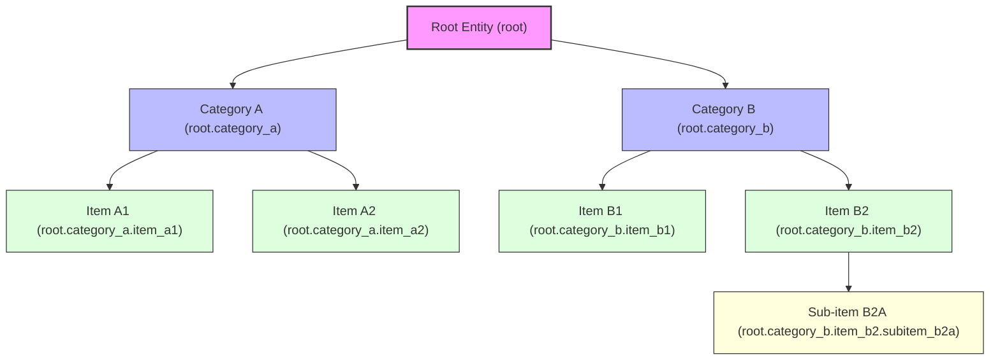

# RustyGPT Database Optimization

This document outlines advanced database optimization strategies, management approaches, and patterns for maintaining high performance at scale in the RustyGPT system.

## Overview

The RustyGPT system relies heavily on PostgreSQL for efficient data storage, retrieval, and complex relationship management. This section covers optimization strategies for vector search, hierarchical data management, and performance tuning.

## PostgreSQL ltree Extension

The `ltree` extension is central to our hierarchical data management strategy, enabling efficient traversal of relationship trees and taxonomies. This extension provides specialized operators and functions for working with tree structures stored as materialized paths.

### ltree Usage Patterns



Our entity relationships leverage the hierarchical ltree structure through the `path` column in the `relationships` table. This enables several powerful query patterns:

### Query Patterns

1. **Ancestor Queries**: Find all parent relationships (using the `@>` operator)

   ```sql
   -- Find all ancestors of a specific entity relationship
   SELECT * FROM relationships
   WHERE path @> 'root.category_b.item_b2.subitem_b2a';
   ```

2. **Descendant Queries**: Find all child relationships (using the `<@` operator)

   ```sql
   -- Find all descendants of Category B
   SELECT * FROM relationships
   WHERE path <@ 'root.category_b';
   ```

3. **Path Matching**: Find relationships matching specific patterns
   ```sql
   -- Find all items in any category (using wildcards)
   SELECT * FROM relationships
   WHERE path ~ 'root.*.item_*';
   ```

### Advanced ltree Stored Procedures

```sql
CREATE OR REPLACE FUNCTION find_relationship_ancestors(target_path ltree)
RETURNS TABLE(relationship_id INT, path ltree, entity_id_1 INT, entity_id_2 INT, relationship_type TEXT) AS $$
BEGIN
    RETURN QUERY
    SELECT r.relationship_id, r.path, r.entity_id_1, r.entity_id_2, r.relationship_type
    FROM relationships r
    WHERE r.path @> target_path
    ORDER BY nlevel(r.path);
END;
$$ LANGUAGE plpgsql;

CREATE OR REPLACE FUNCTION find_relationship_descendants(parent_path ltree)
RETURNS TABLE(relationship_id INT, path ltree, entity_id_1 INT, entity_id_2 INT, relationship_type TEXT) AS $$
BEGIN
    RETURN QUERY
    SELECT r.relationship_id, r.path, r.entity_id_1, r.entity_id_2, r.relationship_type
    FROM relationships r
    WHERE r.path <@ parent_path
    ORDER BY nlevel(r.path);
END;
$$ LANGUAGE plpgsql;

CREATE OR REPLACE FUNCTION find_relationship_siblings(entity_path ltree)
RETURNS TABLE(relationship_id INT, path ltree, entity_id_1 INT, entity_id_2 INT, relationship_type TEXT) AS $$
DECLARE
    parent_path ltree;
BEGIN
    -- Extract parent path
    SELECT subpath(entity_path, 0, nlevel(entity_path) - 1) INTO parent_path;

    RETURN QUERY
    SELECT r.relationship_id, r.path, r.entity_id_1, r.entity_id_2, r.relationship_type
    FROM relationships r
    WHERE
        r.path <@ parent_path AND
        nlevel(r.path) = nlevel(entity_path) AND
        r.path != entity_path
    ORDER BY r.path;
END;
$$ LANGUAGE plpgsql;
```

## Vector Search Optimization

The embedding vectors stored in the `entities` and `external_resources` tables are critical for semantic similarity searches. PostgreSQL's vector extension enables efficient nearest-neighbor searches, but requires careful optimization.

### Embedding Index Strategies

We implement several techniques to optimize vector searches:

#### 1. IVFFlat Indexing

The primary index on embeddings uses the IVFFlat (Inverted File with Flat Compression) algorithm, which divides the vector space into clusters:

```sql
-- Create optimized vector index with custom parameters
CREATE INDEX idx_entity_embedding_optimized ON entities
USING ivfflat (embedding vector_l2_ops)
WITH (lists = 100);  -- Number of clusters
```

#### 2. Approximate Nearest Neighbor (ANN) Search

For improved performance, especially with large datasets, we use approximate rather than exact nearest-neighbor search:

```sql
-- Find similar entities with efficient ANN search
CREATE OR REPLACE FUNCTION find_similar_entities_ann(
    input_embedding VECTOR(768),
    similarity_threshold FLOAT,
    max_results INT,
    search_quality FLOAT DEFAULT 0.9
) RETURNS TABLE(entity_id INT, name TEXT, similarity FLOAT) AS $$
BEGIN
    SET LOCAL ivfflat.probes = GREATEST(1, LEAST(100, CEIL(search_quality * 100)));

    RETURN QUERY
    SELECT e.entity_id, e.name, (1 - (e.embedding <=> input_embedding)) AS similarity
    FROM entities e
    WHERE (1 - (e.embedding <=> input_embedding)) > similarity_threshold
    ORDER BY similarity DESC
    LIMIT max_results;
END;
$$ LANGUAGE plpgsql;
```

#### 3. Hybrid Search

Combining exact text matching with vector similarity for optimal results:

```sql
CREATE OR REPLACE FUNCTION hybrid_entity_search(
    search_text TEXT,
    input_embedding VECTOR(768),
    text_weight FLOAT DEFAULT 0.3,
    vector_weight FLOAT DEFAULT 0.7,
    max_results INT DEFAULT 20,
    language TEXT DEFAULT 'english'
) RETURNS TABLE(entity_id INT, name TEXT, score FLOAT) AS $$
BEGIN
    RETURN QUERY
    WITH text_matches AS (
        SELECT
            e.entity_id,
            e.name,
            ts_rank_cd(to_tsvector(language, e.name), to_tsquery(language, search_text)) AS text_score
        FROM entities e
        WHERE to_tsvector(language, e.name) @@ to_tsquery(language, search_text)
    ),
    vector_matches AS (
        SELECT
            e.entity_id,
            e.name,
            (1 - (e.embedding <=> input_embedding)) AS vector_score
        FROM entities e
        ORDER BY vector_score DESC
        LIMIT max_results * 2
    )
    SELECT
        COALESCE(t.entity_id, v.entity_id) AS entity_id,
        COALESCE(t.name, v.name) AS name,
        (COALESCE(t.text_score, 0) * text_weight +
         COALESCE(v.vector_score, 0) * vector_weight) AS score
    FROM text_matches t
    FULL OUTER JOIN vector_matches v ON t.entity_id = v.entity_id
    ORDER BY score DESC
    LIMIT max_results;
END;
$$ LANGUAGE plpgsql;
```

## Embedding Maintenance Procedures

Managing vector embeddings efficiently is critical for system performance. The following procedures handle embedding updates and maintenance:

### Embedding History and Updates

```sql
-- Update entity embeddings while maintaining historical references
CREATE OR REPLACE FUNCTION update_entity_embedding(
    target_entity_id INT,
    new_embedding VECTOR(768)
) RETURNS VOID AS $$
DECLARE
    old_embedding VECTOR(768);
BEGIN
    -- Save old embedding for reference
    SELECT embedding INTO old_embedding FROM entities WHERE entity_id = target_entity_id;

    -- Create embedding history record
    INSERT INTO embedding_history (
        entity_id,
        previous_embedding,
        change_date
    ) VALUES (
        target_entity_id,
        old_embedding,
        NOW()
    );

    -- Update entity with new embedding
    UPDATE entities
    SET
        embedding = new_embedding,
        updated_at = NOW()
    WHERE entity_id = target_entity_id;
END;
$$ LANGUAGE plpgsql;
```

### Supporting Tables for Embedding Management

```sql
-- Additional table needed for embedding history
CREATE TABLE embedding_history (
    history_id SERIAL PRIMARY KEY,
    entity_id INT REFERENCES entities(entity_id),
    previous_embedding VECTOR(768),
    change_date TIMESTAMP NOT NULL DEFAULT NOW()
);

-- Additional table needed for model version tracking
CREATE TABLE embedding_model_versions (
    version_id SERIAL PRIMARY KEY,
    version_name TEXT NOT NULL,
    applied_date TIMESTAMP NOT NULL,
    entities_processed INT DEFAULT 0,
    status TEXT DEFAULT 'in_progress'
);
```

### Model Rebasing

```sql
-- Rebase all embeddings after model change
CREATE OR REPLACE FUNCTION rebase_all_embeddings(
    model_version TEXT
) RETURNS INT AS $$
DECLARE
    entities_updated INT := 0;
BEGIN
    -- Create embedding model version record
    INSERT INTO embedding_model_versions (
        version_name,
        applied_date
    ) VALUES (
        model_version,
        NOW()
    );

    -- Note: Actual rebasing implementation happens in Rust code
    -- This function mainly creates the tracking record
    RETURN entities_updated;
END;
$$ LANGUAGE plpgsql;
```

## Advanced Entity Relationships Management

Managing complex entity relationships efficiently requires specialized procedures for multi-hop relationship discovery:

```sql
-- Find multi-hop relationships between entities with confidence scoring
CREATE OR REPLACE FUNCTION find_entity_connection_paths(
    start_entity_id INT,
    end_entity_id INT,
    max_hops INT DEFAULT 3
) RETURNS TABLE(
    path_entities INT[],
    path_relationships TEXT[],
    confidence FLOAT
) AS $$
DECLARE
    hop INT;
BEGIN
    -- Initialize temporary tables for path finding
    CREATE TEMPORARY TABLE IF NOT EXISTS temp_paths (
        id SERIAL PRIMARY KEY,
        entity_path INT[],
        relationship_path TEXT[],
        path_confidence FLOAT
    ) ON COMMIT DROP;

    -- Start with the source entity
    INSERT INTO temp_paths (entity_path, relationship_path, path_confidence)
    VALUES (ARRAY[start_entity_id], ARRAY[]::TEXT[], 1.0);

    -- Iteratively build paths up to max_hops
    FOR hop IN 1..max_hops LOOP
        INSERT INTO temp_paths (entity_path, relationship_path, path_confidence)
        SELECT
            tp.entity_path || r.entity_id_2,
            tp.relationship_path || r.relationship_type,
            tp.path_confidence * r.weight
        FROM temp_paths tp
        JOIN relationships r ON r.entity_id_1 = tp.entity_path[array_length(tp.entity_path, 1)]
        WHERE
            r.entity_id_2 != ALL(tp.entity_path) AND  -- Prevent cycles
            array_length(tp.entity_path, 1) = hop;    -- Only extend paths of current hop length
    END LOOP;

    -- Return paths that reach the target entity, ordered by confidence
    RETURN QUERY
    SELECT
        tp.entity_path,
        tp.relationship_path,
        tp.path_confidence
    FROM temp_paths tp
    WHERE
        tp.entity_path[array_length(tp.entity_path, 1)] = end_entity_id AND
        array_length(tp.entity_path, 1) > 1
    ORDER BY tp.path_confidence DESC;
END;
$$ LANGUAGE plpgsql;

-- Find entities connected by specific relationship patterns
CREATE OR REPLACE FUNCTION find_entities_by_relationship_pattern(
    relationship_types TEXT[]
) RETURNS TABLE(
    start_entity_id INT,
    start_entity_name TEXT,
    end_entity_id INT,
    end_entity_name TEXT,
    path_confidence FLOAT
) AS $$
BEGIN
    RETURN QUERY
    WITH relevant_paths AS (
        SELECT
            r1.entity_id_1,
            r1.entity_id_2 AS intermediate_id,
            r2.entity_id_2,
            r1.weight * r2.weight AS combined_weight
        FROM relationships r1
        JOIN relationships r2 ON r1.entity_id_2 = r2.entity_id_1
        WHERE
            r1.relationship_type = relationship_types[1] AND
            r2.relationship_type = relationship_types[2]
    )
    SELECT
        rp.entity_id_1,
        e1.name,
        rp.entity_id_2,
        e2.name,
        rp.combined_weight
    FROM relevant_paths rp
    JOIN entities e1 ON rp.entity_id_1 = e1.entity_id
    JOIN entities e2 ON rp.entity_id_2 = e2.entity_id
    ORDER BY rp.combined_weight DESC;
END;
$$ LANGUAGE plpgsql;
```

## Related Documents

For detailed information about specific aspects of the architecture, see:

- [Architecture Overview](./overview.md) - High-level system overview and key concepts
- [Requirements](./requirements.md) - Detailed functional and non-functional requirements
- [Reasoning DAG](./reasoning-dag.md) - In-depth DAG architecture and node orchestration
- [Database Schema](./database-schema.md) - Core database design and stored procedures
- [Error Handling](./error-handling.md) - Comprehensive error handling architecture
