# RustyGPT Database Schema

This document provides an architectural overview of the RustyGPT database schema with Mermaid diagrams and cross-references to detailed implementation files.

## Quick Navigation

- **📋 [Table Definitions](./database-schema-tables.md)** - Complete table structures, indexes, and constraints
- **⚙️ [Procedures & Functions](./database-schema-procs.md)** - Stored procedures, functions, and triggers
- **🔧 [Database Optimization Guide](./database-optimization.md)** - Performance tuning recommendations

## Database Architecture Overview

The RustyGPT database is designed as a high-performance knowledge graph with automatic relationship inference, confidence scoring, and vector similarity search capabilities.

### Core Design Principles

1. **Knowledge Graph Structure** - Nodes and relationships with rich attributes
2. **Confidence-Based Inference** - Automated relationship discovery with confidence scoring
3. **Vector Similarity** - Embedding-based semantic search and clustering
4. **Performance Optimization** - Materialized views and intelligent indexing
5. **System Configuration** - Tunable parameters for optimal performance

## Entity Relationship Diagram

## Knowledge Graph Structure

The RustyGPT knowledge graph follows a hyper-normalized design that supports dynamic relationship inference and high-performance queries.

## Data Flow Diagrams

### Confidence Calculation Flow

```mermaid
flowchart TD
    A[Attribute Update] --> B{Trigger Confidence Update}
    B --> C[Calculate Attribute Confidence]
    C --> D[Weight × Source Reliability × Recency]
    D --> E[Update Node Confidence]
    E --> F[Materialized Score Cache]
    
    G[Relationship Update] --> H[Calculate Relationship Confidence]
    H --> I[Shared Attributes Analysis]
    I --> J[Confidence Score Calculation]
    J --> K[Update Materialized Score]
    
    L[Background Job] --> M[Batch Update Process]
    M --> N[Identify Stale Scores]
    N --> O[Recalculate Confidence]
    O --> F
    O --> K
```

### Relationship Inference Flow

### Vector Index Optimization Flow

## System Configuration Architecture

## Performance Optimization Features

### Materialized Confidence Scores

The database uses materialized confidence scores to eliminate expensive real-time calculations:

- **Node Confidence**: Pre-calculated aggregate scores based on attribute confidence
- **Relationship Confidence**: Cached scores based on shared attributes and node confidence
- **Automatic Updates**: Triggers maintain consistency when underlying data changes
- **Background Jobs**: Scheduled updates for stale confidence scores

### Vector Index Management

- **Adaptive Parameters**: Automatic calculation of optimal IVFFlat `lists` parameter
- **Performance Monitoring**: Tracks index usage and query performance
- **Auto-Optimization**: Rebuilds indexes when significant improvements are available
- **Configuration Management**: Tunable parameters for different deployment sizes

### Intelligent Indexing Strategy

- **Composite Indexes**: Multi-column indexes for common query patterns
- **Partial Indexes**: Conditional indexes for filtered queries
- **Vector Indexes**: Optimized for similarity search operations
- **Confidence Indexes**: Specialized indexes for confidence-based filtering

## Error Handling and Reliability

### Structured Error Framework

- **Error Codes**: Standardized RG-prefixed error codes for different categories
- **Context Preservation**: JSON-structured error details for debugging
- **Transaction Safety**: Error handling that maintains data consistency
- **Retry Logic**: Automatic retry for transient failures

### Data Consistency

- **ACID Compliance**: Full transactional consistency for critical operations
- **Constraint Enforcement**: Database-level validation of business rules
- **Referential Integrity**: Foreign key constraints with cascade rules
- **Concurrent Access**: Proper locking for multi-user environments

## Usage Guidelines

### Best Practices

1. **Confidence Thresholds**: Use materialized confidence scores for filtering
2. **Batch Operations**: Process large datasets using batch functions
3. **Index Optimization**: Regularly run vector index optimization
4. **Configuration Tuning**: Adjust parameters based on data growth patterns
5. **Monitoring**: Track performance metrics and error rates

### Performance Considerations

- **Query Planning**: Use `EXPLAIN ANALYZE` to verify index usage
- **Batch Size Tuning**: Adjust batch sizes based on available memory
- **Connection Pooling**: Use connection pooling for high-concurrency applications
- **Memory Configuration**: Tune PostgreSQL memory settings for workload

### Security Considerations

- **Parameter Validation**: All functions include comprehensive input validation
- **SQL Injection Prevention**: Parameterized queries and proper escaping
- **Access Control**: Role-based permissions for different operations
- **Audit Trail**: Complete audit logging for configuration changes

## Migration and Maintenance

### Schema Updates

- **Version Control**: All schema changes are versioned and tracked
- **Backward Compatibility**: Careful consideration of breaking changes
- **Migration Scripts**: Automated migration procedures
- **Rollback Plans**: Documented rollback procedures for each change

### Regular Maintenance

- **Confidence Updates**: Schedule regular confidence score refresh
- **Index Optimization**: Monitor and optimize vector indexes
- **Statistics Updates**: Keep PostgreSQL statistics current
- **Configuration Review**: Periodic review of configuration parameters

## Related Documentation

- **[Table Definitions](./database-schema-tables.md)** - Detailed table structures with all constraints and indexes
- **[Procedures & Functions](./database-schema-procs.md)** - Complete stored procedure documentation with examples
- **[Database Optimization Guide](./database-optimization.md)** - Advanced performance tuning recommendations
- **[API Integration Guide](./api-integration.md)** - How to integrate with the database from applications

## Schema Evolution

The RustyGPT database schema is designed to evolve with the system's needs while maintaining compatibility and performance. Key evolution strategies include:

- **Incremental Improvements**: Small, backward-compatible enhancements
- **Performance Optimization**: Continuous improvement of indexes and queries
- **Feature Additions**: New capabilities added through modular design
- **Scalability Enhancements**: Optimizations for larger datasets and higher concurrency

This architecture supports the RustyGPT system's requirements for intelligent knowledge graph management, high-performance vector operations, and reliable automated inference capabilities.