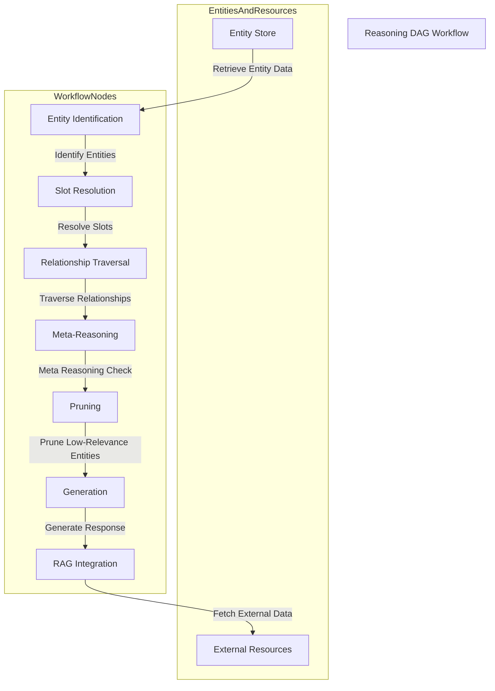

# RustyGPT Reasoning DAG Architecture

This document describes the detailed architecture of the Reasoning DAG system, including component design and orchestration workflow.

## Architectural Design

The system is implemented as a Directed Acyclic Graph (DAG), where each node performs a specific reasoning function. The graph structure allows for modular, autonomous processing, supporting dynamic interactions between nodes.

## Key Components

### 1. Entity Identification Node

- Uses vector similarity to find the most relevant entities based on input data.
- Efficiently queries the PostgreSQL database for embedding matches.

### 2. Slot Resolution Node

- Fills required and optional slots for identified entities.
- Uses embedding-based matching to ensure high accuracy in slot population.

### 3. Relationship Traversal Node

- Expands reasoning by exploring relationships between identified entities.
- Traverses dynamic links inferred from semantic similarity or shared attributes.

### 4. Meta-Reasoning Controller

- Validates the coherence of the reasoning chain.
- Ensures that all necessary slots and relationships are populated before generating output.

### 5. Pruning Node

- Reduces reasoning complexity by removing low-relevance entities or outdated relationships.
- Applies memory optimization by caching frequently accessed entities.

### 6. Generation Node

- Synthesizes responses based on resolved entities and enriched context.
- Integrates data retrieved through RAG to enhance output quality.

### 7. RAG Integration Node

- Links entities to external resources when context gaps are detected.
- Uses embedding vectors to match retrieved data with the current reasoning path.

## Orchestration Workflow

Nodes are organized in a flexible and modular fashion, allowing seamless integration and modification. The DAG structure ensures that each node can independently process data and pass it to the next node.

## Node Implementation Details

### Entity Identification Node

The Entity Identification Node serves as the entry point for the reasoning process. It receives input data and uses vector similarity techniques to find the most relevant entities from the entity store.

**Key Responsibilities:**

- Process incoming query data
- Generate query embeddings
- Perform similarity search against entity embeddings
- Return ranked list of relevant entities

### Slot Resolution Node

The Slot Resolution Node takes the identified entities and fills in their required and optional slots based on the context and available data.

**Key Responsibilities:**

- Analyze entity slot requirements
- Match available data to entity slots
- Use embedding-based matching for high accuracy
- Handle optional vs. required slot constraints

### Relationship Traversal Node

This node expands the reasoning scope by exploring relationships between identified entities, discovering additional relevant entities through their connections.

**Key Responsibilities:**

- Traverse entity relationships
- Follow semantic similarity links
- Explore shared attribute connections
- Maintain relationship weights and confidence scores

### Meta-Reasoning Controller

The Meta-Reasoning Controller validates the overall coherence of the reasoning chain and ensures quality before proceeding to generation.

**Key Responsibilities:**

- Validate reasoning chain coherence
- Check slot completeness
- Verify relationship consistency
- Apply reasoning quality metrics

### Pruning Node

The Pruning Node optimizes performance by removing low-relevance entities and outdated relationships from the reasoning context.

**Key Responsibilities:**

- Apply relevance thresholds
- Remove outdated relationships
- Optimize memory usage
- Cache frequently accessed entities

### Generation Node

The Generation Node synthesizes the final response based on the resolved entities and enriched context.

**Key Responsibilities:**

- Synthesize response from entity data
- Integrate RAG-retrieved information
- Apply generation templates and patterns
- Ensure output quality and coherence

### RAG Integration Node

The RAG Integration Node links entities to external resources when context gaps are detected, enriching the reasoning with additional knowledge.

**Key Responsibilities:**

- Detect context gaps
- Query external knowledge sources
- Match retrieved data with reasoning context
- Integrate external information seamlessly

## Related Documents

For detailed information about specific aspects of the architecture, see:

- [Architecture Overview](./overview.md) - High-level system overview and key concepts
- [Requirements](./requirements.md) - Detailed functional and non-functional requirements
- [Database Schema](./database-schema.md) - Core database design and stored procedures
- [Database Optimization](./database-optimization.md) - Advanced optimization strategies
- [Error Handling](./error-handling.md) - Comprehensive error handling architecture
