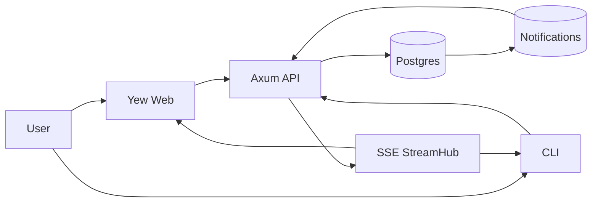

# Service Topology

> TL;DR – The RustyGPT platform pairs an Axum-based API, background workers, and a Yew web client connected through message queues and SSE streams.

## Components

- **API Gateway** – `rustygpt-server` exposes REST, SSE, and WebSocket endpoints. It authenticates requests, orchestrates reasoning DAG execution, and streams results via [Streaming Delivery](streaming.md).
- **Workers** – Background jobs handle embedding refresh, summarisation, and rate-limit enforcement using `tokio` tasks driven by Postgres notifications.
- **Shared Library** – `rustygpt-shared` provides DTOs, telemetry, and dimensioned entity traits consumed by server, CLI, and web crates.
- **Clients** – The Yew SPA and CLI share the same API surface described in [REST API](../reference/api.md).

## Data Flow

_Caption: Requests traverse the API, persist to Postgres, and fan out through StreamHub to connected clients._

## Operational Notes

- All components share observability through `tracing` and Prometheus exporters. Dashboards are stored under `deploy/grafana`.
- Config values are centralised; see [Configuration](../reference/config.md) for environment variable mapping.
- Secrets rotate in place using the workflow documented in [Rotate Secrets](../howto/rotate-secrets.md).

## Scaling

Scale horizontally by running multiple API pods behind a load balancer. Sticky sessions are not required because StreamHub tracks subscription state via durable IDs. Worker concurrency scales with `RUSTYGPT_WORKER_CONCURRENCY`, documented in [Docker Deploy](../howto/docker-deploy.md).
