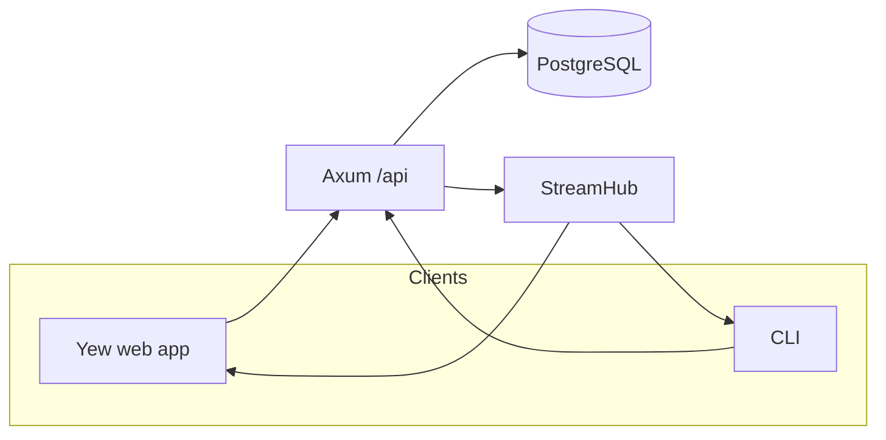

# Service topology

RustyGPT is composed of a single Axum process backed by PostgreSQL. The web client and CLI talk to the same REST + SSE surface.

## Components

- **Axum API (`rustygpt-server`)** – exposes `/api/*` endpoints, authentication middleware, rate limiting, SSE, OpenAPI docs,
  health probes, metrics, and static file hosting.
- **PostgreSQL** – stores users, sessions, conversations, threads, SSE history, and rate-limit configuration. Schema and stored
  procedures live in `scripts/pg` and are applied automatically during bootstrap.
- **SSE StreamHub** – in-memory fan-out implemented in `handlers/streaming.rs`, optionally persisting events through
  `services::sse_persistence`.
- **Yew SPA (`rustygpt-web`)** – compiled to WebAssembly with Trunk. `src/api.rs` handles authentication, CSRF, SSE reconnection,
  and REST calls for conversations/threads.
- **CLI (`rustygpt-cli`)** – shares configuration and models with the server. Provides helper commands for session management,
  SSE following, and OpenAPI/config generation.

## Data flow

_Requests hit the Axum router, which talks to PostgreSQL via SQLx and fans out live events via StreamHub. Clients subscribe to
`/api/stream/conversations/:conversation_id` to receive updates._

## Feature flags

Many subsystems are gated by `[features]` in configuration:

- `auth_v1` – enables session middleware, `/api/auth/*`, protected routes, and the rate-limit admin API
- `sse_v1` – enables the SSE route and persistence options
- `well_known` – serves `.well-known/*` entries from the config

Toggle these flags without recompiling the binaries.

## Scaling notes

The server is stateless apart from in-memory SSE buffers. For horizontal scaling you must either:

- Disable persistence and tolerate best-effort delivery, or
- Configure `[sse.persistence]` so each instance replays from PostgreSQL on reconnect

Rate limiting already supports multi-instance deployments because configuration is stored in the database and periodically
reloaded (`RateLimitState::reload_from_db`).
